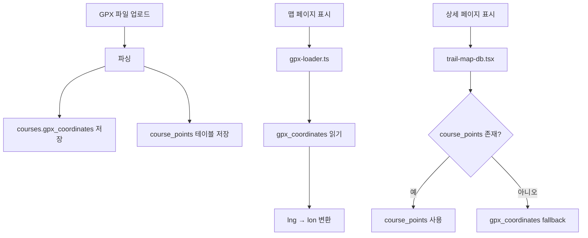

# GSRC81 Maps GPX 데이터 구조 개선 제안서

## 📋 목차
1. [현재 상태 분석](#1-현재-상태-분석)
2. [문제점 정의](#2-문제점-정의)
3. [개선 방안](#3-개선-방안)
4. [기술 상세 설계](#4-기술-상세-설계)
5. [마이그레이션 계획](#5-마이그레이션-계획)
6. [예상 효과](#6-예상-효과)

---

## 1. 현재 상태 분석

### 1.1 데이터 저장 구조

현재 GSRC81 Maps는 GPX 데이터를 **3가지 다른 방식**으로 저장하고 있습니다:

#### A. Database 테이블 구조
```sql
-- courses 테이블
- gpx_coordinates: TEXT (JSON 문자열)
- start_latitude/longitude: DECIMAL
- end_latitude/longitude: DECIMAL
- distance_km, avg_time_min, elevation_gain: 개별 컬럼

-- course_points 테이블 (중복 저장)
- course_id, seq, latitude, longitude, elevation
```

#### B. 데이터 형식 불일치
- **업로드 시**: `{lat, lng, ele}` 형식
- **gpx-loader.ts**: `{lat, lon, ele}` 형식
- **course_points**: `{latitude, longitude, elevation}` 형식

### 1.2 현재 데이터 플로우



### 1.3 실제 사용 현황

#### ✅ 사용중인 필드
- **courses**: id, title, description, start/end 좌표, distance_km, avg_time_min, difficulty, nearest_station, gpx_coordinates, elevation_gain, is_active, created_at
- **course_points**: 전체 필드 (하지만 중복)

#### ❌ 미사용 필드
- **courses**: gpx_url, gpx_data, altitude_gain, cover_image_url, landmarks, created_by, updated_at
- **profiles, app_settings**: 거의 미사용

---

## 2. 문제점 정의

### 2.1 데이터 중복
- 동일한 GPX 데이터가 2곳에 저장 (courses.gpx_coordinates, course_points)
- 저장 공간 낭비 및 동기화 문제 발생 가능

### 2.2 형식 불일치
- 좌표 필드명 불일치: lng vs lon vs longitude
- 데이터 구조 불일치: 객체 vs 배열 vs 테이블 row

### 2.3 성능 이슈
- course_points 테이블 조회 시 N개의 row 조회 필요
- JSON 문자열 파싱 오버헤드
- 불필요한 변환 로직

### 2.4 유지보수성
- 3개의 서로 다른 데이터 처리 로직
- 수정 시 여러 곳을 동시에 변경해야 함
- 버그 발생 가능성 증가

---

## 3. 개선 방안

### 3.1 단일 데이터 저장소
- **course_points 테이블 제거**
- **courses.gpx_data** JSONB 컬럼으로 통합

### 3.2 표준화된 데이터 형식
```typescript
interface UnifiedGPXData {
  version: "1.0";  // 버전 관리
  points: Array<{
    lat: number;
    lng: number;
    ele?: number;
    dist?: number;  // 누적 거리
  }>;
  bounds: {
    minLat: number;
    maxLat: number;
    minLng: number;
    maxLng: number;
  };
  stats: {
    totalDistance: number;     // km
    elevationGain: number;      // m
    elevationLoss: number;      // m
    estimatedDuration: number;  // minutes
    maxElevation: number;       // m
    minElevation: number;       // m
  };
  metadata?: {
    originalFileName?: string;
    uploadedAt?: string;
    processedAt?: string;
  };
}
```

### 3.3 단순화된 스키마
```sql
CREATE TABLE courses_v2 (
    id UUID PRIMARY KEY DEFAULT gen_random_uuid(),
    
    -- 기본 정보
    title VARCHAR(200) NOT NULL,
    description TEXT,
    
    -- GPX 데이터 (JSONB로 통합)
    gpx_data JSONB NOT NULL,
    
    -- 검색/필터용 컬럼 (인덱싱)
    distance_km DECIMAL(5,2) GENERATED ALWAYS AS 
        ((gpx_data->'stats'->>'totalDistance')::DECIMAL) STORED,
    difficulty VARCHAR(20) CHECK (difficulty IN ('easy', 'medium', 'hard')),
    nearest_station VARCHAR(100),
    
    -- 메타데이터
    is_active BOOLEAN DEFAULT true,
    created_at TIMESTAMP WITH TIME ZONE DEFAULT NOW(),
    
    -- 인덱스
    INDEX idx_distance (distance_km),
    INDEX idx_difficulty (difficulty),
    INDEX idx_active (is_active)
);

-- GIN 인덱스로 JSONB 검색 최적화
CREATE INDEX idx_gpx_data ON courses_v2 USING GIN (gpx_data);
```

---

## 4. 기술 상세 설계

### 4.1 GPX 업로드 프로세스

```typescript
// 1. GPX 파일 파싱
function parseGPXFile(file: File): Promise<ParsedGPX> {
  // XML 파싱
  // 좌표 추출
  // 통계 계산
  return {
    points: extractedPoints,
    stats: calculatedStats,
    bounds: calculatedBounds
  };
}

// 2. 데이터 저장
async function saveCourse(gpxData: ParsedGPX, metadata: CourseMetadata) {
  const unifiedData: UnifiedGPXData = {
    version: "1.0",
    points: gpxData.points,
    bounds: gpxData.bounds,
    stats: gpxData.stats,
    metadata: {
      originalFileName: metadata.fileName,
      uploadedAt: new Date().toISOString(),
      processedAt: new Date().toISOString()
    }
  };
  
  await supabase
    .from('courses')
    .insert({
      title: metadata.title,
      description: metadata.description,
      gpx_data: unifiedData,
      difficulty: metadata.difficulty,
      nearest_station: metadata.nearestStation,
      is_active: true
    });
}
```

### 4.2 데이터 조회 및 표시

```typescript
// 단순화된 데이터 조회
async function getCourse(courseId: string): Promise<Course> {
  const { data } = await supabase
    .from('courses')
    .select('*')
    .eq('id', courseId)
    .single();
  
  return {
    ...data,
    gpxData: data.gpx_data as UnifiedGPXData
  };
}

// GeoJSON 변환 (바로 사용 가능)
function toGeoJSON(gpxData: UnifiedGPXData): GeoJSON.FeatureCollection {
  return {
    type: "FeatureCollection",
    features: [{
      type: "Feature",
      properties: {},
      geometry: {
        type: "LineString",
        coordinates: gpxData.points.map(p => [p.lng, p.lat, p.ele || 0])
      }
    }]
  };
}
```

### 4.3 컴포넌트 통합

```typescript
// 통합된 Trail Map 컴포넌트
export function UnifiedTrailMap({ courseId }: { courseId: string }) {
  const [course, setCourse] = useState<Course | null>(null);
  
  useEffect(() => {
    // 단일 데이터 소스에서 로드
    getCourse(courseId).then(setCourse);
  }, [courseId]);
  
  if (!course) return <Loading />;
  
  const geoJSON = toGeoJSON(course.gpxData);
  
  return (
    <Map
      initialViewState={calculateViewState(course.gpxData.bounds)}
    >
      <Source type="geojson" data={geoJSON}>
        <Layer {...lineLayerStyle} />
      </Source>
    </Map>
  );
}
```

---

## 5. 마이그레이션 계획

### 5.1 단계별 진행

#### Phase 1: 준비 (1주)
- [ ] 새로운 스키마 설계 확정
- [ ] 마이그레이션 스크립트 작성
- [ ] 백업 계획 수립

#### Phase 2: 병렬 운영 (2주)
- [ ] 새 테이블 생성 (courses_v2)
- [ ] 기존 데이터 마이그레이션
- [ ] 새 업로드는 양쪽에 저장

#### Phase 3: 전환 (1주)
- [ ] 읽기 로직을 새 테이블로 전환
- [ ] 성능 모니터링
- [ ] 이슈 대응

#### Phase 4: 정리 (1주)
- [ ] 구 테이블 백업
- [ ] 구 테이블 삭제
- [ ] 문서 업데이트

### 5.2 데이터 마이그레이션 스크립트

```sql
-- 기존 데이터 변환 및 이전
INSERT INTO courses_v2 (
  id, title, description, gpx_data, difficulty, nearest_station, is_active, created_at
)
SELECT 
  c.id,
  c.title,
  c.description,
  jsonb_build_object(
    'version', '1.0',
    'points', COALESCE(
      (SELECT jsonb_agg(
        jsonb_build_object(
          'lat', cp.latitude,
          'lng', cp.longitude,
          'ele', cp.elevation,
          'dist', NULL
        ) ORDER BY cp.seq
      ) FROM course_points cp WHERE cp.course_id = c.id),
      c.gpx_coordinates::jsonb
    ),
    'bounds', jsonb_build_object(
      'minLat', least(c.start_latitude, c.end_latitude),
      'maxLat', greatest(c.start_latitude, c.end_latitude),
      'minLng', least(c.start_longitude, c.end_longitude),
      'maxLng', greatest(c.start_longitude, c.end_longitude)
    ),
    'stats', jsonb_build_object(
      'totalDistance', c.distance_km,
      'elevationGain', COALESCE(c.elevation_gain, 0),
      'elevationLoss', COALESCE(c.elevation_gain * 0.8, 0),
      'estimatedDuration', c.avg_time_min,
      'maxElevation', 0,
      'minElevation', 0
    )
  ),
  c.difficulty,
  c.nearest_station,
  c.is_active,
  c.created_at
FROM courses c;
```

### 5.3 롤백 계획

```sql
-- 롤백 시나리오 대비 백업
CREATE TABLE courses_backup AS SELECT * FROM courses;
CREATE TABLE course_points_backup AS SELECT * FROM course_points;

-- 문제 발생 시 즉시 복원 가능
```

---

## 6. 예상 효과

### 6.1 성능 개선
- **DB 쿼리 감소**: N개 row 조회 → 1개 JSONB 조회
- **파싱 오버헤드 제거**: JSONB 네이티브 지원
- **인덱싱 최적화**: GIN 인덱스로 빠른 검색

### 6.2 유지보수성 향상
- **코드 라인 감소**: 약 40% 감소 예상
- **버그 감소**: 단일 데이터 소스로 동기화 문제 해결
- **개발 속도 향상**: 단순한 구조로 빠른 기능 추가

### 6.3 확장성
- **버전 관리**: version 필드로 향후 변경 대응
- **메타데이터 추가 용이**: JSONB 구조로 유연한 확장
- **새로운 기능 추가 간편**: 웨이포인트, POI 등

### 6.4 비용 절감
- **스토리지**: 중복 제거로 약 30% 절감
- **컴퓨팅**: 쿼리 최적화로 DB 부하 감소

---

## 📎 참고 자료

### 현재 파일 구조
```
src/
├── app/admin/courses/page.tsx (GPX 업로드)
├── components/
│   ├── admin/GPX-upload-form.tsx
│   ├── map/
│   │   ├── trail-map.tsx (gpx-loader 사용)
│   │   └── trail-map-db.tsx (course_points 사용)
├── lib/
│   ├── gpx-loader.ts (gpx_coordinates 파싱)
│   └── supabase.ts
└── types/index.ts
```

### 영향받는 컴포넌트
1. GPX-upload-form.tsx - 업로드 로직
2. trail-map.tsx - 맵 렌더링
3. trail-map-db.tsx - 상세 페이지
4. gpx-loader.ts - 데이터 로더
5. courses/page.tsx - 관리자 페이지

---

*작성일: 2025년 1월*
*작성자: GSRC81 개발팀*