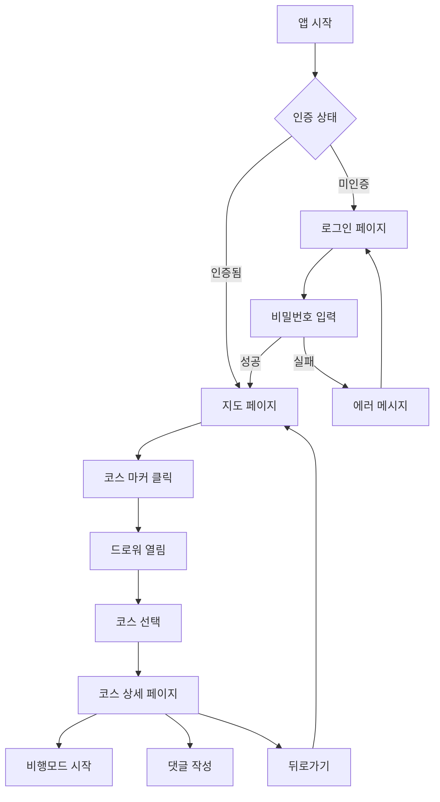
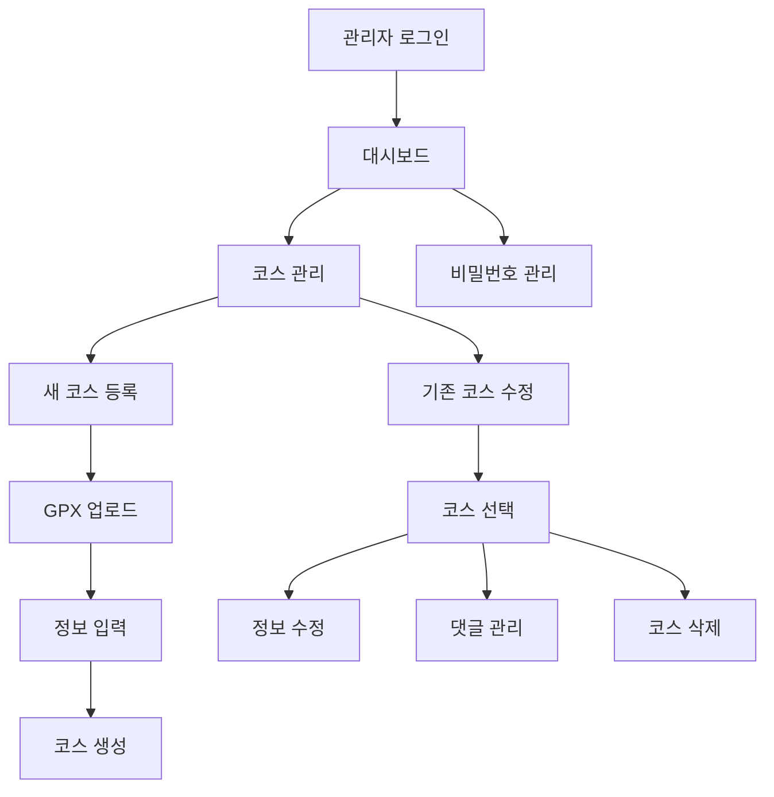

# GSRC81 Maps 페이지별 기획서

## 📋 목차
1. [사용자 페이지](#1-사용자-페이지)
2. [관리자 페이지](#2-관리자-페이지)
3. [공통 컴포넌트](#3-공통-컴포넌트)
4. [UI/UX 플로우](#4-uiux-플로우)
5. [데이터 플로우](#5-데이터-플로우)

---

## 1. 사용자 페이지

### 1.1 랜딩/로그인 페이지 (`/`)

#### 📝 페이지 개요
- **목적**: 앱 첫 진입점, 비밀번호 인증
- **경로**: `/`
- **컴포넌트**: `src/app/page.tsx`
- **인증**: 불필요 (공개)

#### 🎨 UI 구성
```
┌─────────────────────────────────────┐
│              GSRC81 MAPS            │
│         구파발 러너 매퍼              │
├─────────────────────────────────────┤
│                                     │
│    🔐 비밀번호를 입력하세요           │
│    ┌─────────────────────────┐     │
│    │ [Password Input Field]  │     │
│    └─────────────────────────┘     │
│    ┌─────────────────────────┐     │
│    │    [로그인 버튼]           │     │
│    └─────────────────────────┘     │
│                                     │
│    💡 GSRC81 크루원만 이용 가능       │
└─────────────────────────────────────┘
```

#### 🔧 기능 명세
| 기능 | 설명 | 우선순위 |
|------|------|----------|
| 비밀번호 입력 | access_links 테이블 기반 인증 | P0 |
| 자동 리다이렉트 | 인증 성공 시 `/map`으로 이동 | P0 |
| 로딩 상태 | 인증 확인 중 스피너 표시 | P1 |
| 에러 처리 | 잘못된 비밀번호 에러 메시지 | P1 |

#### 📱 반응형 대응
- **데스크톱**: 중앙 정렬, 최대 400px 폭
- **모바일**: 전체 폭 사용, 터치 최적화
- **키보드**: Enter 키로 로그인 가능

#### 🔄 상태 관리
```typescript
interface LoginState {
  password: string;
  isLoading: boolean;
  error: string | null;
  isAuthenticated: boolean;
}
```

#### 🎯 사용자 여정
1. 앱 접속
2. 비밀번호 입력
3. 인증 확인
4. 성공 시 → `/map`, 실패 시 → 에러 메시지

---

### 1.2 메인 지도 페이지 (`/map`)

#### 📝 페이지 개요
- **목적**: 전체 러닝 코스 지도 표시 및 탐색
- **경로**: `/map`
- **컴포넌트**: `src/app/map/page.tsx`
- **인증**: 필수 (ProtectedRoute)

#### 🎨 UI 구성
```
┌─────────────────────────────────────┐
│  [현재위치] [필터] [설정]  [로그아웃]  │
├─────────────────────────────────────┤
│                                     │
│        🗺️ Mapbox 지도 영역           │
│                                     │
│    🔵🟢🔴 코스 마커들                 │
│                                     │
│ ┌─────────────────────────────────┐ │
│ │     📋 하단 드로워 (코스 리스트)   │ │
│ │                                 │ │
│ │ ┌─────┐ ┌─────┐ ┌─────┐       │ │
│ │ │코스1│ │코스2│ │코스3│  ...   │ │
│ │ └─────┘ └─────┘ └─────┘       │ │
│ └─────────────────────────────────┘ │
└─────────────────────────────────────┘
```

#### 🔧 기능 명세
| 기능 | 설명 | 우선순위 |
|------|------|----------|
| 지도 표시 | Mapbox GL 기반 은평구 중심 지도 | P0 |
| 코스 마커 | 시작점별 컬러 코딩 마커 표시 | P0 |
| 드로워 UI | 하단 슬라이드업 코스 리스트 | P0 |
| 필터링 | 거리별/난이도별 코스 필터 | P1 |
| 현재 위치 | GPS 기반 사용자 위치 표시 | P1 |
| 클러스터링 | 확대 시 마커 그룹화 | P2 |

#### 📊 데이터 요구사항
```typescript
interface MapPageData {
  courses: Course[];          // 전체 코스 목록
  selectedCourse?: Course;    // 선택된 코스
  mapBounds: MapBounds;       // 지도 영역
  filters: FilterState;       // 필터 상태
}
```

#### 🎮 인터랙션 플로우
1. **페이지 로드** → 지도 초기화 → 코스 데이터 로드
2. **마커 클릭** → 드로워 열림 → 코스 정보 표시
3. **코스 선택** → 상세 페이지 이동 (`/courses/[id]`)
4. **필터 적용** → 지도 업데이트 → 드로워 업데이트

#### 📱 반응형 특징
- **데스크톱**: 사이드바형 드로워, 호버 효과
- **모바일**: 하단 드로워, 스와이프 제스처
- **터치**: 핀치 줌, 드래그 이동

---

### 1.3 코스 상세 페이지 (`/courses/[id]`)

#### 📝 페이지 개요
- **목적**: 개별 코스의 상세 정보 및 GPX 경로 표시
- **경로**: `/courses/[id]`
- **컴포넌트**: `src/app/courses/[id]/page.tsx`
- **인증**: 필수 (ProtectedRoute)

#### 🎨 UI 구성 (v2 기준)
```
┌─────────────────────────────────────┐
│ [←뒤로] 불광천 따라 달리기 [❤️] [📤]  │
├─────────────────────────────────────┤
│ 📊 4.2km • 35분 • ⭐⭐ 중급 • 🚇구파발 │
├─────────────────────────────────────┤
│                                     │
│        🗺️ GPX 경로 지도              │
│     ✈️ 비행모드 + 💬 웨이포인트       │
│                                     │
├─────────────────────────────────────┤
│ ┌─ 비행모드 컨트롤 ─────────────────┐ │
│ │ [✈️] [⏸️] [2x] [━━━●──] [🔄]   │ │
│ └───────────────────────────────────┘ │
├─────────────────────────────────────┤
│ 💬 댓글 (5)                          │
│ ┌─────────────────────────────────┐   │
│ │ 👤 김러너: 여기 전망 좋아요!       │   │
│ │ 👑 관리자: 신호등 조심하세요        │   │
│ └─────────────────────────────────┘   │
└─────────────────────────────────────┘
```

#### 🔧 기능 명세 (v2 업그레이드)
| 기능 | 설명 | 우선순위 |
|------|------|----------|
| GPX 경로 표시 | 정확한 러닝 경로 라인 렌더링 | P0 |
| ✈️ 비행모드 | 자동 경로 재생, 속도 조절 | P0 |
| 💬 웨이포인트 댓글 | 지점별 댓글 CRUD | P0 |
| 고도 프로필 | 높이별 색상 구분 경로 | P1 |
| km 마커 | 1km 단위 거리 표시 | P1 |
| 공유 기능 | 코스 링크 공유 | P2 |
| 북마크 | 즐겨찾기 기능 | P2 |

#### ✈️ 비행모드 상세 기능
```typescript
interface FlightModeState {
  isActive: boolean;         // 비행모드 활성화
  isPaused: boolean;         // 일시정지 상태
  speed: number;             // 재생 속도 (0.5x ~ 3x)
  progress: number;          // 진행률 (0-100%)
  currentPointIndex: number; // 현재 포인트 인덱스
}

// 컨트롤 기능
- 재생/일시정지
- 속도 조절 (0.5x, 1x, 2x, 3x)
- 진행률 바 (클릭하여 특정 지점 이동)
- 리셋 (처음부터 다시)
- 카메라 추적 (자동 시점 이동)
```

#### 💬 웨이포인트 댓글 시스템
```typescript
interface WaypointComment {
  id: string;
  pointIndex: number;        // GPX points 배열 인덱스
  lat: number;               // 댓글 위치
  lng: number;
  username: string;
  content: string;           // 최대 200자
  isAdmin: boolean;
  createdAt: string;
}

// UI 인터랙션
1. 지도 포인트 클릭 → 댓글 팝업 표시
2. 기존 댓글 조회 + 새 댓글 작성 폼
3. 실시간 업데이트 (Supabase Realtime)
4. 관리자 댓글은 하단 고정, 일반 댓글은 상단
```

#### 📊 성능 최적화
- **지도 렌더링**: GPX 포인트 간소화 (Douglas-Peucker 알고리즘)
- **애니메이션**: requestAnimationFrame 기반 부드러운 이동
- **댓글 로딩**: 무한 스크롤 (페이지네이션)
- **이미지 최적화**: WebP 형식, lazy loading

---

## 2. 관리자 페이지

### 2.1 관리자 로그인 (`/admin/login`)

#### 📝 페이지 개요
- **목적**: 관리자 전용 로그인
- **경로**: `/admin/login`
- **컴포넌트**: `src/app/admin/login/page.tsx`
- **인증**: 불필요 (공개)

#### 🎨 UI 구성
```
┌─────────────────────────────────────┐
│          🛡️ 관리자 로그인             │
├─────────────────────────────────────┤
│    ┌─────────────────────────────┐   │
│    │     아이디                   │   │
│    │ [Username Input]            │   │
│    └─────────────────────────────┘   │
│    ┌─────────────────────────────┐   │
│    │     비밀번호                 │   │
│    │ [Password Input]            │   │
│    └─────────────────────────────┘   │
│    ┌─────────────────────────────┐   │
│    │      [로그인]                │   │
│    └─────────────────────────────┘   │
│                                     │
│    💡 관리자만 접근 가능한 영역입니다   │
└─────────────────────────────────────┘
```

#### 🔧 기능 명세
| 기능 | 설명 | 우선순위 |
|------|------|----------|
| 관리자 인증 | admin 테이블 기반 로그인 | P0 |
| 세션 관리 | JWT 토큰 기반 세션 유지 | P0 |
| 자동 리다이렉트 | 로그인 성공 시 `/admin`으로 이동 | P0 |
| 보안 강화 | Rate limiting, 브루트포스 방지 | P1 |

---

### 2.2 관리자 대시보드 (`/admin`)

#### 📝 페이지 개요
- **목적**: 관리자 메인 화면, 통계 및 빠른 작업
- **경로**: `/admin`
- **컴포넌트**: `src/app/admin/page.tsx`
- **인증**: 관리자 필수 (ProtectedAdminRoute)

#### 🎨 UI 구성 (데스크톱)
```
┌─────────────────────────────────────┐
│ 📊 GSRC81 Maps 관리자 대시보드        │
├─────────────────────────────────────┤
│ ┌──통계──┐ ┌──통계──┐ ┌──통계──┐   │
│ │🗺️ 총코스│ │💬 댓글수│ │👥 사용자│   │
│ │   12   │ │   45   │ │    8   │   │
│ └────────┘ └────────┘ └────────┘   │
├─────────────────────────────────────┤
│ ┌─── 빠른 작업 ───┐ ┌─ 최근 코스 ─┐ │
│ │ ➕ 새 코스 등록  │ │ 🏃 불광천코스 │ │
│ │ ✏️ 코스 관리    │ │ 🏃 연신내공원 │ │
│ │ 🔒 비밀번호 변경 │ │ 🏃 북한산둘레 │ │
│ │ ⚙️ 시스템 설정   │ │      ...    │ │
│ └─────────────────┘ └─────────────┘ │
└─────────────────────────────────────┘
```

#### 🎨 UI 구성 (모바일)
```
┌─────────────────────────────────────┐
│ 📊 관리자 대시보드                    │
├─────────────────────────────────────┤
│ ┌─────────────────────────────────┐ │
│ │ 📝 코스 관리                  › │ │
│ └─────────────────────────────────┘ │
│ ┌─────────────────────────────────┐ │
│ │ 🔒 비밀번호 관리              › │ │
│ └─────────────────────────────────┘ │
│ ┌─────────────────────────────────┐ │
│ │ ⚙️ 시스템 설정                › │ │
│ └─────────────────────────────────┘ │
│ ┌─────────────────────────────────┐ │
│ │ 📄 버전정보                    │ │
│ │                         v1.0.0 │ │
│ └─────────────────────────────────┘ │
│ ┌─────────────────────────────────┐ │
│ │         🚪 로그아웃              │ │
│ └─────────────────────────────────┘ │
└─────────────────────────────────────┘
```

#### 🔧 기능 명세
| 기능 | 설명 | 우선순위 |
|------|------|----------|
| 통계 대시보드 | 코스, 댓글, 사용자 수 표시 | P0 |
| 빠른 작업 버튼 | 주요 관리 기능 바로가기 | P0 |
| 최근 코스 목록 | 최근 등록된 코스 5개 표시 | P1 |
| 반응형 UI | 데스크톱/모바일 최적화 | P1 |

#### 📊 실시간 통계
```typescript
interface DashboardStats {
  totalCourses: number;      // 전체 코스 수
  totalComments: number;     // 전체 댓글 수
  activeUsers: number;       // 활성 사용자 수 (30일)
  newCoursesToday: number;   // 오늘 등록된 코스
  popularCourse: string;     // 가장 인기 있는 코스
}
```

---

### 2.3 코스 관리 페이지 (`/admin/courses`)

#### 📝 페이지 개요
- **목적**: 코스 CRUD 및 GPX 업로드
- **경로**: `/admin/courses`
- **컴포넌트**: `src/app/admin/courses/page.tsx`
- **인증**: 관리자 필수

#### 🎨 UI 구성
```
┌─────────────────────────────────────┐
│ 📝 코스 관리                 [← 뒤로] │
├─────────────────────────────────────┤
│ ┌─── 새 코스 등록 (아코디언) ──────┐   │
│ │ ➕ GPX 파일 업로드             ▼ │   │
│ │ ┌─────────────────────────────┐ │   │
│ │ │ 📁 [GPX 파일 선택]           │ │   │
│ │ │ 📝 코스명: [            ]   │ │   │
│ │ │ 📄 설명: [              ]   │ │   │
│ │ │ ⚡ 난이도: [쉬움▼]          │ │   │
│ │ │ 🚇 지하철역: [         ]    │ │   │  
│ │ │ ┌─────────────────────────┐ │ │   │
│ │ │ │      [등록하기]          │ │ │   │
│ │ │ └─────────────────────────┘ │ │   │
│ │ └─────────────────────────────┘ │   │
│ └─────────────────────────────────┘   │
├─────────────────────────────────────┤
│ 📋 등록된 코스 목록 (3)               │
│ ┌─────────────────────────────────┐   │
│ │ 🟢 불광천 따라 달리기              │   │
│ │ 4.2km • 35분 • 중급 • 구파발역    │   │
│ │ 2025-01-03                   [✏️][🗑️] │
│ └─────────────────────────────────┘   │
│ ┌─────────────────────────────────┐   │
│ │ 🔵 연신내 공원 루프               │   │
│ │ 2.8km • 25분 • 쉬움 • 연신내역    │   │
│ │ 2025-01-02                   [✏️][🗑️] │
│ └─────────────────────────────────┘   │
└─────────────────────────────────────┘
```

#### 🔧 GPX 업로드 프로세스 (v2)
```typescript
// 1단계: GPX 파일 업로드
interface GPXUploadData {
  file: File;                    // 원본 GPX 파일
  title: string;                 // 코스명
  description?: string;          // 설명
  difficulty: 'easy' | 'medium' | 'hard';
}

// 2단계: GPX 파싱 및 검증
interface ParsedGPXData {
  points: GPXPoint[];            // 좌표 배열
  bounds: Bounds;                // 경계 영역
  stats: {
    totalDistance: number;       // 총 거리 (km)
    elevationGain: number;       // 고도 상승 (m)
    estimatedDuration: number;   // 예상 소요시간 (분)
  };
}

// 3단계: UnifiedGPXData v1.1 형식으로 변환
interface UnifiedGPXData {
  version: '1.1';
  points: GPXPoint[];
  bounds: Bounds;
  stats: Stats;
  metadata: {
    originalFileName: string;
    uploadedAt: string;
    uploadedBy: string;
  };
}

// 4단계: 데이터베이스 저장
INSERT INTO courses_v2 (
  title,
  description, 
  difficulty,
  gpx_data,           // JSONB로 저장
  created_by
);
```

#### 🔧 기능 명세
| 기능 | 설명 | 우선순위 |
|------|------|----------|
| GPX 업로드 | 드래그앤드롭, 파일 선택 지원 | P0 |
| 실시간 미리보기 | 업로드 시 즉시 경로 표시 | P0 |
| 자동 정보 추출 | 거리, 고도, 시간 자동 계산 | P0 |
| 코스 편집 | 제목, 설명, 난이도 수정 | P0 |
| 코스 삭제 | 안전한 삭제 (확인 대화상자) | P0 |
| 코스 복제 | 기존 코스 기반 새 코스 생성 | P2 |

#### 📊 업로드 제한사항
```typescript
const UPLOAD_CONSTRAINTS = {
  maxFileSize: 10 * 1024 * 1024,      // 10MB
  allowedFormats: ['.gpx'],            // GPX만 허용
  maxPoints: 10000,                    // 최대 포인트 수
  minDistance: 0.1,                    // 최소 거리 (km)
  maxDistance: 50,                     // 최대 거리 (km)
};
```

---

### 2.4 개별 코스 관리 (`/admin/courses/[id]/manage`)

#### 📝 페이지 개요
- **목적**: 특정 코스의 상세 관리
- **경로**: `/admin/courses/[id]/manage`
- **컴포넌트**: `src/app/admin/courses/[id]/manage/page.tsx`
- **인증**: 관리자 필수

#### 🎨 UI 구성
```
┌─────────────────────────────────────┐
│ ✏️ 불광천 따라 달리기 관리     [← 뒤로] │
├─────────────────────────────────────┤
│ 📋 기본 정보                         │
│ ┌─────────────────────────────────┐   │
│ │ 📝 코스명: [불광천 따라 달리기    ] │   │
│ │ 📄 설명: [불광천을 따라...]      │   │
│ │ ⚡ 난이도: [중급 ▼]              │   │
│ │ 🚇 지하철역: [구파발역]          │   │
│ │ ✅ 활성화: [☑️ 공개]            │   │
│ └─────────────────────────────────┘   │
├─────────────────────────────────────┤
│ 🗺️ GPX 정보                          │
│ ┌─────────────────────────────────┐   │
│ │ 📏 거리: 4.2km                   │   │
│ │ ⏱️ 소요시간: 35분                 │   │
│ │ ⛰️ 고도상승: 120m                 │   │
│ │ 📊 포인트 수: 1,247개              │   │
│ │ ┌─────────────────────────────┐ │   │
│ │ │    [GPX 재업로드]             │ │   │
│ │ └─────────────────────────────┘ │   │
│ └─────────────────────────────────┘   │
├─────────────────────────────────────┤
│ 💬 댓글 관리 (12개)                   │
│ ┌─────────────────────────────────┐   │
│ │ 👤 김러너: 여기 전망 좋아요!       │ [🗑️] │
│ │ 👑 관리자: 신호등 조심하세요      │ [✏️] │
│ │ 👤 박런너: 경사가 좀 있어요       │ [🗑️] │
│ └─────────────────────────────────┘   │
├─────────────────────────────────────┤
│ ⚠️ 위험 작업                          │
│ ┌─────────────────────────────────┐   │
│ │      [🗑️ 코스 완전 삭제]           │   │
│ └─────────────────────────────────┘   │
└─────────────────────────────────────┘
```

#### 🔧 기능 명세
| 기능 | 설명 | 우선순위 |
|------|------|----------|
| 정보 수정 | 제목, 설명, 난이도, 지하철역 수정 | P0 |
| 활성화 토글 | 코스 공개/비공개 설정 | P0 |
| 댓글 관리 | 댓글 삭제, 관리자 댓글 작성 | P0 |
| GPX 재업로드 | 기존 GPX 교체 | P1 |
| 통계 조회 | 조회수, 완주 인증 수 | P2 |
| 코스 복제 | 동일한 설정으로 새 코스 생성 | P2 |

---

### 2.5 비밀번호 관리 (`/admin/password`)

#### 📝 페이지 개요
- **목적**: 앱 접근 비밀번호 변경
- **경로**: `/admin/password`
- **컴포넌트**: `src/app/admin/password/page.tsx`
- **인증**: 관리자 필수

#### 🎨 UI 구성
```
┌─────────────────────────────────────┐
│ 🔒 비밀번호 관리              [← 뒤로] │
├─────────────────────────────────────┤
│ 📱 앱 접근 비밀번호                   │
│ ┌─────────────────────────────────┐   │
│ │ 현재 비밀번호: [**********]      │   │
│ │ 새 비밀번호: [            ]      │   │
│ │ 비밀번호 확인: [            ]    │   │
│ │ ┌─────────────────────────────┐ │   │
│ │ │        [변경하기]            │ │   │
│ │ └─────────────────────────────┘ │   │
│ └─────────────────────────────────┘   │
├─────────────────────────────────────┤
│ 🛡️ 관리자 비밀번호                    │
│ ┌─────────────────────────────────┐   │
│ │ 현재 비밀번호: [            ]    │   │
│ │ 새 비밀번호: [            ]      │   │
│ │ 비밀번호 확인: [            ]    │   │
│ │ ┌─────────────────────────────┐ │   │
│ │ │        [변경하기]            │ │   │
│ │ └─────────────────────────────┘ │   │
│ └─────────────────────────────────┘   │
├─────────────────────────────────────┤
│ 📊 접근 로그                          │
│ ┌─────────────────────────────────┐   │
│ │ 2025-01-06 14:30 - 성공 로그인   │   │
│ │ 2025-01-06 09:15 - 성공 로그인   │   │
│ │ 2025-01-05 18:22 - 실패 (3회)    │   │
│ └─────────────────────────────────┘   │
└─────────────────────────────────────┘
```

#### 🔧 기능 명세
| 기능 | 설명 | 우선순위 |
|------|------|----------|
| 앱 비밀번호 변경 | access_links 테이블 업데이트 | P0 |
| 관리자 비밀번호 변경 | admin 테이블 업데이트 | P0 |
| 비밀번호 강도 검증 | 최소 8자, 영문+숫자 조합 | P1 |
| 접근 로그 조회 | 최근 로그인 기록 표시 | P2 |

---

## 3. 공통 컴포넌트

### 3.1 인증 컴포넌트

#### ProtectedRoute
```typescript
// 일반 사용자 보호 라우트
interface ProtectedRouteProps {
  children: React.ReactNode;
  fallback?: React.ReactNode;
}

// 사용법
<ProtectedRoute>
  <MapPage />
</ProtectedRoute>
```

#### ProtectedAdminRoute
```typescript
// 관리자 보호 라우트
interface ProtectedAdminRouteProps {
  children: React.ReactNode;
  fallback?: React.ReactNode;
}

// 사용법
<ProtectedAdminRoute>
  <AdminDashboard />
</ProtectedAdminRoute>
```

### 3.2 지도 컴포넌트

#### MapboxMap
```typescript
interface MapboxMapProps {
  initialViewState: ViewState;
  onMapLoad?: () => void;
  children?: React.ReactNode;
}
```

#### TrailMapV2 (신규)
```typescript
interface TrailMapV2Props {
  courseId: string;
  gpxData: UnifiedGPXData;
  enableFlightMode?: boolean;
  enableComments?: boolean;
  className?: string;
}
```

### 3.3 UI 컴포넌트

#### CourseCard
```typescript
interface CourseCardProps {
  course: Course;
  onClick?: () => void;
  showActions?: boolean;
}
```

#### LoadingSpinner
```typescript
interface LoadingSpinnerProps {
  size?: 'sm' | 'md' | 'lg';
  message?: string;
}
```

---

## 4. UI/UX 플로우

### 4.1 사용자 플로우



### 4.2 관리자 플로우



### 4.3 반응형 breakpoint

```css
/* Mobile First 접근 */
.container {
  /* 기본: 모바일 (< 640px) */
  padding: 1rem;
}

@media (min-width: 640px) {
  /* 태블릿 */
  .container {
    padding: 2rem;
  }
}

@media (min-width: 1024px) {
  /* 데스크톱 */
  .container {
    max-width: 1200px;
    margin: 0 auto;
  }
}
```

---

## 5. 데이터 플로우

### 5.1 지도 페이지 데이터 플로우

```typescript
// 1. 페이지 로드
useEffect(() => {
  loadCourses();
}, []);

// 2. 코스 데이터 로드
const loadCourses = async () => {
  const courses = await supabase
    .from('courses_v2')
    .select('id, title, gpx_data, distance_km, difficulty')
    .eq('is_active', true);
  
  setCourses(courses);
  updateMapMarkers(courses);
};

// 3. 지도 마커 업데이트
const updateMapMarkers = (courses: Course[]) => {
  const markers = courses.map(course => ({
    lng: course.gpx_data.points[0].lng,
    lat: course.gpx_data.points[0].lat,
    courseId: course.id,
    difficulty: course.difficulty,
  }));
  
  setMapMarkers(markers);
};
```

### 5.2 코스 상세 페이지 데이터 플로우

```typescript
// 1. 코스 데이터 로드
const { data: course } = await supabase
  .from('courses_v2')
  .select('*')
  .eq('id', courseId)
  .single();

// 2. 댓글 데이터 로드
const { data: comments } = await supabase
  .from('course_comments_v2')
  .select('*')
  .eq('course_id', courseId)
  .eq('is_active', true)
  .order('created_at', { ascending: false });

// 3. 실시간 댓글 구독
const commentsSubscription = supabase
  .channel('course_comments')
  .on('postgres_changes', 
    { event: '*', schema: 'public', table: 'course_comments_v2' },
    (payload) => {
      if (payload.new.course_id === courseId) {
        setComments(prev => [...prev, payload.new]);
      }
    }
  )
  .subscribe();
```

### 5.3 GPX 업로드 데이터 플로우

```typescript
// 1. 파일 업로드 및 파싱
const handleGPXUpload = async (file: File) => {
  const gpxText = await file.text();
  const parsedData = parseGPX(gpxText);
  
  // 2. UnifiedGPXData 생성
  const unifiedData = createUnifiedGPXData(
    parsedData.points,
    {
      originalFileName: file.name,
      uploadedAt: new Date().toISOString(),
      uploadedBy: adminUser.id,
    }
  );
  
  // 3. 데이터베이스 저장
  const { data: course } = await supabase
    .from('courses_v2')
    .insert({
      title: formData.title,
      description: formData.description,
      difficulty: formData.difficulty,
      gpx_data: unifiedData,
      created_by: adminUser.id,
    })
    .select()
    .single();
    
  return course;
};
```

---

## 📊 성능 고려사항

### 5.1 페이지별 성능 목표

| 페이지 | 초기 로드 | 인터랙션 | 메모리 사용량 |
|--------|-----------|----------|---------------|
| 로그인 | < 1초 | < 200ms | < 10MB |
| 지도 | < 3초 | < 500ms | < 50MB |
| 코스 상세 | < 2초 | < 300ms | < 30MB |
| 관리자 | < 2초 | < 400ms | < 20MB |

### 5.2 최적화 전략

#### 코드 분할
```typescript
// 페이지별 lazy loading
const MapPage = lazy(() => import('@/app/map/page'));
const CourseDetailPage = lazy(() => import('@/app/courses/[id]/page'));
const AdminDashboard = lazy(() => import('@/app/admin/page'));
```

#### 이미지 최적화
```typescript
// Next.js Image 컴포넌트 사용
import Image from 'next/image';

<Image
  src="/course-thumbnail.jpg"
  alt="코스 썸네일"
  width={300}
  height={200}
  loading="lazy"
  placeholder="blur"
/>
```

#### 데이터 캐싱
```typescript
// React Query 기반 캐싱
const { data: courses } = useQuery({
  queryKey: ['courses'],
  queryFn: getCourses,
  staleTime: 5 * 60 * 1000, // 5분
});
```

---

*작성일: 2025-01-06*  
*작성자: GSRC81 개발팀*  
*버전: 1.0*