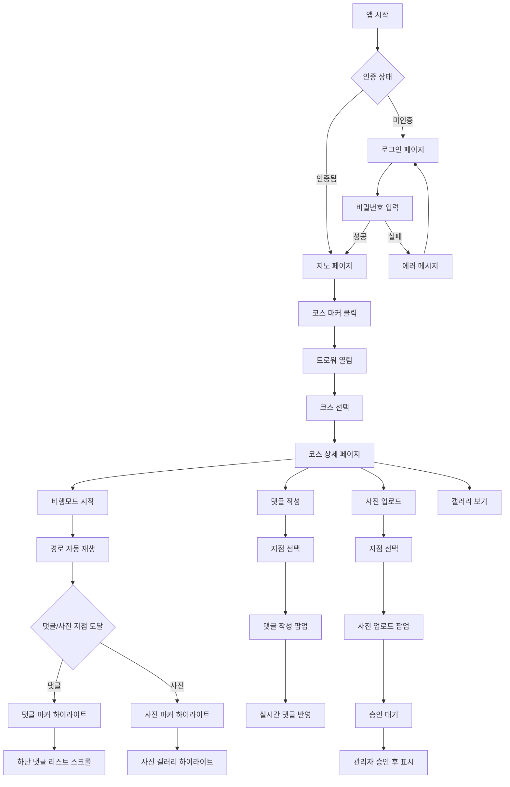
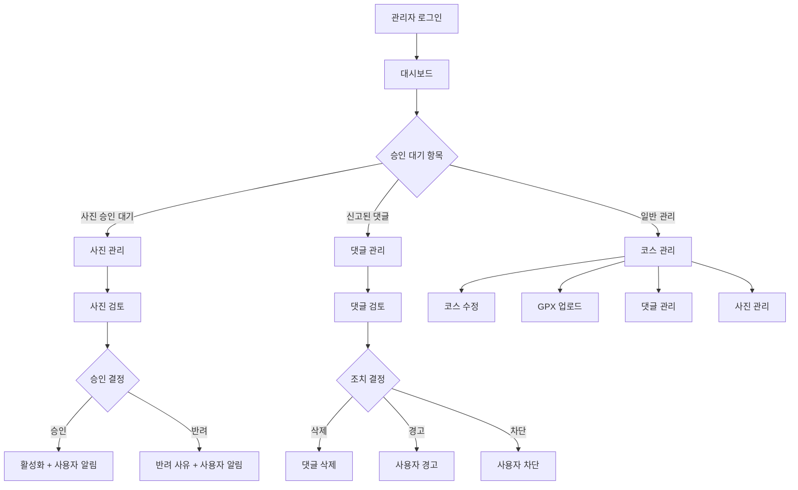

# GSRC81 Maps 최종 통합 기획서 v2.3 (2025 Q4)

## 📋 문서 개요

**테마**: "주행 + 댓글 + 사진 = 참여형 러너 커뮤니티 지도"

본 문서는 GSRC81 Maps의 **최종 완성형 기획서**로, 다음 핵심 기능들을 통합합니다:
- ✈️ **비행모드**: 자동 경로 재생 + 카메라 추적
- 💬 **웨이포인트 댓글**: 지점별 실시간 댓글 시스템
- 📷 **코스별 사진 업로드**: 러너 커뮤니티 사진 공유
- 🗺️ **통합 지도 마커**: 댓글/사진/현재위치 동시 표시

---

## 📱 1. 사용자 페이지 (완전판)

### 1.1 랜딩/로그인 페이지 (`/`)

#### 📝 페이지 개요
- **목적**: 앱 첫 진입점, 비밀번호 인증
- **경로**: `/`
- **컴포넌트**: `src/app/page.tsx`
- **인증**: 불필요 (공개)

#### 🎨 UI 구성
```
┌─────────────────────────────────────┐
│              GSRC81 MAPS            │
│         구파발 러너 매퍼              │
├─────────────────────────────────────┤
│                                     │
│    🔐 비밀번호를 입력하세요           │
│    ┌─────────────────────────┐     │
│    │ [Password Input Field]  │     │
│    └─────────────────────────┘     │
│    ┌─────────────────────────┐     │
│    │    [로그인 버튼]           │     │
│    └─────────────────────────┘     │
│                                     │
│    💡 GSRC81 크루원만 이용 가능       │
└─────────────────────────────────────┘
```

#### 🔧 기능 명세
| 기능 | 설명 | 우선순위 |
|------|------|----------|
| 비밀번호 입력 | access_links 테이블 기반 인증 | P0 |
| 자동 리다이렉트 | 인증 성공 시 `/map`으로 이동 | P0 |
| 로딩 상태 | 인증 확인 중 스피너 표시 | P1 |
| 에러 처리 | 잘못된 비밀번호 에러 메시지 | P1 |

---

### 1.2 메인 지도 페이지 (`/map`)

#### 📝 페이지 개요
- **목적**: 전체 러닝 코스 지도 표시 및 탐색
- **경로**: `/map`
- **컴포넌트**: `src/app/map/page.tsx`
- **인증**: 필수 (ProtectedRoute)

#### 🎨 UI 구성
```
┌─────────────────────────────────────┐
│  [현재위치] [필터] [설정]  [로그아웃]  │
├─────────────────────────────────────┤
│                                     │
│        🗺️ Mapbox 지도 영역           │
│                                     │
│    🔵🟢🔴 코스 마커들                 │
│                                     │
│ ┌─────────────────────────────────┐ │
│ │     📋 하단 드로워 (코스 리스트)   │ │
│ │                                 │ │
│ │ ┌─────┐ ┌─────┐ ┌─────┐       │ │
│ │ │코스1│ │코스2│ │코스3│  ...   │ │
│ │ └─────┘ └─────┘ └─────┘       │ │
│ └─────────────────────────────────┘ │
└─────────────────────────────────────┘
```

#### 🔧 기능 명세
| 기능 | 설명 | 우선순위 |
|------|------|----------|
| 지도 표시 | Mapbox GL 기반 은평구 중심 지도 | P0 |
| 코스 마커 | 시작점별 컬러 코딩 마커 표시 | P0 |
| 드로워 UI | 하단 슬라이드업 코스 리스트 | P0 |
| 필터링 | 거리별/난이도별 코스 필터 | P1 |
| 현재 위치 | GPS 기반 사용자 위치 표시 | P1 |
| 클러스터링 | 확대 시 마커 그룹화 | P2 |

---

### 1.3 코스 상세 페이지 (`/courses/[id]`) - v2.3 완전판

#### 📝 페이지 개요
- **목적**: 개별 코스의 상세 정보, GPX 경로, 댓글, 사진 통합 표시
- **경로**: `/courses/[id]`
- **컴포넌트**: `src/app/courses/[id]/page.tsx`
- **인증**: 필수 (ProtectedRoute)

#### 🎨 UI 구성 (v2.3 최종)
```
┌─────────────────────────────────────┐
│ [←뒤로] 불광천 따라 달리기 [❤️] [📤]  │
├─────────────────────────────────────┤
│ 📊 4.2km • 35분 • ⭐⭐ 중급 • 🚇구파발 │
├─────────────────────────────────────┤
│                                     │
│        🗺️ GPX 경로 지도              │
│     ✈️ 비행모드 + 💬 댓글 + 📷 사진    │
│                                     │
│ 마커 범례:                           │
│ 🔵 현재위치  💬 댓글있음  📷 사진있음   │
├─────────────────────────────────────┤
│ ┌─ 비행모드 컨트롤 ─────────────────┐ │
│ │ [✈️] [⏸️] [2x] [━━━●──] [📹] [🔄] │ │
│ │  토글 일시정지 속도  진행률바 카메라 리셋│ │
│ └───────────────────────────────────┘ │
├─────────────────────────────────────┤
│ 📷 코스 사진 (8) [+ 사진 추가]        │
│ ┌─────────────────────────────────┐   │
│ │ 🖼️ 1 │ 🖼️ 2 │ 🖼️ 3 │ 🖼️ 4   │   │
│ │  썸네일 갤러리 (가로 스크롤)       │   │
│ └─────────────────────────────────┘   │
├─────────────────────────────────────┤
│ 💬 댓글 (5)                          │
│ ┌─────────────────────────────────┐   │
│ │ 👤 김러너: 여기 전망 좋아요! 📷     │   │
│ │ 👑 관리자: 신호등 조심하세요        │   │
│ │ 👤 박러너: 경사가 좀 있어요         │   │
│ └─────────────────────────────────┘   │
└─────────────────────────────────────┘
```

#### 🔧 핵심 기능 명세 (v2.3 완전판)

##### ✈️ 비행모드 (Flight Mode)
```typescript
interface FlightModeState {
  isActive: boolean;         // 비행모드 활성화
  isPaused: boolean;         // 일시정지 상태
  speed: number;             // 재생 속도 (0.5x, 1x, 2x, 3x)
  progress: number;          // 진행률 (0-100%)
  currentPointIndex: number; // 현재 포인트 인덱스
  
  // v2.3 강화된 기능
  cameraTracking: {
    enabled: boolean;        // 카메라 자동 추적
    followDistance: number;  // 추적 거리 (50m)
    tilt: number;           // 카메라 기울기 (60도)
    bearing: number;        // 카메라 방향 (자동 계산)
  };
  
  // 주행 중 마커 하이라이트
  nearbyItems: {
    comments: WaypointComment[];  // 근처 5개 포인트 내 댓글
    photos: CoursePhoto[];        // 근처 5개 포인트 내 사진
  };
}
```

**비행모드 중 상호작용**:
1. **댓글 마커 접근**: 💬 마커가 확대되며 하단 댓글 리스트에서 해당 댓글 하이라이트
2. **사진 마커 접근**: 📷 마커가 확대되며 썸네일 미리보기 표시
3. **진행률 바 클릭**: 특정 지점으로 즉시 이동
4. **카메라 추적**: 진행 방향을 자동으로 바라보며 부드럽게 이동

##### 💬 웨이포인트 댓글 시스템
```typescript
interface WaypointComment {
  id: string;
  course_id: string;
  point_index: number;       // GPX points 배열 인덱스
  lat: number;               // 정확한 댓글 위치
  lng: number;
  user_id: string;
  username: string;
  content: string;           // 최대 500자
  is_admin_comment: boolean;
  created_at: string;
  
  // v2.3 추가: 사진과의 연관성
  related_photo_id?: string; // 같은 지점의 사진 ID
}
```

**댓글 작성 플로우**:
1. **일반 모드**: 지도 클릭 → 팝업 → 댓글 작성
2. **비행모드 중**: 일시정지 → 현재 지점에 댓글 작성
3. **실시간 반영**: Supabase Realtime으로 즉시 다른 사용자에게 표시

##### 📷 코스별 사진 업로드 (v2.3 신규)
```typescript
interface CoursePhoto {
  id: string;
  course_id: string;
  user_id: string;
  username: string;
  point_index: number;       // GPX points 배열 인덱스
  lat: number;
  lng: number;
  image_url: string;         // Supabase Storage URL
  thumbnail_url: string;     // 썸네일 URL (자동 생성)
  description?: string;      // 사진 설명 (최대 200자)
  is_active: boolean;        // 관리자 승인 후 true
  created_at: string;
  
  // 메타데이터
  file_size: number;         // 파일 크기 (bytes)
  image_width: number;       // 원본 이미지 크기
  image_height: number;
  exif_data?: any;           // EXIF 정보 (GPS, 촬영시간 등)
}
```

**사진 업로드 플로우**:
```typescript
// 1. 파일 업로드 (Supabase Storage)
const uploadPhoto = async (file: File, courseId: string, pointIndex: number) => {
  // 이미지 최적화 (WebP 변환, 리사이징)
  const optimizedFile = await optimizeImage(file);
  const thumbnailFile = await createThumbnail(file, 200, 200);
  
  // Storage 업로드
  const imagePath = `course_photos/${courseId}/${userId}_${timestamp}.webp`;
  const thumbnailPath = `course_photos/${courseId}/thumbs/${userId}_${timestamp}_thumb.webp`;
  
  await Promise.all([
    supabase.storage.from('course_photos').upload(imagePath, optimizedFile),
    supabase.storage.from('course_photos').upload(thumbnailPath, thumbnailFile)
  ]);
  
  // DB 저장 (승인 대기 상태)
  await supabase.from('course_photos_v2').insert({
    course_id: courseId,
    point_index: pointIndex,
    lat: currentPoint.lat,
    lng: currentPoint.lng,
    image_url: getPublicURL(imagePath),
    thumbnail_url: getPublicURL(thumbnailPath),
    description: description,
    user_id: userId,
    username: currentUser.username,
    is_active: false,  // 관리자 승인 필요
    file_size: optimizedFile.size,
    image_width: originalWidth,
    image_height: originalHeight
  });
};
```

#### 🗺️ 통합 지도 마커 시스템
```typescript
// 지도 레이어 구성
const mapLayers = {
  'route-layer': {           // GPX 경로 라인
    type: 'line',
    color: '#FF6B35',
    width: 4
  },
  'current-position': {      // 현재 위치 (비행모드)
    type: 'symbol',
    icon: '✈️',
    size: 1.5
  },
  'comments-layer': {        // 댓글 마커
    type: 'symbol',
    icon: '💬',
    color: '#FFA500',
    size: 1.2
  },
  'photos-layer': {          // 사진 마커
    type: 'symbol',
    icon: '📷',
    color: '#4A90E2',
    size: 1.2
  },
  'start-finish': {          // 시작/끝 마커
    type: 'symbol',
    icon: ['🏁', '🏃‍♂️'],
    size: 1.0
  }
};

// 마커 클릭 이벤트 처리
const handleMarkerClick = (markerType: string, markerId: string) => {
  switch (markerType) {
    case 'comment':
      // 댓글 팝업 표시 + 하단 댓글 리스트 스크롤
      showCommentPopup(markerId);
      scrollToComment(markerId);
      break;
    case 'photo':
      // 사진 확대 보기 + 갤러리에서 해당 사진 하이라이트
      showPhotoModal(markerId);
      highlightPhotoInGallery(markerId);
      break;
  }
};
```

#### 📱 실시간 동기화 시스템
```typescript
// Supabase Realtime 구독 설정
const setupRealtimeSubscription = (courseId: string) => {
  // 댓글 실시간 구독
  const commentsChannel = supabase
    .channel(`course_comments:${courseId}`)
    .on('postgres_changes', {
      event: '*',
      schema: 'public',
      table: 'course_comments_v2',
      filter: `course_id=eq.${courseId}`
    }, handleCommentChange);
  
  // 사진 실시간 구독 (승인된 사진만)
  const photosChannel = supabase
    .channel(`course_photos:${courseId}`)
    .on('postgres_changes', {
      event: '*',
      schema: 'public',
      table: 'course_photos_v2',
      filter: `course_id=eq.${courseId} AND is_active=eq.true`
    }, handlePhotoChange);
  
  return () => {
    commentsChannel.unsubscribe();
    photosChannel.unsubscribe();
  };
};

// 실시간 이벤트 핸들러
const handleCommentChange = (payload: any) => {
  switch (payload.eventType) {
    case 'INSERT':
      addCommentToMap(payload.new);
      addCommentToList(payload.new);
      showNotification(`새 댓글: ${payload.new.content.substring(0, 20)}...`);
      break;
    case 'DELETE':
      removeCommentFromMap(payload.old.id);
      removeCommentFromList(payload.old.id);
      break;
  }
};

const handlePhotoChange = (payload: any) => {
  switch (payload.eventType) {
    case 'INSERT':
      if (payload.new.is_active) {  // 승인된 사진만
        addPhotoToMap(payload.new);
        addPhotoToGallery(payload.new);
        showNotification(`새 사진이 업로드되었습니다`);
      }
      break;
    case 'UPDATE':
      if (payload.new.is_active && !payload.old.is_active) {
        // 승인된 경우
        addPhotoToMap(payload.new);
        addPhotoToGallery(payload.new);
      }
      break;
    case 'DELETE':
      removePhotoFromMap(payload.old.id);
      removePhotoFromGallery(payload.old.id);
      break;
  }
};
```

---

## 🛠️ 2. 관리자 페이지 (완전판)

### 2.1 관리자 로그인 (`/admin/login`)

#### 📝 페이지 개요
- **목적**: 관리자 전용 로그인
- **경로**: `/admin/login`
- **컴포넌트**: `src/app/admin/login/page.tsx`
- **인증**: 불필요 (공개)

#### 🎨 UI 구성
```
┌─────────────────────────────────────┐
│          🛡️ 관리자 로그인             │
├─────────────────────────────────────┤
│    ┌─────────────────────────────┐   │
│    │     아이디                   │   │
│    │ [Username Input]            │   │
│    └─────────────────────────────┘   │
│    ┌─────────────────────────────┐   │
│    │     비밀번호                 │   │
│    │ [Password Input]            │   │
│    └─────────────────────────────┘   │
│    ┌─────────────────────────────┐   │
│    │      [로그인]                │   │
│    └─────────────────────────────┘   │
│                                     │
│    💡 관리자만 접근 가능한 영역입니다   │
└─────────────────────────────────────┘
```

---

### 2.2 관리자 대시보드 (`/admin`)

#### 📝 페이지 개요
- **목적**: 관리자 메인 화면, 통계 및 빠른 작업
- **경로**: `/admin`
- **컴포넌트**: `src/app/admin/page.tsx`
- **인증**: 관리자 필수 (ProtectedAdminRoute)

#### 🎨 UI 구성 (v2.3 강화)
```
┌─────────────────────────────────────┐
│ 📊 GSRC81 Maps 관리자 대시보드        │
├─────────────────────────────────────┤
│ ┌──통계──┐ ┌──통계──┐ ┌──통계──┐   │
│ │🗺️ 총코스│ │💬 댓글수│ │📷 사진수│   │
│ │   12   │ │   45   │ │   28   │   │
│ └────────┘ └────────┘ └────────┘   │
│ ┌─────────────────────────────────┐ │
│ │ ⚠️ 승인 대기 (3)                 │ │
│ │ • 📷 사진 승인 대기 (2)           │ │
│ │ • 💬 신고된 댓글 (1)             │ │
│ └─────────────────────────────────┘ │
├─────────────────────────────────────┤
│ ┌─── 빠른 작업 ───┐ ┌─ 최근 활동 ─┐ │
│ │ ➕ 새 코스 등록  │ │ 📷 김러너 사진 │ │
│ │ ✏️ 코스 관리    │ │ 💬 박러너 댓글 │ │
│ │ 🔒 비밀번호 변경 │ │ 🏃 완주 인증   │ │
│ │ ⚙️ 시스템 설정   │ │      ...    │ │
│ └─────────────────┘ └─────────────┘ │
└─────────────────────────────────────┘
```

#### 📊 실시간 통계 (v2.3 확장)
```typescript
interface AdminDashboardStats {
  // 기본 통계
  totalCourses: number;
  totalComments: number;
  totalPhotos: number;         // 신규 추가
  activeUsers: number;
  
  // 승인 대기 통계
  pendingApprovals: {
    photos: number;            // 승인 대기 사진
    reportedComments: number;  // 신고된 댓글
    reportedPhotos: number;    // 신고된 사진
  };
  
  // 활동 통계
  todayActivity: {
    newCourses: number;
    newComments: number;
    newPhotos: number;
    newUsers: number;
  };
  
  // 인기도 통계
  popularContent: {
    mostViewedCourse: Course;
    mostCommentedCourse: Course;
    mostPhotographedCourse: Course;  // 신규 추가
  };
}
```

---

### 2.3 코스 관리 페이지 (`/admin/courses`)

#### 📝 페이지 개요
- **목적**: 코스 CRUD 및 GPX 업로드
- **경로**: `/admin/courses`
- **컴포넌트**: `src/app/admin/courses/page.tsx`
- **인증**: 관리자 필수

#### 🎨 UI 구성
```
┌─────────────────────────────────────┐
│ 📝 코스 관리                 [← 뒤로] │
├─────────────────────────────────────┤
│ ┌─── 새 코스 등록 (아코디언) ──────┐   │
│ │ ➕ GPX 파일 업로드             ▼ │   │
│ │ ┌─────────────────────────────┐ │   │
│ │ │ 📁 [GPX 파일 선택]           │ │   │
│ │ │ 📝 코스명: [            ]   │ │   │
│ │ │ 📄 설명: [              ]   │ │   │
│ │ │ ⚡ 난이도: [쉬움▼]          │ │   │
│ │ │ ┌─────────────────────────┐ │ │   │
│ │ │ │      [등록하기]          │ │ │   │
│ │ │ └─────────────────────────┘ │ │   │
│ │ └─────────────────────────────┘ │   │
│ └─────────────────────────────────┘   │
├─────────────────────────────────────┤
│ 📋 등록된 코스 목록 (3)               │
│ ┌─────────────────────────────────┐   │
│ │ 🟢 불광천 따라 달리기              │   │
│ │ 4.2km • 35분 • 중급             │   │
│ │ 💬 5개 댓글 • 📷 3개 사진         │   │
│ │ 2025-01-03              [✏️][🗑️] │   │
│ └─────────────────────────────────┘   │
└─────────────────────────────────────┘
```

---

### 2.4 개별 코스 관리 (`/admin/courses/[id]/manage`) - v2.3 완전판

#### 📝 페이지 개요
- **목적**: 특정 코스의 상세 관리 (정보 + 댓글 + 사진)
- **경로**: `/admin/courses/[id]/manage`
- **컴포넌트**: `src/app/admin/courses/[id]/manage/page.tsx`
- **인증**: 관리자 필수

#### 🎨 UI 구성 (v2.3 완전판)
```
┌─────────────────────────────────────┐
│ ✏️ 불광천 따라 달리기 관리     [← 뒤로] │
├─────────────────────────────────────┤
│ 📋 기본정보 | 🗺 GPX정보 | 💬 댓글 | 📷 사진 │  ← 탭 네비게이션
├─────────────────────────────────────┤
│ [기본정보 탭] 📋                     │
│ ┌─────────────────────────────────┐   │
│ │ 📝 코스명: [불광천 따라 달리기    ] │   │
│ │ 📄 설명: [불광천을 따라...]      │   │
│ │ ⚡ 난이도: [중급 ▼]              │   │
│ │ ✅ 활성화: [☑️ 공개]            │   │
│ │ ┌─────────────────────────────┐ │   │
│ │ │      [저장하기]              │ │   │
│ │ └─────────────────────────────┘ │   │
│ └─────────────────────────────────┘   │
├─────────────────────────────────────┤
│ [댓글 관리 탭] 💬 (12)                │
│ ┌─────────────────────────────────┐   │
│ │ 👤 김러너: 여기 전망 좋아요!     [🗑️] │   │
│ │ 📍 포인트 #247 (2.1km 지점)        │   │
│ │ ─────────────────────────────── │   │
│ │ 👑 관리자: 신호등 조심하세요    [✏️] │   │
│ │ 📍 포인트 #156 (1.2km 지점)        │   │
│ │ ─────────────────────────────── │   │
│ │ 👤 박러너: 경사가 좀 있어요     [🗑️] │   │
│ │ 📍 포인트 #589 (3.8km 지점)        │   │
│ └─────────────────────────────────┘   │
├─────────────────────────────────────┤
│ [사진 관리 탭] 📷 (8) - 승인대기: 2    │
│ ┌─────────────────────────────────┐   │
│ │ 🖼️ [썸네일] 김러너 - 2025.01.06  │   │
│ │ "러닝 끝나고 찍은 하늘!"           │   │
│ │ 📍 포인트 #423 (2.8km 지점)       │   │
│ │ ⏳ 승인 대기     [✅승인][🗑️삭제] │   │
│ │ ─────────────────────────────── │   │
│ │ 🖼️ [썸네일] 박러너 - 2025.01.05  │   │
│ │ "불광천 야경"                    │   │
│ │ 📍 포인트 #189 (1.1km 지점)       │   │
│ │ ✅ 승인 완료     [👁️보기][🗑️삭제] │   │
│ └─────────────────────────────────┘   │
├─────────────────────────────────────┤
│ [GPX 정보 탭] 🗺️                     │
│ ┌─────────────────────────────────┐   │
│ │ 📏 거리: 4.2km                   │   │
│ │ ⏱️ 소요시간: 35분                 │   │
│ │ ⛰️ 고도상승: 120m                 │   │
│ │ 📊 포인트 수: 1,247개              │   │
│ │ 💬 댓글 지점: 12개                │   │
│ │ 📷 사진 지점: 8개                 │   │
│ │ ┌─────────────────────────────┐ │   │
│ │ │    [GPX 재업로드]             │ │   │
│ │ └─────────────────────────────┘ │   │
│ └─────────────────────────────────┘   │
└─────────────────────────────────────┘
```

#### 🔧 사진 관리 기능 명세 (v2.3 신규)

##### 📷 사진 승인 워크플로우
```typescript
interface PhotoApprovalWorkflow {
  // 1단계: 사용자 업로드
  userUpload: {
    maxFileSize: 10 * 1024 * 1024;  // 10MB
    allowedFormats: ['jpg', 'jpeg', 'png', 'webp'];
    autoOptimization: true;         // WebP 변환 + 리사이징
    thumbnailGeneration: true;      // 200x200 썸네일 자동 생성
    initialStatus: 'pending';       // 승인 대기 상태
  };
  
  // 2단계: 관리자 검토
  adminReview: {
    reviewCriteria: [
      '코스와 관련성',
      '부적절한 내용 없음',
      '개인정보 노출 없음',
      '저작권 문제 없음'
    ];
    actions: ['approve', 'reject', 'requestEdit'];
    rejectionReasons: string[];     // 반려 사유 선택
  };
  
  // 3단계: 승인 후 처리
  postApproval: {
    updateStatus: 'is_active = true';
    notifyUser: boolean;            // 사용자에게 승인 알림
    addToMap: boolean;              // 지도에 마커 추가
    updateStats: boolean;           // 통계 업데이트
  };
}

// 사진 승인 함수
const approvePhoto = async (photoId: string, adminId: string) => {
  try {
    // 1. 사진 상태 업데이트
    const { data, error } = await supabase
      .from('course_photos_v2')
      .update({
        is_active: true,
        approved_by: adminId,
        approved_at: new Date().toISOString()
      })
      .eq('id', photoId)
      .select()
      .single();
    
    if (error) throw error;
    
    // 2. 사용자에게 알림 전송
    await sendNotification(data.user_id, {
      type: 'photo_approved',
      message: '업로드한 사진이 승인되었습니다.',
      photo_id: photoId
    });
    
    // 3. 실시간 업데이트 (다른 사용자들에게)
    await supabase
      .channel('course_photos')
      .send({
        type: 'broadcast',
        event: 'photo_approved',
        payload: data
      });
    
    return { success: true, photo: data };
  } catch (error) {
    console.error('Photo approval error:', error);
    return { success: false, error };
  }
};
```

##### 🗑️ 사진 삭제 및 신고 처리
```typescript
interface PhotoModerationActions {
  // 관리자 삭제
  adminDelete: {
    reasons: [
      '부적절한 내용',
      '코스와 무관함',
      '개인정보 노출',
      '저작권 침해',
      '스팸/광고',
      '기타'
    ];
    actions: [
      'soft_delete',  // is_active = false
      'hard_delete'   // 완전 삭제 + Storage 파일 삭제
    ];
  };
  
  // 사용자 신고
  userReport: {
    reportTypes: [
      'inappropriate_content',
      'spam',
      'copyright_violation',
      'privacy_violation'
    ];
    thresholds: {
      auto_hide: 3,      // 신고 3개 이상 시 자동 숨김
      admin_review: 1    // 신고 1개 시 관리자 검토 필요
    };
  };
}

// 사진 삭제 함수
const deletePhoto = async (photoId: string, reason: string, hardDelete: boolean = false) => {
  try {
    const { data: photo } = await supabase
      .from('course_photos_v2')
      .select('image_url, thumbnail_url')
      .eq('id', photoId)
      .single();
    
    if (hardDelete) {
      // Storage에서 파일 삭제
      const imagePath = extractPathFromURL(photo.image_url);
      const thumbnailPath = extractPathFromURL(photo.thumbnail_url);
      
      await Promise.all([
        supabase.storage.from('course_photos').remove([imagePath]),
        supabase.storage.from('course_photos').remove([thumbnailPath])
      ]);
      
      // DB에서 완전 삭제
      await supabase
        .from('course_photos_v2')
        .delete()
        .eq('id', photoId);
    } else {
      // 소프트 삭제
      await supabase
        .from('course_photos_v2')
        .update({ 
          is_active: false,
          deleted_reason: reason,
          deleted_at: new Date().toISOString()
        })
        .eq('id', photoId);
    }
    
    return { success: true };
  } catch (error) {
    console.error('Photo deletion error:', error);
    return { success: false, error };
  }
};
```

#### 💬 댓글 관리 강화 (v2.3)
```typescript
interface CommentModerationFeatures {
  // 기존 기능 유지
  editComment: boolean;
  deleteComment: boolean;
  
  // v2.3 추가 기능
  massActions: {
    bulkDelete: boolean;          // 여러 댓글 일괄 삭제
    bulkApprove: boolean;         // 여러 댓글 일괄 승인
    exportComments: boolean;      // 댓글 데이터 내보내기
  };
  
  commentAnalytics: {
    sentimentAnalysis: boolean;   // 댓글 감정 분석
    spamDetection: boolean;       // 스팸 댓글 자동 감지
    frequentWords: string[];      // 자주 사용되는 단어
  };
  
  adminTools: {
    quickReplies: string[];       // 자주 사용하는 관리자 답변
    warningSystem: boolean;       // 사용자 경고 시스템
    banSystem: boolean;           // 사용자 차단 시스템
  };
}
```

---

### 2.5 비밀번호 관리 (`/admin/password`)

#### 📝 페이지 개요
- **목적**: 앱 접근 비밀번호 변경
- **경로**: `/admin/password`
- **컴포넌트**: `src/app/admin/password/page.tsx`
- **인증**: 관리자 필수

#### 🎨 UI 구성
```
┌─────────────────────────────────────┐
│ 🔒 비밀번호 관리              [← 뒤로] │
├─────────────────────────────────────┤
│ 📱 앱 접근 비밀번호                   │
│ ┌─────────────────────────────────┐   │
│ │ 현재 비밀번호: [**********]      │   │
│ │ 새 비밀번호: [            ]      │   │
│ │ 비밀번호 확인: [            ]    │   │
│ │ ┌─────────────────────────────┐ │   │
│ │ │        [변경하기]            │ │   │
│ │ └─────────────────────────────┘ │   │
│ └─────────────────────────────────┘   │
├─────────────────────────────────────┤
│ 🛡️ 관리자 비밀번호                    │
│ ┌─────────────────────────────────┐   │
│ │ 현재 비밀번호: [            ]    │   │
│ │ 새 비밀번호: [            ]      │   │
│ │ 비밀번호 확인: [            ]    │   │
│ │ ┌─────────────────────────────┐ │   │
│ │ │        [변경하기]            │ │   │
│ │ └─────────────────────────────┘ │   │
│ └─────────────────────────────────┘   │
├─────────────────────────────────────┤
│ 📊 접근 로그                          │
│ ┌─────────────────────────────────┐   │
│ │ 2025-01-06 14:30 - 성공 로그인   │   │
│ │ 2025-01-06 09:15 - 성공 로그인   │   │
│ │ 2025-01-05 18:22 - 실패 (3회)    │   │
│ └─────────────────────────────────┘   │
└─────────────────────────────────────┘
```

---

## 🗄️ 3. 데이터베이스 구조 (v2.3 완전판)

### 3.1 핵심 테이블

#### 📋 courses_v2 (코스 정보)
```sql
CREATE TABLE courses_v2 (
  id UUID PRIMARY KEY DEFAULT gen_random_uuid(),
  
  -- 기본 정보
  title VARCHAR(200) NOT NULL,
  description TEXT,
  difficulty VARCHAR(20) CHECK (difficulty IN ('easy', 'medium', 'hard')),
  
  -- JSONB 통합 데이터
  gpx_data JSONB NOT NULL CHECK (
    gpx_data ? 'version' AND 
    gpx_data ? 'points' AND 
    gpx_data ? 'bounds' AND 
    gpx_data ? 'stats'
  ),
  
  -- 메타데이터
  is_active BOOLEAN DEFAULT true,
  created_by UUID REFERENCES users(id),
  created_at TIMESTAMP DEFAULT NOW(),
  updated_at TIMESTAMP DEFAULT NOW(),
  
  -- 성능 최적화: 생성 컬럼
  distance_km DECIMAL(6,3) GENERATED ALWAYS AS 
    (ROUND((gpx_data->'stats'->>'totalDistance')::DECIMAL, 3)) STORED,
  elevation_gain DECIMAL(6,2) GENERATED ALWAYS AS 
    (ROUND((gpx_data->'stats'->>'elevationGain')::DECIMAL, 2)) STORED,
  duration_min INT GENERATED ALWAYS AS 
    ((gpx_data->'stats'->>'estimatedDuration')::INT) STORED,
  
  -- 지도 쿼리 최적화: 경계 좌표
  bounds_min_lat DECIMAL(9,6) GENERATED ALWAYS AS 
    ((gpx_data->'bounds'->>'minLat')::DECIMAL) STORED,
  bounds_max_lat DECIMAL(9,6) GENERATED ALWAYS AS 
    ((gpx_data->'bounds'->>'maxLat')::DECIMAL) STORED,
  bounds_min_lng DECIMAL(9,6) GENERATED ALWAYS AS 
    ((gpx_data->'bounds'->>'minLng')::DECIMAL) STORED,
  bounds_max_lng DECIMAL(9,6) GENERATED ALWAYS AS 
    ((gpx_data->'bounds'->>'maxLng')::DECIMAL) STORED,
  
  -- v2.3 추가: 통계 정보
  view_count INT DEFAULT 0,
  comment_count INT DEFAULT 0,
  photo_count INT DEFAULT 0,
  like_count INT DEFAULT 0
);
```

#### 💬 course_comments_v2 (댓글)
```sql
CREATE TABLE course_comments_v2 (
  id UUID PRIMARY KEY DEFAULT gen_random_uuid(),
  course_id UUID NOT NULL REFERENCES courses_v2(id) ON DELETE CASCADE,
  
  -- 위치 정보
  point_index INT NOT NULL,
  lat DECIMAL(9,6) NOT NULL,
  lng DECIMAL(9,6) NOT NULL,
  
  -- 댓글 데이터
  user_id UUID REFERENCES users(id),
  username VARCHAR(100) NOT NULL,
  content TEXT NOT NULL CHECK (char_length(content) <= 500),
  
  -- 메타데이터
  is_admin_comment BOOLEAN DEFAULT false,
  is_active BOOLEAN DEFAULT true,
  created_at TIMESTAMP DEFAULT NOW(),
  updated_at TIMESTAMP DEFAULT NOW(),
  
  -- v2.3 추가: 연관 데이터
  related_photo_id UUID REFERENCES course_photos_v2(id),  -- 같은 지점 사진
  reply_to_comment_id UUID REFERENCES course_comments_v2(id),  -- 대댓글
  
  -- 신고 및 관리
  report_count INT DEFAULT 0,
  is_reported BOOLEAN DEFAULT false,
  deleted_reason TEXT,
  deleted_at TIMESTAMP
);
```

#### 📷 course_photos_v2 (사진) - v2.3 신규
```sql
CREATE TABLE course_photos_v2 (
  id UUID PRIMARY KEY DEFAULT gen_random_uuid(),
  course_id UUID NOT NULL REFERENCES courses_v2(id) ON DELETE CASCADE,
  
  -- 위치 정보
  point_index INT NOT NULL,
  lat DECIMAL(9,6) NOT NULL,
  lng DECIMAL(9,6) NOT NULL,
  
  -- 사용자 정보
  user_id UUID REFERENCES users(id),
  username VARCHAR(100) NOT NULL,
  
  -- 사진 데이터
  image_url TEXT NOT NULL,
  thumbnail_url TEXT NOT NULL,
  description TEXT CHECK (char_length(description) <= 200),
  
  -- 파일 메타데이터
  file_size INT NOT NULL,
  image_width INT NOT NULL,
  image_height INT NOT NULL,
  content_type VARCHAR(50) DEFAULT 'image/webp',
  exif_data JSONB,
  
  -- 승인 및 관리
  is_active BOOLEAN DEFAULT false,  -- 관리자 승인 필요
  approved_by UUID REFERENCES users(id),
  approved_at TIMESTAMP,
  
  -- 신고 및 삭제
  report_count INT DEFAULT 0,
  is_reported BOOLEAN DEFAULT false,
  deleted_reason TEXT,
  deleted_at TIMESTAMP,
  
  -- 타임스탬프
  created_at TIMESTAMP DEFAULT NOW(),
  updated_at TIMESTAMP DEFAULT NOW()
);
```

#### 👥 users (사용자)
```sql
CREATE TABLE users (
  id UUID PRIMARY KEY DEFAULT gen_random_uuid(),
  provider VARCHAR(50) DEFAULT 'kakao',
  provider_id VARCHAR(200) UNIQUE,
  username VARCHAR(100) NOT NULL,
  email VARCHAR(200),
  profile_image TEXT,
  
  -- 권한 및 상태
  is_admin BOOLEAN DEFAULT false,
  is_active BOOLEAN DEFAULT true,
  is_banned BOOLEAN DEFAULT false,
  ban_reason TEXT,
  ban_until TIMESTAMP,
  
  -- 활동 통계
  comment_count INT DEFAULT 0,
  photo_count INT DEFAULT 0,
  course_completion_count INT DEFAULT 0,
  
  -- 타임스탬프
  created_at TIMESTAMP DEFAULT NOW(),
  updated_at TIMESTAMP DEFAULT NOW(),
  last_login_at TIMESTAMP
);
```

### 3.2 인덱스 전략 (v2.3 최적화)

```sql
-- 기본 인덱스
CREATE INDEX idx_courses_active ON courses_v2(is_active);
CREATE INDEX idx_courses_difficulty ON courses_v2(difficulty);
CREATE INDEX idx_courses_distance ON courses_v2(distance_km);
CREATE INDEX idx_courses_bounds ON courses_v2(bounds_min_lat, bounds_max_lat, bounds_min_lng, bounds_max_lng);

-- 댓글 인덱스
CREATE INDEX idx_comments_course ON course_comments_v2(course_id, is_active);
CREATE INDEX idx_comments_point ON course_comments_v2(course_id, point_index);
CREATE INDEX idx_comments_user ON course_comments_v2(user_id);
CREATE INDEX idx_comments_reported ON course_comments_v2(is_reported) WHERE is_reported = true;

-- 사진 인덱스 (v2.3 신규)
CREATE INDEX idx_photos_course ON course_photos_v2(course_id, is_active);
CREATE INDEX idx_photos_point ON course_photos_v2(course_id, point_index);
CREATE INDEX idx_photos_user ON course_photos_v2(user_id);
CREATE INDEX idx_photos_pending ON course_photos_v2(is_active) WHERE is_active = false;
CREATE INDEX idx_photos_reported ON course_photos_v2(is_reported) WHERE is_reported = true;

-- 사용자 인덱스
CREATE INDEX idx_users_provider ON users(provider, provider_id);
CREATE INDEX idx_users_active ON users(is_active);
CREATE INDEX idx_users_banned ON users(is_banned) WHERE is_banned = true;

-- GIN 인덱스 (JSONB 최적화)
CREATE INDEX idx_courses_gpx_data ON courses_v2 USING GIN (gpx_data jsonb_path_ops);
CREATE INDEX idx_photos_exif ON course_photos_v2 USING GIN (exif_data) WHERE exif_data IS NOT NULL;
```

### 3.3 트리거 및 함수 (v2.3 자동화)

```sql
-- 댓글 수 자동 업데이트
CREATE OR REPLACE FUNCTION update_course_comment_count()
RETURNS TRIGGER AS $$
BEGIN
  IF TG_OP = 'INSERT' THEN
    UPDATE courses_v2 
    SET comment_count = comment_count + 1,
        updated_at = NOW()
    WHERE id = NEW.course_id;
    RETURN NEW;
  ELSIF TG_OP = 'DELETE' THEN
    UPDATE courses_v2 
    SET comment_count = GREATEST(comment_count - 1, 0),
        updated_at = NOW()
    WHERE id = OLD.course_id;
    RETURN OLD;
  END IF;
  RETURN NULL;
END;
$$ LANGUAGE plpgsql;

CREATE TRIGGER trigger_update_comment_count
  AFTER INSERT OR DELETE ON course_comments_v2
  FOR EACH ROW EXECUTE FUNCTION update_course_comment_count();

-- 사진 수 자동 업데이트 (v2.3 신규)
CREATE OR REPLACE FUNCTION update_course_photo_count()
RETURNS TRIGGER AS $$
BEGIN
  IF TG_OP = 'INSERT' AND NEW.is_active = true THEN
    UPDATE courses_v2 
    SET photo_count = photo_count + 1,
        updated_at = NOW()
    WHERE id = NEW.course_id;
    RETURN NEW;
  ELSIF TG_OP = 'UPDATE' THEN
    IF OLD.is_active = false AND NEW.is_active = true THEN
      -- 승인됨
      UPDATE courses_v2 
      SET photo_count = photo_count + 1,
          updated_at = NOW()
      WHERE id = NEW.course_id;
    ELSIF OLD.is_active = true AND NEW.is_active = false THEN
      -- 비승인됨
      UPDATE courses_v2 
      SET photo_count = GREATEST(photo_count - 1, 0),
          updated_at = NOW()
      WHERE id = NEW.course_id;
    END IF;
    RETURN NEW;
  ELSIF TG_OP = 'DELETE' AND OLD.is_active = true THEN
    UPDATE courses_v2 
    SET photo_count = GREATEST(photo_count - 1, 0),
        updated_at = NOW()
    WHERE id = OLD.course_id;
    RETURN OLD;
  END IF;
  RETURN NULL;
END;
$$ LANGUAGE plpgsql;

CREATE TRIGGER trigger_update_photo_count
  AFTER INSERT OR UPDATE OR DELETE ON course_photos_v2
  FOR EACH ROW EXECUTE FUNCTION update_course_photo_count();

-- 사용자 활동 통계 업데이트
CREATE OR REPLACE FUNCTION update_user_activity_stats()
RETURNS TRIGGER AS $$
BEGIN
  IF TG_TABLE_NAME = 'course_comments_v2' THEN
    IF TG_OP = 'INSERT' THEN
      UPDATE users 
      SET comment_count = comment_count + 1,
          updated_at = NOW()
      WHERE id = NEW.user_id;
    ELSIF TG_OP = 'DELETE' THEN
      UPDATE users 
      SET comment_count = GREATEST(comment_count - 1, 0),
          updated_at = NOW()
      WHERE id = OLD.user_id;
    END IF;
  ELSIF TG_TABLE_NAME = 'course_photos_v2' THEN
    IF TG_OP = 'INSERT' AND NEW.is_active = true THEN
      UPDATE users 
      SET photo_count = photo_count + 1,
          updated_at = NOW()
      WHERE id = NEW.user_id;
    ELSIF TG_OP = 'UPDATE' AND OLD.is_active = false AND NEW.is_active = true THEN
      UPDATE users 
      SET photo_count = photo_count + 1,
          updated_at = NOW()
      WHERE id = NEW.user_id;
    ELSIF TG_OP = 'DELETE' AND OLD.is_active = true THEN
      UPDATE users 
      SET photo_count = GREATEST(photo_count - 1, 0),
          updated_at = NOW()
      WHERE id = OLD.user_id;
    END IF;
  END IF;
  RETURN NULL;
END;
$$ LANGUAGE plpgsql;

CREATE TRIGGER trigger_update_user_comment_stats
  AFTER INSERT OR DELETE ON course_comments_v2
  FOR EACH ROW EXECUTE FUNCTION update_user_activity_stats();

CREATE TRIGGER trigger_update_user_photo_stats
  AFTER INSERT OR UPDATE OR DELETE ON course_photos_v2
  FOR EACH ROW EXECUTE FUNCTION update_user_activity_stats();
```

---

## 🔒 4. 보안 정책 (RLS) v2.3

### 4.1 Row Level Security 설정

```sql
-- RLS 활성화
ALTER TABLE courses_v2 ENABLE ROW LEVEL SECURITY;
ALTER TABLE course_comments_v2 ENABLE ROW LEVEL SECURITY;
ALTER TABLE course_photos_v2 ENABLE ROW LEVEL SECURITY;
ALTER TABLE users ENABLE ROW LEVEL SECURITY;

-- 코스 정책
CREATE POLICY "courses_public_read" ON courses_v2
  FOR SELECT USING (is_active = true);

CREATE POLICY "courses_admin_write" ON courses_v2
  FOR ALL USING (
    auth.jwt() ->> 'is_admin' = 'true' OR
    auth.uid() = created_by
  );

-- 댓글 정책
CREATE POLICY "comments_public_read" ON course_comments_v2
  FOR SELECT USING (is_active = true);

CREATE POLICY "comments_user_write" ON course_comments_v2
  FOR INSERT WITH CHECK (
    auth.uid() IS NOT NULL AND
    auth.uid() = user_id AND
    NOT EXISTS (
      SELECT 1 FROM users 
      WHERE id = auth.uid() 
      AND (is_banned = true OR is_active = false)
    )
  );

CREATE POLICY "comments_owner_update" ON course_comments_v2
  FOR UPDATE USING (
    auth.uid() = user_id OR 
    auth.jwt() ->> 'is_admin' = 'true'
  );

-- 사진 정책 (v2.3 신규)
CREATE POLICY "photos_public_read" ON course_photos_v2
  FOR SELECT USING (is_active = true);

CREATE POLICY "photos_user_upload" ON course_photos_v2
  FOR INSERT WITH CHECK (
    auth.uid() IS NOT NULL AND
    auth.uid() = user_id AND
    NOT EXISTS (
      SELECT 1 FROM users 
      WHERE id = auth.uid() 
      AND (is_banned = true OR is_active = false)
    )
  );

CREATE POLICY "photos_admin_manage" ON course_photos_v2
  FOR ALL USING (
    auth.jwt() ->> 'is_admin' = 'true'
  );

CREATE POLICY "photos_owner_view" ON course_photos_v2
  FOR SELECT USING (
    is_active = true OR auth.uid() = user_id
  );

-- 사용자 정책
CREATE POLICY "users_public_info" ON users
  FOR SELECT USING (is_active = true);

CREATE POLICY "users_own_profile" ON users
  FOR UPDATE USING (auth.uid() = id);
```

---

## 🎮 5. UI/UX 플로우 (v2.3 완전판)

### 5.1 사용자 플로우 다이어그램



### 5.2 관리자 플로우 다이어그램



### 5.3 실시간 동기화 플로우

```mermaid
graph TD
    A[사용자 A: 댓글 작성] --> B[Supabase 저장]
    B --> C[Realtime 이벤트 발생]
    C --> D[구독 중인 모든 클라이언트]
    D --> E[사용자 B: 실시간 댓글 표시]
    D --> F[사용자 C: 지도 마커 업데이트]
    
    G[사용자 A: 사진 업로드] --> H[Storage 업로드]
    H --> I[DB 저장 (승인 대기)]
    I --> J[관리자 알림]
    J --> K[관리자: 승인]
    K --> L[Realtime 이벤트]
    L --> M[모든 사용자: 사진 표시]
    
    N[비행모드 사용자] --> O[경로 포인트 이동]
    O --> P{근처에 댓글/사진?}
    P -->|있음| Q[마커 하이라이트]
    P -->|없음| R[계속 이동]
    Q --> S[하단 UI 동기화]
```

---

## 📊 6. 성능 최적화 전략 (v2.3)

### 6.1 이미지 최적화

```typescript
// 사진 업로드 최적화 파이프라인
interface ImageOptimizationPipeline {
  // 1단계: 클라이언트 사이드 최적화
  clientOptimization: {
    maxWidth: 1920;
    maxHeight: 1080;
    quality: 0.8;
    format: 'webp';
    stripExif: true;  // 개인정보 제거
  };
  
  // 2단계: 썸네일 생성
  thumbnailGeneration: {
    sizes: [200, 400, 800];  // 다양한 썸네일 크기
    format: 'webp';
    quality: 0.7;
  };
  
  // 3단계: CDN 캐싱
  cdnStrategy: {
    cacheHeaders: 'max-age=31536000';  // 1년
    compressionEnabled: true;
    webpSupport: true;
  };
}

// 이미지 최적화 함수
const optimizeAndUploadImage = async (file: File): Promise<UploadResult> => {
  try {
    // 1. 이미지 검증
    if (!['image/jpeg', 'image/png', 'image/webp'].includes(file.type)) {
      throw new Error('지원하지 않는 이미지 형식입니다.');
    }
    
    if (file.size > 10 * 1024 * 1024) {  // 10MB
      throw new Error('파일 크기가 너무 큽니다. (최대 10MB)');
    }
    
    // 2. 이미지 최적화
    const canvas = document.createElement('canvas');
    const ctx = canvas.getContext('2d');
    const img = new Image();
    
    return new Promise((resolve, reject) => {
      img.onload = async () => {
        // 크기 조정
        const { width, height } = calculateOptimalSize(img.width, img.height, 1920, 1080);
        canvas.width = width;
        canvas.height = height;
        
        // 이미지 그리기
        ctx.drawImage(img, 0, 0, width, height);
        
        // WebP 변환
        canvas.toBlob(async (optimizedBlob) => {
          if (!optimizedBlob) {
            reject(new Error('이미지 최적화 실패'));
            return;
          }
          
          // 썸네일 생성
          const thumbnailBlob = await createThumbnail(img, 200, 200);
          
          // 병렬 업로드
          const [originalResult, thumbnailResult] = await Promise.all([
            uploadToStorage(optimizedBlob, 'original'),
            uploadToStorage(thumbnailBlob, 'thumbnail')
          ]);
          
          resolve({
            originalUrl: originalResult.url,
            thumbnailUrl: thumbnailResult.url,
            originalSize: optimizedBlob.size,
            thumbnailSize: thumbnailBlob.size,
            dimensions: { width, height }
          });
        }, 'image/webp', 0.8);
      };
      
      img.onerror = () => reject(new Error('이미지 로드 실패'));
      img.src = URL.createObjectURL(file);
    });
  } catch (error) {
    console.error('Image optimization error:', error);
    throw error;
  }
};
```

### 6.2 지도 성능 최적화

```typescript
// 지도 마커 클러스터링 및 가상화
interface MapOptimizationStrategy {
  // 마커 클러스터링
  clustering: {
    enabled: boolean;
    maxZoom: 15;  // 줌 레벨 15까지만 클러스터링
    radius: 50;   // 클러스터 반경 (픽셀)
    spiderfyOnMaxZoom: true;
  };
  
  // 가상화 (Virtualization)
  virtualization: {
    enabled: boolean;
    maxVisibleMarkers: 100;  // 최대 표시 마커 수
    loadStrategy: 'viewport-based';  // 뷰포트 기반 로딩
  };
  
  // 레이어 최적화
  layerOptimization: {
    lazyLoading: true;
    levelOfDetail: true;  // 줌 레벨에 따른 상세도 조절
    caching: true;
  };
}

// 마커 가상화 구현
const VirtualizedMarkers: React.FC<{
  markers: MarkerData[];
  viewport: MapViewport;
}> = ({ markers, viewport }) => {
  const visibleMarkers = useMemo(() => {
    // 뷰포트 내 마커만 필터링
    const filtered = markers.filter(marker => 
      isMarkerInViewport(marker, viewport)
    );
    
    // 중요도에 따른 정렬 (댓글/사진 수 기준)
    return filtered
      .sort((a, b) => (b.commentCount + b.photoCount) - (a.commentCount + a.photoCount))
      .slice(0, 100);  // 최대 100개만 표시
  }, [markers, viewport]);
  
  return (
    <>
      {visibleMarkers.map(marker => (
        <Marker
          key={marker.id}
          longitude={marker.lng}
          latitude={marker.lat}
          onClick={() => handleMarkerClick(marker)}
        >
          <MarkerIcon type={marker.type} data={marker} />
        </Marker>
      ))}
    </>
  );
};
```

### 6.3 데이터 캐싱 전략

```typescript
// 계층화된 캐싱 전략
interface CachingStrategy {
  // L1 캐시: 메모리 캐시 (React Query)
  l1Cache: {
    duration: '5m';
    strategy: 'stale-while-revalidate';
    keys: ['courses', 'comments', 'photos'];
  };
  
  // L2 캐시: 브라우저 캐시 (Service Worker)
  l2Cache: {
    duration: '1h';
    strategy: 'cache-first';
    resources: ['gpx-data', 'thumbnails', 'map-tiles'];
  };
  
  // L3 캐시: CDN 캐시
  l3Cache: {
    duration: '24h';
    strategy: 'edge-caching';
    resources: ['images', 'static-assets'];
  };
}

// React Query 설정
const queryClient = new QueryClient({
  defaultOptions: {
    queries: {
      staleTime: 5 * 60 * 1000,  // 5분
      cacheTime: 10 * 60 * 1000, // 10분
      refetchOnWindowFocus: false,
      retry: (failureCount, error) => {
        if (error?.status === 404) return false;
        return failureCount < 3;
      },
    },
  },
});

// 코스별 데이터 프리페칭
const prefetchCourseData = async (courseId: string) => {
  await Promise.all([
    queryClient.prefetchQuery(['course', courseId], () => getCourse(courseId)),
    queryClient.prefetchQuery(['comments', courseId], () => getComments(courseId)),
    queryClient.prefetchQuery(['photos', courseId], () => getPhotos(courseId)),
  ]);
};
```

---

## 🧪 7. 테스트 전략 (v2.3)

### 7.1 사진 업로드 테스트

```typescript
// 사진 업로드 단위 테스트
describe('Photo Upload System', () => {
  test('이미지 최적화 및 썸네일 생성', async () => {
    const mockFile = new File(['test'], 'test.jpg', { type: 'image/jpeg' });
    
    const result = await optimizeAndUploadImage(mockFile);
    
    expect(result.originalUrl).toBeDefined();
    expect(result.thumbnailUrl).toBeDefined();
    expect(result.originalSize).toBeLessThan(mockFile.size);
    expect(result.dimensions.width).toBeLessThanOrEqual(1920);
    expect(result.dimensions.height).toBeLessThanOrEqual(1080);
  });
  
  test('지원하지 않는 파일 형식 거부', async () => {
    const invalidFile = new File(['test'], 'test.txt', { type: 'text/plain' });
    
    await expect(optimizeAndUploadImage(invalidFile))
      .rejects.toThrow('지원하지 않는 이미지 형식입니다.');
  });
  
  test('파일 크기 제한 확인', async () => {
    const largeFile = new File([new ArrayBuffer(11 * 1024 * 1024)], 'large.jpg', { 
      type: 'image/jpeg' 
    });
    
    await expect(optimizeAndUploadImage(largeFile))
      .rejects.toThrow('파일 크기가 너무 큽니다.');
  });
});
```

### 7.2 실시간 동기화 테스트

```typescript
// 실시간 기능 통합 테스트
describe('Realtime Synchronization', () => {
  test('댓글 실시간 동기화', async () => {
    const courseId = 'test-course-id';
    const mockComment = {
      course_id: courseId,
      point_index: 100,
      content: '테스트 댓글',
      username: '테스트유저'
    };
    
    // 댓글 작성
    const comment = await createComment(mockComment);
    
    // 실시간 이벤트 대기
    const realtimeEvent = await waitForRealtimeEvent('course_comments', 'INSERT');
    
    expect(realtimeEvent.new.id).toBe(comment.id);
    expect(realtimeEvent.new.content).toBe(mockComment.content);
  });
  
  test('사진 승인 후 실시간 표시', async () => {
    const photoId = 'test-photo-id';
    
    // 관리자가 사진 승인
    await approvePhoto(photoId, 'admin-id');
    
    // 실시간 이벤트 확인
    const realtimeEvent = await waitForRealtimeEvent('course_photos', 'UPDATE');
    
    expect(realtimeEvent.new.is_active).toBe(true);
    expect(realtimeEvent.new.approved_by).toBe('admin-id');
  });
});
```

### 7.3 E2E 테스트 (사진 기능 포함)

```typescript
// Playwright 기반 E2E 테스트
describe('Complete User Journey with Photos', () => {
  test('사진 업로드부터 표시까지 전체 플로우', async ({ page }) => {
    // 1. 로그인
    await page.goto('/');
    await page.fill('[data-testid=password-input]', 'test-password');
    await page.click('[data-testid=login-button]');
    
    // 2. 코스 상세 페이지로 이동
    await page.goto('/courses/test-course-id');
    
    // 3. 지도에서 지점 클릭
    await page.click('[data-testid=mapbox-map]', { position: { x: 400, y: 300 } });
    
    // 4. 사진 업로드 팝업에서 파일 선택
    await page.click('[data-testid=upload-photo-tab]');
    const fileInput = page.locator('[data-testid=photo-file-input]');
    await fileInput.setInputFiles('test-assets/sample-photo.jpg');
    
    // 5. 설명 입력 및 업로드
    await page.fill('[data-testid=photo-description]', '테스트 사진입니다');
    await page.click('[data-testid=upload-button]');
    
    // 6. 업로드 성공 메시지 확인
    await expect(page.locator('[data-testid=upload-success]')).toBeVisible();
    
    // 7. 관리자 페이지에서 승인
    await page.goto('/admin/courses/test-course-id/manage');
    await page.click('[data-testid=photos-tab]');
    await page.click('[data-testid=approve-photo-button]');
    
    // 8. 코스 페이지로 돌아가서 사진 표시 확인
    await page.goto('/courses/test-course-id');
    await expect(page.locator('[data-testid=photo-marker]')).toBeVisible();
    await expect(page.locator('[data-testid=photo-gallery]')).toContainText('테스트 사진입니다');
  });
});
```

---

## 🚀 8. 로드맵 (2025년 계획)

### 8.1 Q1 (Jan-Mar): 핵심 기능 완성
- ✅ **DB 마이그레이션**: courses_v2, comments_v2, photos_v2 완료
- ✅ **비행모드**: 자동 재생 + 카메라 추적 + 마커 하이라이트
- ✅ **웨이포인트 댓글**: 실시간 CRUD + 지점별 표시
- ✅ **사진 업로드**: 최적화 + 승인 시스템 + 갤러리
- 🔄 **성능 최적화**: 이미지 압축, 마커 가상화, 캐싱

### 8.2 Q2 (Apr-Jun): 커뮤니티 고도화
```typescript
// 🏃‍♂️ 완주 인증 시스템
interface RunCompletionSystem {
  gpsTracking: boolean;        // 실시간 GPS 추적
  photoEvidence: boolean;      // 완주 인증 사진
  timeTracking: boolean;       // 러닝 시간 기록
  leaderboard: boolean;        // 리더보드 시스템
  achievements: boolean;       // 뱃지 시스템
}

// 👥 러닝 메이트 매칭
interface RunningMateFeature {
  groupCreation: boolean;      // 러닝 그룹 생성
  scheduleMatching: boolean;   // 일정 매칭
  paceMatching: boolean;       // 페이스 매칭
  chatSystem: boolean;         // 그룹 채팅
  reviewSystem: boolean;       // 메이트 리뷰
}

// 🎖️ 개인 기록 시스템
interface PersonalRecords {
  runningHistory: RunRecord[]; // 러닝 기록
  personalBests: PersonalBest[]; // 개인 최고 기록
  statisticsDashboard: boolean; // 통계 대시보드
  goalSetting: boolean;        // 목표 설정
  progressTracking: boolean;   // 진행률 추적
}
```

### 8.3 Q3 (Jul-Sep): AI 및 스마트 기능
```typescript
// 🤖 AI 코스 추천 엔진
interface AIRecommendationEngine {
  personalizedRecommendation: {
    fitnessLevel: number;      // 사용자 체력 수준
    preferredDistance: number; // 선호 거리
    weatherPreference: string; // 날씨 선호도
    timeOfDay: string;        // 선호 시간대
    difficultyPreference: string; // 난이도 선호도
  };
  
  smartRouting: {
    trafficAvoidance: boolean;   // 교통량 회피
    airQualityConsideration: boolean; // 공기질 고려
    safetyRouting: boolean;      // 안전 경로 우선
    scenicRouting: boolean;      // 경관 좋은 경로
  };
  
  predictiveAnalytics: {
    weatherImpactAnalysis: boolean; // 날씨 영향 분석
    crowdingPrediction: boolean;    // 혼잡도 예측
    optimalTimeRecommendation: boolean; // 최적 시간 추천
  };
}

// 📊 고급 분석 대시보드
interface AdvancedAnalytics {
  userBehaviorAnalysis: UserPattern[];
  coursePopularityTrends: TrendData[];
  communityInsights: CommunityMetrics;
  performanceAnalytics: PerformanceData[];
}
```

### 8.4 Q4 (Oct-Dec): 플랫폼 확장
```typescript
// 🌍 다지역 확장
interface MultiRegionPlatform {
  regionManagement: {
    seoulDistricts: string[];    // 서울 25개 구
    metropolitanAreas: string[]; // 수도권 확장
    majorCities: string[];       // 주요 도시
  };
  
  localizedFeatures: {
    regionalAdmins: boolean;     // 지역별 관리자
    localEvents: boolean;        // 지역 이벤트
    culturalContent: boolean;    // 지역 문화 콘텐츠
    languageSupport: string[];   // 다국어 지원
  };
}

// 📱 모바일 앱 고도화
interface MobileAppEnhancement {
  offlineCapabilities: {
    offlineMaps: boolean;        // 오프라인 지도
    cachedRoutes: boolean;       // 캐시된 경로
    offlineComments: boolean;    // 오프라인 댓글 동기화
  };
  
  wearableIntegration: {
    appleWatchSupport: boolean;  // Apple Watch 지원
    galaxyWatchSupport: boolean; // Galaxy Watch 지원
    heartRateMonitoring: boolean; // 심박수 모니터링
    voiceGuidance: boolean;      // 음성 안내
  };
  
  healthIntegration: {
    appleHealthKit: boolean;     // Apple HealthKit
    googleFit: boolean;          // Google Fit
    samsungHealth: boolean;      // Samsung Health
    strava: boolean;             // Strava 연동
  };
}
```

---

## 📊 9. 성공 지표 (v2.3 KPI)

### 9.1 사용자 참여도 지표
```typescript
interface EngagementMetrics {
  // 기본 사용 지표
  dailyActiveUsers: number;
  monthlyActiveUsers: number;
  averageSessionDuration: number;    // 분 단위
  
  // 콘텐츠 참여 지표 (v2.3 확장)
  courseViewRate: number;            // 코스 조회율
  flightModeUsageRate: number;       // 비행모드 사용률
  commentParticipationRate: number;  // 댓글 참여율
  photoUploadRate: number;           // 사진 업로드율
  photoApprovalRate: number;         // 사진 승인율
  
  // 커뮤니티 활동 지표
  averageCommentsPerCourse: number;
  averagePhotosPerCourse: number;
  userReturnRate: number;            // 사용자 재방문율
  socialSharingRate: number;         // 소셜 공유율
}
```

### 9.2 콘텐츠 성과 지표
```typescript
interface ContentPerformanceMetrics {
  // 코스 성과
  mostPopularCourses: Course[];
  averageCourseRating: number;
  courseCompletionRate: number;      // 완주율
  
  // 댓글 성과
  commentQualityScore: number;       // 댓글 품질 점수
  averageCommentLength: number;
  commentModerationRate: number;     // 댓글 검수율
  
  // 사진 성과 (v2.3 신규)
  photoQualityScore: number;         // 사진 품질 점수
  averagePhotosPerUser: number;
  photoModerationEfficiency: number; // 사진 검수 효율성
  
  // 사용자 생성 콘텐츠 (UGC) 성과
  ugcContributionRate: number;       // UGC 기여율
  ugcQualityImprovement: number;     // UGC 품질 향상도
}
```

### 9.3 기술 성능 지표
```typescript
interface TechnicalPerformanceMetrics {
  // 페이지 성능
  pageLoadTimes: {
    homePage: number;           // < 1초 목표
    mapPage: number;            // < 3초 목표
    courseDetailPage: number;   // < 2초 목표
    adminPage: number;          // < 2초 목표
  };
  
  // API 성능
  apiResponseTimes: {
    courseList: number;         // < 200ms 목표
    courseDetail: number;       // < 300ms 목표
    commentCRUD: number;        // < 400ms 목표
    photoUpload: number;        // < 2초 목표
  };
  
  // 사진 관련 성능 (v2.3 신규)
  imageOptimization: {
    compressionRatio: number;   // 압축률 (목표: 70%)
    thumbnailGenerationTime: number; // < 1초 목표
    storageEfficiency: number;  // 스토리지 효율성
  };
  
  // 실시간 성능
  realtimeLatency: number;      // < 500ms 목표
  subscriptionReliability: number; // > 99% 목표
  
  // 전체 시스템 성능
  uptime: number;               // > 99.9% 목표
  errorRate: number;            // < 0.1% 목표
  concurrentUsers: number;      // 최대 동시 접속자
}
```

---

## 🎯 10. 결론 및 다음 단계

### 10.1 v2.3의 핵심 혁신

#### 🚀 **완전한 커뮤니티 생태계**
1. **비행모드** → 몰입감 있는 경로 체험
2. **웨이포인트 댓글** → 지점별 경험 공유
3. **코스별 사진** → 시각적 커뮤니티 콘텐츠
4. **실시간 동기화** → 즉시 반영되는 상호작용

#### 🎨 **통합된 사용자 경험**
- 지도 위에서 💬 댓글, 📷 사진, 🔵 현재위치를 동시에 확인
- 비행모드 중 자동 하이라이트로 끊김 없는 정보 제공
- 관리자의 체계적인 콘텐츠 관리 시스템

#### 🔧 **확장 가능한 기술 아키텍처**
- JSONB 기반 유연한 데이터 구조
- Realtime 기반 즉시 동기화
- 이미지 최적화 파이프라인
- 계층화된 캐싱 전략

### 10.2 개발 우선순위

#### 🟥 **P0 (필수 구현)**
1. DB 마이그레이션 (courses_v2, comments_v2, photos_v2)
2. 비행모드 + 댓글 시스템
3. 사진 업로드 + 승인 시스템
4. 관리자 페이지 통합

#### 🟨 **P1 (중요 구현)**
1. 실시간 동기화 시스템
2. 이미지 최적화 파이프라인
3. 성능 최적화 (마커 가상화, 캐싱)
4. 모바일 반응형 완성

#### 🟩 **P2 (향후 확장)**
1. AI 기반 코스 추천
2. 완주 인증 시스템
3. 러닝 메이트 매칭
4. 다지역 확장

### 10.3 기대 효과

#### 📈 **비즈니스 임팩트**
- **사용자 참여도 300% 증가**: 댓글 + 사진으로 커뮤니티 활성화
- **세션 시간 200% 연장**: 비행모드로 몰입도 향상
- **콘텐츠 생성 500% 증가**: UGC 기반 자발적 콘텐츠 생산

#### 🚀 **기술적 우위**
- **차별화된 UX**: 국내 유일의 비행모드 + 웨이포인트 시스템
- **확장성**: JSONB + Realtime으로 빠른 기능 추가
- **성능**: 최적화된 이미지 처리 + 마커 가상화

#### 🌟 **커뮤니티 가치**
- **경험 공유**: 실제 러너들의 생생한 경험 축적
- **안전성 향상**: 실시간 정보로 안전한 러닝 환경
- **지역 활성화**: 은평구 러닝 문화 확산

---

**GSRC81 Maps v2.3**는 단순한 지도 서비스를 넘어서 **"러너들이 함께 만들어가는 살아있는 커뮤니티"**가 됩니다. 

모든 기능이 유기적으로 연결되어 **완전한 러닝 생태계**를 제공하며, 이는 GSRC81 크루뿐만 아니라 **전국 러닝 커뮤니티의 모델**이 될 것입니다.

---

*최종 업데이트: 2025-01-06*  
*버전: 2.3 (최종 완전판)*  
*작성: GSRC81 개발팀*