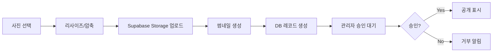

# GSRC81 Maps 최종 통합 기획서 v3.0 (2025)

## 📋 문서 개요

**슬로건**: "RUN OUR ROUTE, MAKE YOUR STORY"  
**테마**: "주행 + 댓글 + 사진 = 참여형 러너 커뮤니티 지도"

본 문서는 GSRC81 Maps의 **공식 디자인 기획서(GSRCmaps2.pdf)를 반영한 최종 통합 기획서**입니다.

### 핵심 기능
- ✈️ **비행모드**: 자동 경로 재생 + 카메라 추적 (말풍선은 비행모드에서만 표시)
- 💬 **웨이포인트 댓글**: 지점별 실시간 댓글 시스템
- 📷 **코스별 사진 업로드**: 러너 커뮤니티 사진 공유
- 🗺️ **통합 지도 마커**: 댓글/사진/현재위치 동시 표시
- 🎨 **다크 모던 디자인**: 집중과 성취를 위한 네온 포인트

---

## 🎨 디자인 시스템 (다크 모던 테마)

### 컨셉
- **키워드**: 집중감, 기록, 야간 러닝, 네온 포인트
- **테마**: 다크 모던 (집중/성취)

### 컬러 팔레트
```css
/* Primary Colors */
--primary: #0E1A2B;        /* Deep Navy */
--surface: #101218;        /* Dark Surface */
--on-surface: #E8EDF5;     /* Light Text on Dark */

/* Accent Colors */
--accent-1: #B8FF3A;       /* Neon Lime - 시작점/활성상태 */
--accent-2: #FF6F3D;       /* Signal Orange - 종료점/강조 */

/* UI Elements */
--divider: #2A2F3A;        /* Subtle Divider */
--error: #FF5252;          /* Error State */
--success: #4CAF50;        /* Success State */
```

### 타이포그래피
```css
/* Headings */
font-family: 'SUIT', 'Pretendard', sans-serif;
font-weight: 700;

/* Body Text */
font-family: 'Noto Sans KR', 'Inter', sans-serif;
font-weight: 400, 500;

/* Size Scale */
--text-xs: 12px;
--text-sm: 14px;
--text-base: 16px;
--text-lg: 18px;
--text-xl: 20px;
--text-2xl: 24px;
```

### 컴포넌트 규칙
- **버튼**: Filled(Primary) / Tonal(Accent-1) / Ghost(Outline=#2A2F3A)
- **칩/배지**: Rounded 16px, 라벨 12-14px, 상태색 Accent-1/Accent-2
- **카드**: Elevation 2 (blur 8px, y=8px, α=18%), Radius 16px
- **바텀시트**: 상단 Radius 24px, 드래그 핸들 표시

### 지도 오버레이
- **루트 라인**: #FF6F3D, width: 4.5px @ 1× 줌 (줌에 따라 4.5-7px 스케일)
- **스타트 핀**: Fill #B8FF3A, 아이콘 #0E1A2B
- **엔드 핀**: Fill #FF6F3D, 아이콘 #101218
- **말풍선**: Surface Dark + On-Surface, drop-shadow subtle (비행모드 전용)
- **클러스터링**: 지도 확대 시에도 스타트 지점이 뭉쳐 보이도록 범위 확장

### 모션/애니메이션
- **페이지 전환**: 240ms fade+scale(0.98→1.0)
- **바텀시트**: 300ms ease-out slide-up
- **마커 호버**: 120ms scale(1.0→1.1)
- **크루 애니메이션**: 랜딩 페이지 브랜드 모션 (협의 필요)

---

## 📱 1. 사용자 페이지 (5개 핵심 화면)

### 1.1 랜딩 페이지 (`/`)

#### 📝 페이지 개요
- **목적**: GSRC81 브랜드 소개 및 첫 진입점
- **경로**: `/`
- **컴포넌트**: `src/app/page.tsx`
- **인증**: 불필요 (공개)

#### 🎨 디자인 요구사항
```
┌─────────────────────────────────────┐
│                                     │
│         GSRC81 MAPS                 │
│                                     │
│          [크루 애니메이션]            │
│                                     │
│     RUN OUR ROUTE,                  │
│     MAKE YOUR STORY.                 │
│                                     │
│    구파발 러너 매퍼                   │
│    은평구 러닝 코스를 찾아보세요        │
│                                     │
│         •••                          │
│                                     │
└─────────────────────────────────────┘
```

#### 🔧 기능 명세
| 기능 | 설명 | 우선순위 |
|------|------|----------|
| 크루 애니메이션 | GSRC81 브랜드 모션 그래픽 | P0 |
| 슬로건 표시 | "RUN OUR ROUTE, MAKE YOUR STORY" | P0 |
| 자동 진입 | 3초 후 로그인 화면 전환 | P1 |

---

### 1.2 로그인 페이지 (`/login`)

#### 📝 페이지 개요
- **목적**: 사용자 인증 및 접근 제어
- **경로**: `/login`
- **컴포넌트**: `src/app/login/page.tsx`
- **인증**: 불필요 (공개)

#### 🎨 디자인 요구사항
```
┌─────────────────────────────────────┐
│              GSRC81 Maps            │
│                                     │
│    한남 크루 전용 서비스              │
│    비밀번호를 입력하여 접속해주세요     │
│                                     │
│    비밀번호                          │
│    ┌─────────────────────────┐     │
│    │ 크루 전용 비밀번호         │     │
│    └─────────────────────────┘     │
│                                     │
│    [접속하기]                        │
│                                     │
│    ─────── 또는 ───────              │
│                                     │
│    [🗨 카카오톡 로그인]              │
│                                     │
│    GSRC81 러닝 크루원만 접속 가능합니다  │
│    [관리자 로그인]                    │
└─────────────────────────────────────┘
```

#### 🔧 기능 명세
| 기능 | 설명 | 우선순위 |
|------|------|----------|
| 비밀번호 입력 | access_links 테이블 기반 인증 | P0 |
| 관리자 로그인 | 별도 관리자 인증 모달 | P0 |
| 카카오톡 연동 | OAuth 소셜 로그인 (준비중) | P2 |

---

### 1.3 전체 맵 페이지 (`/map`)

#### 📝 페이지 개요
- **목적**: 전체 러닝 코스 지도 표시 및 탐색
- **경로**: `/map`
- **컴포넌트**: `src/app/map/page.tsx`
- **인증**: 필수 (ProtectedRoute)

#### 🎨 디자인 요구사항
```
┌─────────────────────────────────────┐
│  GSRC81 MAPS              [≡ 메뉴]  │
├─────────────────────────────────────┤
│                                     │
│         🗺️ Mapbox 지도               │
│                                     │
│    🟢 스타트 포인트 (클러스터)        │
│    🔴 현재 선택된 코스                │
│                                     │
│                                     │
│                                     │
│                                     │
│                                     │
│ ─────────────────────────────────── │
│              트랙 러닝                │
└─────────────────────────────────────┘
```

#### 🔧 기능 명세
| 기능 | 설명 | 우선순위 |
|------|------|----------|
| 지도 그래픽 변경 | 스타트 포인트 그래픽 개선 | P0 |
| 클러스터 확장 | 확대 시에도 지점 묶음 표시 | P0 |
| 루트 타입 표시 | 트랙/트레일/로드 구분 | P1 |

---

### 1.4 루트 리스트 페이지 (바텀시트)

#### 📝 페이지 개요
- **목적**: 코스 목록 표시 및 선택
- **경로**: 바텀시트 UI (지도 위)
- **컴포넌트**: `src/components/map/course-list-drawer.tsx`
- **인증**: 필수 (상위 페이지에서 처리)

#### 🎨 디자인 요구사항
```
┌─────────────────────────────────────┐
│ ═══════════════════════════════════ │ <- 드래그 핸들
│              트랙 러닝                │
├─────────────────────────────────────┤
│ ┌─────────────────────────────────┐ │
│ │ 정기런 코스 😊                    │ │
│ │ 5km  30분  쉬움  고도 3m         │ │
│ └─────────────────────────────────┘ │
│ ┌─────────────────────────────────┐ │
│ │ 창릉천-오금천-공릉천 코스          │ │
│ │ 16km  130분  보통  고도 120m     │ │
│ └─────────────────────────────────┘ │
│ ┌─────────────────────────────────┐ │
│ │ 한옥마을 코스                     │ │
│ │ 8km  60분  쉬움  고도 45m        │ │
│ └─────────────────────────────────┘ │
│ ┌─────────────────────────────────┐ │
│ │ 스타벅스 코스                     │ │
│ │ 5km  30분  쉬움  고도 15m        │ │
│ └─────────────────────────────────┘ │
│                                     │
│ [더보기 스크롤 암시 UI ↓]             │
└─────────────────────────────────────┘
```

#### 🔧 기능 명세
| 기능 | 설명 | 우선순위 |
|------|------|----------|
| 바텀시트 UI | 위로 스와이프로 확장 | P0 |
| 세이프에리어 | 하단 여백 체크 | P0 |
| 스크롤 암시 | 더 많은 루트 존재 표시 | P0 |
| 그래픽 적용 | 루트 수에 따른 레이아웃 | P1 |
| 시간 표시 | "1시간 30분" 형식 (90분 X) | P0 |
| 거리 표시 | 소수점 3자리까지 (GPX 정확도) | P0 |
| 크루 사진 | 해당 루트 달린 사진 표시 | P2 |

---

### 1.5 루트 맵 페이지 (`/courses/[id]`)

#### 📝 페이지 개요
- **목적**: 개별 코스의 상세 경로 및 커뮤니티 기능
- **경로**: `/courses/[id]`
- **컴포넌트**: `src/app/courses/[id]/page.tsx`
- **인증**: 필수 (ProtectedRoute)

#### 🎨 디자인 요구사항
```
┌─────────────────────────────────────┐
│  [← 뒤로]  한옥마을 코스    [✈️비행]  │
├─────────────────────────────────────┤
│                                     │
│         🗺️ 경로 지도                 │
│    🟢━━━━━━━━━━━━━━━━━🔴           │
│         💬 말풍선 (비행모드만)        │
│                                     │
│ ┌─────────────────────────────────┐ │
│ │      📊 코스 정보 (2×2 카드)      │ │
│ ├─────────────┬─────────────────┤ │
│ │ 8.0 km      │ 14시 0분         │ │
│ │ 거리         │ 예상 시간         │ │
│ ├─────────────┼─────────────────┤ │
│ │ +78m        │ Easy              │ │
│ │ 고도 상승     │ 난이도            │ │
│ └─────────────┴─────────────────┘ │
│                                     │
│ [📍내 위치]  [📷사진]  [💬댓글]      │
└─────────────────────────────────────┘
```

#### 🔧 기능 명세
| 기능 | 설명 | 우선순위 |
|------|------|----------|
| 말풍선 수정 | 비행모드 시에만 표시 | P0 |
| 말풍선 추가 | 경로 클릭으로 추가 | P0 |
| 정보 카드 | 2×2 형식 테이블 | P0 |
| 속도 제거 | 개발모드에서만 표시 | P0 |
| 내위치 찾기 | GPS 현재 위치 이동 | P0 |
| 비행모드 | 수동 시작 (자동시작 X) | P0 |
| 경로 전체뷰 | 자동 줌/위치 조정 | P1 |
| 사진/댓글 | 하단 탭으로 접근 | P1 |

---

## 🔧 2. 관리자 페이지

### 2.1 관리자 대시보드 (`/admin`)

#### 📝 페이지 개요
- **목적**: 코스 관리 및 시스템 운영
- **경로**: `/admin`
- **컴포넌트**: `src/app/admin/page.tsx`
- **인증**: 관리자 권한 필수

#### 🎨 디자인 요구사항
```
┌─────────────────────────────────────┐
│         GSRC81 Maps Admin           │
├─────────────────────────────────────┤
│                                     │
│ [+] GPX 파일로 코스 등록             │
│                                     │
│ ┌─────────────────────────────────┐ │
│ │ 📁 GPX 파일 업로드                │ │
│ │ [파일 선택] 또는 드래그&드롭       │ │
│ └─────────────────────────────────┘ │
│                                     │
│ 루트 이름: [________________]       │
│ 루트 종류: [트랙/트레일/로드 ▼]      │
│ 난이도: [쉬움/보통/어려움 ▼]         │
│                                     │
│ [미리보기]  [등록하기]               │
│                                     │
│ ─────── 등록된 코스 목록 ──────      │
│                                     │
│ • 별무리 경기장 인터벌 (14km)        │
│   [미리보기] [승인] [거부] [삭제]    │
│                                     │
│ • 정기런 코스 (5km)                 │
│   [미리보기] [승인] [거부] [삭제]    │
│                                     │
└─────────────────────────────────────┘
```

#### 🔧 기능 명세
| 기능 | 설명 | 우선순위 |
|------|------|----------|
| GPX 업로드 | 드래그&드롭 파일 업로드 | P0 |
| 거리 계산 | 소수점 3자리 자동 계산 | P0 |
| 시간 형식 | "1시간 30분" 형식 변환 | P0 |
| 미리보기 | 업로드 전 경로 확인 | P0 |
| 승인/거부 | 코스 공개 상태 관리 | P1 |
| 제공자 표시 | 업로더 정보 확인 | P2 |
| 마이페이지 | 내가 올린 코스 확인 | P2 |

---

## 💾 3. 데이터베이스 설계 (v2)

### 3.1 핵심 테이블 구조

#### courses_v2 (코스 정보)
```sql
CREATE TABLE courses_v2 (
    id UUID PRIMARY KEY,
    title TEXT NOT NULL,
    description TEXT,
    difficulty TEXT CHECK (difficulty IN ('easy', 'medium', 'hard')),
    course_type TEXT CHECK (course_type IN ('track', 'trail', 'road')),
    
    -- 통합 GPX 데이터 (JSONB)
    gpx_data JSONB NOT NULL,
    /*
    {
      "version": "1.1",
      "points": [{"lat": 37.123, "lng": 127.456, "ele": 50}],
      "bounds": {"minLat": 37.1, "maxLat": 37.2, ...},
      "stats": {
        "totalDistance": 14.567,  -- km, 소수점 3자리
        "elevationGain": 234,
        "estimatedDuration": 90   -- 분 단위
      }
    }
    */
    
    is_active BOOLEAN DEFAULT true,
    created_at TIMESTAMP WITH TIME ZONE DEFAULT NOW(),
    created_by UUID REFERENCES users(id),
    approved_at TIMESTAMP WITH TIME ZONE,
    approved_by UUID REFERENCES admin(id)
);
```

#### course_waypoints_v2 (웨이포인트 댓글 지점)
```sql
CREATE TABLE course_waypoints_v2 (
    id UUID PRIMARY KEY,
    course_id UUID REFERENCES courses_v2(id) ON DELETE CASCADE,
    sequence INTEGER NOT NULL,
    name TEXT NOT NULL,
    description TEXT,
    latitude DECIMAL(10, 8) NOT NULL,
    longitude DECIMAL(11, 8) NOT NULL,
    created_at TIMESTAMP WITH TIME ZONE DEFAULT NOW()
);
```

#### course_comments_v2 (댓글 시스템)
```sql
CREATE TABLE course_comments_v2 (
    id UUID PRIMARY KEY,
    course_id UUID REFERENCES courses_v2(id) ON DELETE CASCADE,
    waypoint_id UUID REFERENCES course_waypoints_v2(id) ON DELETE CASCADE,
    user_id UUID REFERENCES users(id),
    content TEXT NOT NULL,
    created_at TIMESTAMP WITH TIME ZONE DEFAULT NOW()
);
```

#### course_photos_v2 (사진 업로드)
```sql
CREATE TABLE course_photos_v2 (
    id UUID PRIMARY KEY,
    course_id UUID REFERENCES courses_v2(id) ON DELETE CASCADE,
    waypoint_id UUID REFERENCES course_waypoints_v2(id),
    uploader_id UUID REFERENCES users(id),
    file_path TEXT NOT NULL,
    thumbnail_path TEXT,
    description TEXT,
    status TEXT DEFAULT 'pending' CHECK (status IN ('pending', 'approved', 'rejected')),
    likes_count INTEGER DEFAULT 0,
    uploaded_at TIMESTAMP WITH TIME ZONE DEFAULT NOW(),
    approved_by UUID REFERENCES admin(id),
    approved_at TIMESTAMP WITH TIME ZONE
);
```

---

## 🚁 4. 비행모드 상세 기능

### 4.1 카메라 추적 시스템

```typescript
interface FlightModeConfig {
  // 카메라 설정
  camera: {
    zoom: 16,                    // 기본 줌 레벨
    pitch: 60,                   // 3D 각도
    bearing: 0,                  // 회전 각도 (경로 방향 자동 계산)
    speed: 0.5,                  // 이동 속도 (0.1-1.0)
    curve: 1.42,                 // 부드러운 전환 커브
  };
  
  // 애니메이션
  animation: {
    duration: 240000,            // 전체 재생 시간 (ms)
    framesPerSecond: 60,         // FPS
    pauseAtWaypoints: true,      // 웨이포인트 일시정지
    waypointPauseDuration: 3000, // 정지 시간 (ms)
  };
  
  // 말풍선
  balloon: {
    enabled: true,               // 비행모드에서만 활성화
    showDistance: 100,           // 표시 거리 (m)
    autoHide: true,              // 자동 숨김
    hideDelay: 5000,             // 숨김 지연 (ms)
  };
}
```

### 4.2 실시간 마커 강조

```typescript
// 현재 위치 마커 업데이트
function updateFlightMarker(position: Position) {
  // 메인 마커 (파란 원)
  const mainMarker = {
    type: 'circle',
    radius: 12,
    color: '#007AFF',
    pulseAnimation: true,
  };
  
  // 방향 표시기
  const directionIndicator = {
    type: 'arrow',
    rotation: position.bearing,
    color: '#FFFFFF',
  };
  
  // 웨이포인트 도달 시
  if (nearWaypoint(position)) {
    showBalloon(position.waypoint);
    pauseFlight(3000);
  }
}
```

---

## 📷 5. 사진 업로드 시스템

### 5.1 업로드 워크플로우



### 5.2 이미지 최적화

```typescript
interface ImageOptimization {
  original: {
    maxWidth: 2048,
    maxHeight: 2048,
    quality: 0.9,
    format: 'jpeg'
  },
  thumbnail: {
    width: 300,
    height: 300,
    quality: 0.8,
    format: 'webp'
  },
  display: {
    maxWidth: 1024,
    maxHeight: 1024,
    quality: 0.85,
    format: 'webp'
  }
}
```

---

## 💬 6. 웨이포인트 댓글 시스템

### 6.1 실시간 동기화

```typescript
// Supabase Realtime 구독
const subscription = supabase
  .channel('course-comments')
  .on('postgres_changes', {
    event: 'INSERT',
    schema: 'public',
    table: 'course_comments_v2',
    filter: `course_id=eq.${courseId}`
  }, (payload) => {
    addCommentToMap(payload.new);
    updateCommentCount();
  })
  .subscribe();
```

### 6.2 댓글 말풍선 UI

```typescript
interface CommentBalloon {
  // 표시 조건
  displayRules: {
    inFlightMode: true,          // 비행모드에서만
    maxDistance: 50,             // 최대 표시 거리 (m)
    maxCount: 5,                 // 동시 표시 최대 개수
    priority: 'recent',          // 우선순위 (recent/popular)
  };
  
  // 스타일
  style: {
    background: '#101218',
    textColor: '#E8EDF5',
    borderColor: '#2A2F3A',
    maxWidth: '200px',
    fontSize: '14px',
    padding: '8px 12px',
    borderRadius: '8px',
    shadow: '0 4px 8px rgba(0,0,0,0.3)'
  };
}
```

---

## 🎯 7. 성능 최적화

### 7.1 지도 렌더링 최적화

```typescript
// 마커 클러스터링 설정
const clusterConfig = {
  radius: 50,                    // 클러스터 반경
  maxZoom: 14,                   // 최대 클러스터 줌
  minPoints: 2,                  // 최소 포인트 수
  
  // 스타일
  clusterStyle: {
    small: { radius: 20, color: '#B8FF3A' },
    medium: { radius: 30, color: '#FFD93D' },
    large: { radius: 40, color: '#FF6F3D' }
  }
};
```

### 7.2 이미지 레이지 로딩

```typescript
// Intersection Observer 활용
const imageObserver = new IntersectionObserver(
  (entries) => {
    entries.forEach(entry => {
      if (entry.isIntersecting) {
        loadImage(entry.target);
      }
    });
  },
  { rootMargin: '100px' }
);
```

---

## 📅 8. 개발 로드맵

### Phase 1: 기본 기능 (2025 Q1)
- [x] 로그인/인증 시스템
- [x] 지도 기본 기능
- [x] 코스 CRUD
- [ ] 다크 모던 디자인 적용

### Phase 2: 커뮤니티 기능 (2025 Q2)
- [ ] 웨이포인트 댓글
- [ ] 비행모드 (말풍선 포함)
- [ ] 실시간 동기화
- [ ] 바텀시트 UI

### Phase 3: 사진 공유 (2025 Q3)
- [ ] 사진 업로드
- [ ] 갤러리 뷰
- [ ] 관리자 승인
- [ ] 크루 사진 연동

### Phase 4: 고도화 (2025 Q4)
- [ ] 카카오톡 로그인
- [ ] 푸시 알림
- [ ] 러닝 기록
- [ ] 소셜 기능

---

## 📝 9. 주요 변경사항 (v3.0)

### 디자인 시스템
- ✅ 다크 모던 테마 전체 적용
- ✅ 네온 라임/시그널 오렌지 컬러 시스템
- ✅ SUIT/Pretendard 타이포그래피

### UI/UX 개선
- ✅ 말풍선: 비행모드 전용으로 변경
- ✅ 루트 리스트: 바텀시트 UI 적용
- ✅ 정보 카드: 2×2 테이블 형식
- ✅ 시간 표시: "1시간 30분" 자연어 형식
- ✅ 거리 표시: 소수점 3자리 정밀도

### 기능 추가
- ✅ 크루 사진 갤러리
- ✅ GPX 미리보기
- ✅ 클러스터 확장 범위
- ✅ 슬로건 적용

---

## 🔒 10. 보안 및 정책

### 10.1 Row Level Security (RLS)

```sql
-- 코스 조회: 모든 인증 사용자
CREATE POLICY "courses_select" ON courses_v2
    FOR SELECT USING (auth.uid() IS NOT NULL);

-- 댓글 작성: 인증된 사용자
CREATE POLICY "comments_insert" ON course_comments_v2
    FOR INSERT WITH CHECK (auth.uid() = user_id);

-- 사진 업로드: 인증된 사용자
CREATE POLICY "photos_upload" ON course_photos_v2
    FOR INSERT WITH CHECK (auth.uid() = uploader_id);

-- 관리자 권한
CREATE POLICY "admin_all" ON courses_v2
    FOR ALL USING (
        EXISTS (
            SELECT 1 FROM admin 
            WHERE id = auth.uid() AND is_active = true
        )
    );
```

### 10.2 API 레이트 리미팅

```typescript
const rateLimits = {
  photoUpload: {
    maxRequests: 10,
    windowMs: 3600000,  // 1시간
  },
  commentPost: {
    maxRequests: 50,
    windowMs: 3600000,
  },
  mapRequest: {
    maxRequests: 1000,
    windowMs: 3600000,
  }
};
```

---

## 📚 11. 참고 문서

- [Mapbox GL JS Documentation](https://docs.mapbox.com/mapbox-gl-js/)
- [Supabase Documentation](https://supabase.com/docs)
- [Next.js 15 Documentation](https://nextjs.org/docs)
- [Capacitor Documentation](https://capacitorjs.com/docs)

---

**문서 버전**: 3.0  
**최종 수정일**: 2025-01-06  
**작성자**: GSRC81 Development Team  
**슬로건**: "RUN OUR ROUTE, MAKE YOUR STORY"