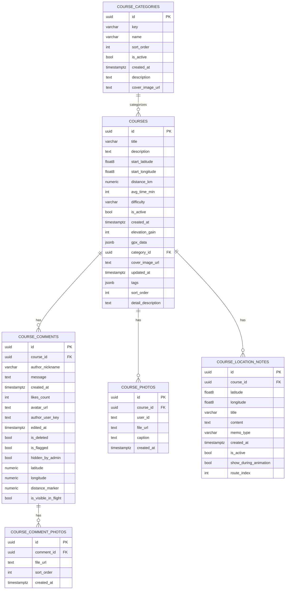

# 📘 Database Schema Documentation

**Schema:** `public`
**Access Level:** Read-Only
**Last Updated:** (자동 생성 시점 기준)

---

## 1. 개요

이 문서는 `public` 스키마에 속한 주요 테이블(`courses`, `course_comments`, `course_photos`, `course_location_notes`, `course_comment_photos`, `course_categories`)의 **구조, 관계, 컬럼 메타데이터**를 정의합니다.
데이터 모델의 핵심 목적은 **코스 관리, 사용자 후기, 위치 정보, 사진 및 카테고리 관리**를 통합적으로 다루는 것입니다.

---

## 2. 테이블 구조 상세

### 🟦 2.1. `courses`

| 컬럼명               | 타입             | 기본값              | 설명                        |
| -------------------- | ---------------- | ------------------- | --------------------------- |
| `id`                 | uuid             | `gen_random_uuid()` | 기본키                      |
| `title`              | varchar          |                     | 코스 제목                   |
| `description`        | text             | NULL                | 요약 설명                   |
| `start_latitude`     | double precision |                     | 시작 위도                   |
| `start_longitude`    | double precision |                     | 시작 경도                   |
| `distance_km`        | numeric          |                     | 코스 거리(km)               |
| `avg_time_min`       | integer          | NULL                | 평균 소요 시간(분)          |
| `difficulty`         | varchar          | `'medium'`          | 난이도                      |
| `is_active`          | boolean          | `true`              | 활성화 여부                 |
| `created_at`         | timestamptz      | `now()`             | 생성 시각                   |
| `elevation_gain`     | integer          | `0`                 | 총 상승 고도(m)             |
| `gpx_data`           | jsonb            | NULL                | GPX 데이터                  |
| `category_id`        | uuid             | NULL                | FK → `course_categories.id` |
| `cover_image_url`    | text             | NULL                | 대표 이미지                 |
| `updated_at`         | timestamptz      | `now()`             | 수정 시각                   |
| `tags`               | jsonb            | `'[]'::jsonb`       | 태그 목록                   |
| `sort_order`         | integer          | `0`                 | 정렬 순서                   |
| `detail_description` | text             | NULL                | 상세 설명 (PDF 19p 본문용)  |

**FK 관계**

- `category_id` → `course_categories.id`
- `course_photos.course_id` → `courses.id`
- `course_comments.course_id` → `courses.id`
- `course_location_notes.course_id` → `courses.id`

---

### 🟦 2.2. `course_comments`

| 컬럼명                 | 타입        | 기본값              | 설명              |
| ---------------------- | ----------- | ------------------- | ----------------- |
| `id`                   | uuid        | `gen_random_uuid()` | 기본키            |
| `course_id`            | uuid        |                     | FK → `courses.id` |
| `author_nickname`      | varchar     |                     | 작성자 닉네임     |
| `message`              | text        |                     | 댓글 내용         |
| `created_at`           | timestamptz | `now()`             | 작성일시          |
| `likes_count`          | integer     | `0`                 | 좋아요 수         |
| `avatar_url`           | text        | NULL                | 작성자 아바타     |
| `author_user_key`      | text        | NULL                | 사용자 식별자     |
| `edited_at`            | timestamptz | NULL                | 수정일시          |
| `is_deleted`           | boolean     | `false`             | 삭제 여부         |
| `is_flagged`           | boolean     | `false`             | 신고 여부         |
| `hidden_by_admin`      | boolean     | `false`             | 관리자 숨김 여부  |
| `latitude`             | numeric     | NULL                | 위도 (선택)       |
| `longitude`            | numeric     | NULL                | 경도 (선택)       |
| `distance_marker`      | numeric     | NULL                | GPX 경로 거리 (m) |
| `is_visible_in_flight` | boolean     | `true`              | 비행 중 표시 여부 |

**FK 관계**

- `course_id` → `courses.id`
- `course_comment_photos.comment_id` → `course_comments.id`

---

### 🟦 2.3. `course_photos`

| 컬럼명       | 타입        | 기본값              | 설명                 |
| ------------ | ----------- | ------------------- | -------------------- |
| `id`         | uuid        | `gen_random_uuid()` | 기본키               |
| `course_id`  | uuid        | NULL                | FK → `courses.id`    |
| `user_id`    | text        | NULL                | 카카오 사용자 식별자 |
| `file_url`   | text        |                     | 파일 URL             |
| `caption`    | text        | NULL                | 사진 설명            |
| `created_at` | timestamptz | `now()`             | 생성 시각            |

**비고**

- Row Level Security (RLS) 활성화됨
- 코스 단위 유저 사진 (PDF 19p 하단 갤러리용)

---

### 🟦 2.4. `course_location_notes`

| 컬럼명                  | 타입             | 기본값              | 설명                                                  |
| ----------------------- | ---------------- | ------------------- | ----------------------------------------------------- |
| `id`                    | uuid             | `gen_random_uuid()` | 기본키                                                |
| `course_id`             | uuid             |                     | FK → `courses.id`                                     |
| `latitude`              | double precision |                     | 위도                                                  |
| `longitude`             | double precision |                     | 경도                                                  |
| `title`                 | varchar          |                     | 제목                                                  |
| `content`               | text             | NULL                | 내용                                                  |
| `memo_type`             | varchar          | `'general'`         | 메모 종류 (`general`, `warning`, `highlight`, `rest`) |
| `created_at`            | timestamptz      | `now()`             | 생성 시각                                             |
| `is_active`             | boolean          | `true`              | 활성화 여부                                           |
| `show_during_animation` | boolean          | `true`              | 애니메이션 중 표시 여부                               |
| `route_index`           | integer          | NULL                | 경로 인덱스                                           |

**비고**

- 관리자 고정 노트 (주의 / 하이라이트 / 휴식 등)

---

### 🟦 2.5. `course_comment_photos`

| 컬럼명       | 타입        | 기본값              | 설명                      |
| ------------ | ----------- | ------------------- | ------------------------- |
| `id`         | uuid        | `gen_random_uuid()` | 기본키                    |
| `comment_id` | uuid        |                     | FK → `course_comments.id` |
| `file_url`   | text        |                     | 파일 URL                  |
| `sort_order` | integer     | `0`                 | 정렬 순서                 |
| `created_at` | timestamptz | `now()`             | 생성 시각                 |

---

### 🟦 2.6. `course_categories`

| 컬럼명            | 타입        | 기본값              | 설명            |
| ----------------- | ----------- | ------------------- | --------------- |
| `id`              | uuid        | `gen_random_uuid()` | 기본키          |
| `key`             | varchar     |                     | 고유 키         |
| `name`            | varchar     |                     | 카테고리 이름   |
| `sort_order`      | integer     | `0`                 | 정렬 순서       |
| `is_active`       | boolean     | `true`              | 활성화 여부     |
| `created_at`      | timestamptz | `now()`             | 생성 시각       |
| `description`     | text        | NULL                | 설명            |
| `cover_image_url` | text        | NULL                | 대표 이미지 URL |

**FK 관계**

- `courses.category_id` → `course_categories.id`

---

## 3. ER 다이어그램 (Mermaid)



---

## 4. 계층 관계 (ASCII 표현)

```
COURSES (id)
├─ course_photos (course_id → courses.id)
├─ course_comments (course_id → courses.id)
│  └─ course_comment_photos (comment_id → course_comments.id)
└─ course_location_notes (course_id → courses.id)
course_categories (id) ← courses.category_id
```

---

## 5. 다음 단계 제안

- Mermaid → SVG/PNG 변환하여 다이어그램 시각화
- PowerPoint / Notion / Confluence용 요약본 생성
- 성능 및 인덱스 개선 제안 (`course_id`, `category_id` 기준)
- RLS 정책 문서화

---
