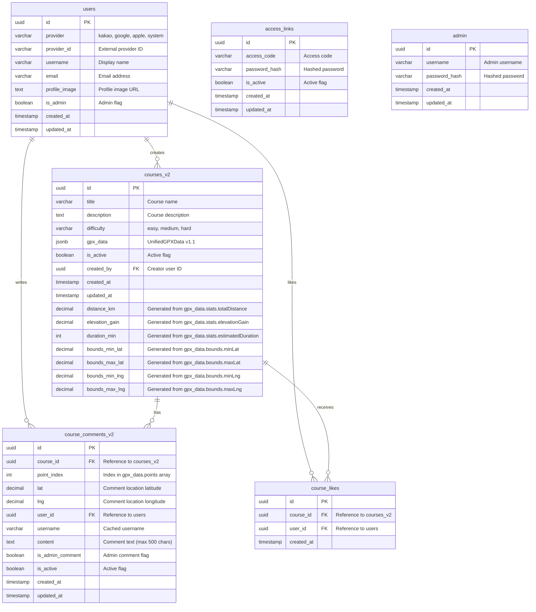

# GSRC81 Maps Database ERD v2

## Entity Relationship Diagram



## Table Descriptions

### 🗺️ courses_v2 (Main Course Table)
**Purpose**: Stores running course information with unified GPX data structure

**Key Features**:
- JSONB column for all GPX data (v1.1 format)
- Generated columns for fast queries (distance, elevation, bounds)
- GIN index on gpx_data for efficient JSONB queries
- Spatial-like indexing on bounds for map queries

**JSONB Structure** (`gpx_data`):
```json
{
  "version": "1.1",
  "points": [
    {
      "lat": 37.544,
      "lng": 127.038,
      "ele": 14.2,
      "dist": 0.5,
      "comments": [...]
    }
  ],
  "bounds": {
    "minLat": 37.540,
    "maxLat": 37.548,
    "minLng": 127.035,
    "maxLng": 127.042
  },
  "stats": {
    "totalDistance": 5.2,
    "elevationGain": 120,
    "elevationLoss": 95,
    "estimatedDuration": 45
  },
  "metadata": {
    "originalFileName": "morning_run.gpx",
    "uploadedAt": "2025-01-06T09:00:00Z"
  }
}
```

### 💬 course_comments_v2 (Waypoint Comments)
**Purpose**: Stores user comments linked to specific waypoints

**Key Features**:
- Links to specific point index in gpx_data.points array
- Supports both regular user and admin comments
- Soft delete with is_active flag
- Cached username for performance

### 👥 users (User Management)
**Purpose**: Manages user accounts with OAuth support

**Key Features**:
- Multi-provider OAuth (Kakao, Google, Apple)
- Admin flag for privileged users
- Profile image support
- Extensible for future social features

### ❤️ course_likes (Optional - Future Feature)
**Purpose**: Bookmark/like functionality for courses

**Key Features**:
- Simple many-to-many relationship
- Unique constraint prevents duplicate likes
- Future extension for favorites/bookmarks

### 🔐 Legacy Tables (Maintaining Compatibility)
- **access_links**: App access control (password-based)
- **admin**: Legacy admin accounts

## Indexes

### Primary Indexes
```sql
-- Courses
CREATE INDEX idx_courses_gpx_data ON courses_v2 USING GIN (gpx_data jsonb_path_ops);
CREATE INDEX idx_courses_active ON courses_v2(is_active);
CREATE INDEX idx_courses_difficulty ON courses_v2(difficulty);
CREATE INDEX idx_courses_distance ON courses_v2(distance_km);
CREATE INDEX idx_courses_bounds ON courses_v2(bounds_min_lat, bounds_max_lat, bounds_min_lng, bounds_max_lng);

-- Comments
CREATE INDEX idx_comments_course ON course_comments_v2(course_id);
CREATE INDEX idx_comments_point ON course_comments_v2(course_id, point_index);
CREATE INDEX idx_comments_user ON course_comments_v2(user_id);

-- Users
CREATE INDEX idx_users_provider ON users(provider, provider_id);
```

## Query Patterns

### Common Queries

1. **Get Active Courses with Stats**:
```sql
SELECT id, title, difficulty, distance_km, elevation_gain, duration_min
FROM courses_v2 
WHERE is_active = true 
ORDER BY distance_km;
```

2. **Get Course with Full GPX Data**:
```sql
SELECT * FROM courses_v2 WHERE id = $1 AND is_active = true;
```

3. **Get Courses in Map Bounds**:
```sql
SELECT * FROM courses_v2 
WHERE is_active = true
  AND bounds_min_lat <= $max_lat 
  AND bounds_max_lat >= $min_lat
  AND bounds_min_lng <= $max_lng 
  AND bounds_max_lng >= $min_lng;
```

4. **Get Comments for Course**:
```sql
SELECT * FROM course_comments_v2 
WHERE course_id = $1 AND is_active = true 
ORDER BY point_index, created_at;
```

5. **JSONB Queries on GPX Data**:
```sql
-- Get courses by distance range
SELECT * FROM courses_v2 
WHERE gpx_data->'stats'->>'totalDistance' BETWEEN '3' AND '10';

-- Get points with comments
SELECT * FROM courses_v2 
WHERE gpx_data @> '{"points": [{"comments": [{}]}]}';
```

## Row Level Security (RLS)

### Policies

```sql
-- Courses: Public read, admin write
CREATE POLICY "courses_read" ON courses_v2 FOR SELECT USING (is_active = true);
CREATE POLICY "courses_admin_write" ON courses_v2 FOR ALL USING (auth.jwt() ->> 'is_admin' = 'true');

-- Comments: Public read, authenticated write, owner/admin update
CREATE POLICY "comments_read" ON course_comments_v2 FOR SELECT USING (is_active = true);
CREATE POLICY "comments_write" ON course_comments_v2 FOR INSERT WITH CHECK (auth.uid() IS NOT NULL);
CREATE POLICY "comments_update" ON course_comments_v2 FOR UPDATE USING (auth.uid() = user_id OR auth.jwt() ->> 'is_admin' = 'true');
```

## Performance Considerations

### Optimization Strategies

1. **JSONB Indexing**: GIN index on gpx_data for fast JSON queries
2. **Generated Columns**: Pre-computed values for common filters
3. **Bounds Indexing**: Multi-column index for spatial queries
4. **Comment Pagination**: Limit comments per waypoint
5. **Cache Strategy**: Redis for frequently accessed courses

### Expected Performance

- **Course List Query**: < 50ms (indexed on distance_km, difficulty)
- **Course Detail Query**: < 100ms (single row + JSONB parsing)
- **Map Bounds Query**: < 200ms (bounds index + JSONB)
- **Comment Load**: < 150ms (course_id + point_index index)

## Migration Strategy

### Phase 1: Parallel Operation
1. Create new tables alongside existing ones
2. Dual-write to both old and new structures
3. Validate data consistency

### Phase 2: Read Migration
1. Switch read queries to new tables
2. Monitor performance and errors
3. Gradual rollout by feature

### Phase 3: Cleanup
1. Stop writing to old tables
2. Archive old table data
3. Drop old tables after backup

### Rollback Plan
```sql
-- Emergency rollback script
DROP TABLE courses_v2, course_comments_v2, users CASCADE;
-- Restore from backup tables
CREATE TABLE courses AS SELECT * FROM courses_backup;
-- ... restore other tables
```

## Data Validation

### Constraints and Checks

```sql
-- JSONB structure validation
ALTER TABLE courses_v2 ADD CONSTRAINT valid_gpx_data 
CHECK (
  gpx_data ? 'version' AND 
  gpx_data ? 'points' AND 
  gpx_data ? 'bounds' AND 
  gpx_data ? 'stats'
);

-- Comment length limit
ALTER TABLE course_comments_v2 ADD CONSTRAINT content_length 
CHECK (char_length(content) <= 500);

-- Difficulty enum
ALTER TABLE courses_v2 ADD CONSTRAINT valid_difficulty 
CHECK (difficulty IN ('easy', 'medium', 'hard'));
```

## Monitoring and Maintenance

### Regular Maintenance Tasks

1. **VACUUM and ANALYZE**: Weekly for performance
2. **Index Usage Analysis**: Monitor index effectiveness
3. **JSONB Compression**: Monitor storage usage
4. **Comment Moderation**: Review flagged content
5. **User Cleanup**: Remove inactive accounts

### Alerting Thresholds

- Query time > 1 second
- Storage growth > 10% per week
- Failed migrations > 1%
- Comment spam detection

---

*Last Updated: 2025-01-06*
*Version: 2.0*