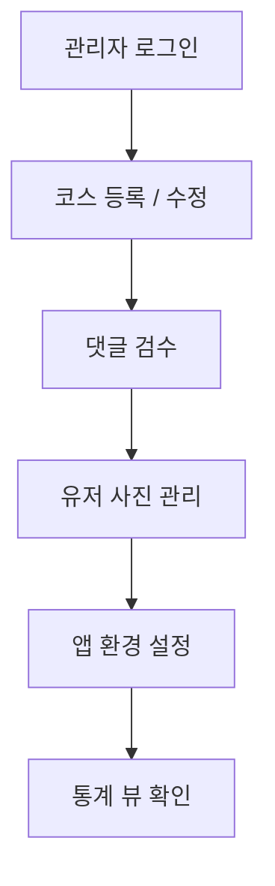
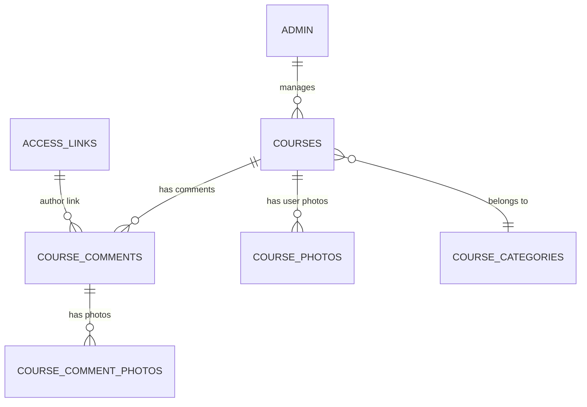

# 🗺️ **GSRC81 MAPS 서비스 기획서 (페이지별 정리)**

> 기준: PDF 시안 (18~19p), Supabase 최신 스키마, Next.js + Supabase 구조 반영

---

## 🌍 `/map` — 지도 페이지

> **사용자 중심의 코스 탐색 허브**

---

### 1️⃣ 페이지 개요

| 항목          | 내용                                                                     |
| ------------- | ------------------------------------------------------------------------ |
| **URL**       | `/map`                                                                   |
| **접근 권한** | 로그인 필요 (카카오 로그인 기반)                                         |
| **주요 목적** | 사용자가 전국의 활성화된 러닝 코스를 지도에서 탐색하고, 코스 상세로 이동 |
| **주요 기술** | `Mapbox`, `Supabase`, `React Suspense`, `Realtime API`                   |

---

### 2️⃣ 주요 기능 요약

| 구분           | 기능명                                                              | 설명 |
| -------------- | ------------------------------------------------------------------- | ---- |
| ✅ 인증 보호   | 로그인하지 않은 유저는 `/login`으로 이동                            |      |
| ✅ 지도 로딩   | Supabase에서 활성 코스 데이터(`courses`) 로드                       |      |
| ✅ 마커 표시   | 각 코스의 시작점(`start_latitude`, `start_longitude`)에 마커 렌더링 |      |
| ✅ 클러스터링  | 가까운 마커 자동 그룹화                                             |      |
| ✅ 드로어      | 코스 카드 목록 및 요약 표시 (`title`, `distance`, `difficulty`)     |      |
| ✅ 상세 이동   | 드로어에서 코스 선택 시 `/courses/[id]` 이동                        |      |
| ⚙️ 상태 동기화 | 지도 이동, 줌 변화, 선택상태 관리 (`useMapState`)                   |      |
| ⚙️ 예외 처리   | API 실패 / Token 오류 / 빈 결과 처리                                |      |

---

### 3️⃣ 데이터 구조

| 테이블              | 주요 필드                                                                 | 설명                       |
| ------------------- | ------------------------------------------------------------------------- | -------------------------- |
| `courses`           | `title`, `distance_km`, `difficulty`, `start_latitude`, `start_longitude` | 지도 마커 및 요약정보 표시 |
| `course_categories` | `name`, `key`                                                             | 지도 필터 (추가 예정)      |
| `app_settings`      | `map_center`, `default_zoom`                                              | 지도 초기 상태 제어        |

---

### 4️⃣ 사용자 플로우

```mermaid
graph TD
A[사용자 로그인] --> B[/map 접속]
B --> C[Supabase에서 활성 코스 목록 로드]
C --> D[지도에 코스 마커 표시]
D --> E[마커 클릭 → 코스 드로어 오픈]
E --> F[코스 상세로 이동 /courses/:id]
```

---

---

## 🏃 `/courses/[id]` — 코스 상세 페이지

> **코스별 상세 정보 + 비행 모드 + 댓글 & 사진**

---

### 1️⃣ 페이지 개요

| 항목          | 내용                                                        |
| ------------- | ----------------------------------------------------------- |
| **URL**       | `/courses/[id]`                                             |
| **목적**      | 단일 코스의 상세정보, 경로(GPX), 후기(댓글), 유저 사진 표시 |
| **접근**      | 로그인한 유저 전용                                          |
| **주요 구성** | 코스 상세 정보 / 지도(비행모드) / 댓글 / 사진               |

---

### 2️⃣ 주요 기능 요약

| 구분              | 기능명                                          | 설명 |
| ----------------- | ----------------------------------------------- | ---- |
| ✅ 코스 상세 조회 | `courses`에서 `id` 기준 데이터 fetch            |      |
| ✅ 비행 모드 재생 | `gpx_data.points[]` 기반 지도 애니메이션        |      |
| ✅ 1km 마커 표시  | 누적거리(`dist`) 기준 1km 간격 표시             |      |
| ✅ 지도 댓글 등록 | 지도 클릭 시 최근접 지점 계산 후 댓글 등록      |      |
| ✅ 말풍선 표시    | `course_comments.is_visible_in_flight = true`   |      |
| ✅ 댓글 목록      | 하단에 정렬(`ORDER BY distance_marker ASC`)     |      |
| ✅ 댓글 사진      | `course_comment_photos.file_url` 렌더링         |      |
| ✅ 유저 사진 섹션 | 코스별 업로드 사진(`course_photos`) 그리드 표시 |      |

---

### 3️⃣ 데이터 구조

| 테이블                  | 주요 필드                                             | 설명                    |
| ----------------------- | ----------------------------------------------------- | ----------------------- |
| `courses`               | `title`, `detail_description`, `gpx_data`             | 상세 정보 및 경로       |
| `course_comments`       | `latitude`, `longitude`, `distance_marker`, `message` | 지도 댓글 (비행 노트)   |
| `course_comment_photos` | `file_url`                                            | 댓글 첨부 이미지        |
| `course_photos`         | `file_url`, `caption`                                 | 코스별 유저 업로드 사진 |

---

### 4️⃣ 사용자 플로우

```mermaid
graph TD
A[코스 상세 페이지 진입] --> B[코스 정보 로드]
B --> C[지도에 경로 렌더링 (gpx_data)]
C --> D[비행모드 시작 / 마커 표시]
D --> E[비행 중 말풍선 표시]
E --> F[댓글 리스트 확인]
F --> G[지도 클릭 → 댓글 등록]
G --> H[사진 업로드 → Storage → DB 등록]
```

---

### 5️⃣ 예외 및 상태 처리

| 상황          | 처리 방식                               |
| ------------- | --------------------------------------- |
| GPX 파싱 실패 | “경로 데이터를 불러올 수 없습니다” 안내 |
| 댓글 0개      | “아직 댓글이 없습니다” 메시지           |
| 사진 없음     | 빈 상태 + 업로드 버튼                   |
| 로그인 안됨   | `/login`으로 리다이렉션                 |

---

### 6️⃣ 향후 개선 포인트

| 항목                  | 설명                                        |
| --------------------- | ------------------------------------------- |
| 💬 댓글 신고 / 숨김   | `is_flagged`, `hidden_by_admin` 관리자 검수 |
| 📸 다중 이미지 업로드 | 댓글 내 복수 이미지 지원                    |
| 🧭 거리 기반 정렬     | 지도 상 표시 순서 최적화                    |
| 🧾 통계 뷰 연결       | 댓글/사진 카운트 실시간 반영                |

---

---

## 🧑‍💻 `/admin` — 관리자 페이지

> **코스 / 댓글 / 사진 / 설정 통합 관리**

---

### 1️⃣ 페이지 개요

| 항목          | 내용                                     |
| ------------- | ---------------------------------------- |
| **URL**       | `/admin`                                 |
| **접근**      | 관리자 전용 (Supabase Auth + Role Check) |
| **목적**      | 데이터 관리, 사용자 생성 콘텐츠 검수     |
| **주요 기술** | Next.js App Router + Supabase Admin API  |

---

### 2️⃣ 주요 기능 요약

| 구분             | 기능명                                           | 설명 |
| ---------------- | ------------------------------------------------ | ---- |
| ✅ 코스 관리     | 코스 등록/수정/삭제 + GPX 업로드                 |      |
| ✅ 카테고리 관리 | `course_categories` 추가/비활성화                |      |
| ✅ 댓글 관리     | 신고/숨김/삭제 (`is_flagged`, `hidden_by_admin`) |      |
| ✅ 사진 관리     | 유저 사진 삭제 (`course_photos`)                 |      |
| ✅ 앱 설정       | 지도 기본 위치 등 (`app_settings`)               |      |
| ⚙️ 통계 뷰       | `course_statistics` 요약 표시                    |      |

---

### 3️⃣ 데이터 구조

| 테이블            | 주요 필드                                 | 설명             |
| ----------------- | ----------------------------------------- | ---------------- |
| `admin`           | `username`, `last_login_at`               | 관리자 계정      |
| `courses`         | `title`, `gpx_data`, `detail_description` | 관리 대상        |
| `course_comments` | `is_flagged`, `hidden_by_admin`           | 신고된 댓글 관리 |
| `course_photos`   | `file_url`, `user_id`                     | 유저 사진 관리   |
| `app_settings`    | `setting_key`, `setting_value`            | 시스템 설정      |

---

### 4️⃣ 관리자 플로우



---

### 5️⃣ 향후 개선 제안

| 항목            | 설명                                    |
| --------------- | --------------------------------------- |
| 🧾 통계 자동화  | 코스별 댓글/사진 수 실시간 반영         |
| 🔒 접근 제어    | Supabase RLS + Admin Role 강화          |
| 🪣 Storage 정리 | 오래된 이미지 자동 삭제                 |
| 🧠 AI 요약      | 코스 후기 요약 기능 (OpenAI Embeddings) |

---

# 🧱 전체 ERD (요약)



---

# ✅ 결론 요약

| 구분               | 요약                                |
| ------------------ | ----------------------------------- |
| 🌍 `/map`          | 코스 지도 탐색 및 진입 포인트       |
| 🏃 `/courses/[id]` | 상세 보기 + 비행 모드 + 댓글 + 사진 |
| 🧑‍💻 `/admin`        | 콘텐츠 관리 및 시스템 설정          |
| 🗄️ DB 스키마       | PDF 18~19p 기준 완벽 매핑           |
| 🚀 향후 확장       | 필터 / 실시간 반영 / AI 요약 등     |

---

원하신다면 다음 단계로

> 🔸 **이 문서를 Notion 템플릿 구조(표/플로우 포함)**
> 🔸 **각 페이지별 UI 와이어프레임 자동 생성 (Figma 구조 기반)**
> 으로 바로 제작할 수 있습니다.

어떤 형식으로 이어서 정리해드릴까요?
**(예: Notion용 / PDF 문서 / 개발 명세 JSON)**
