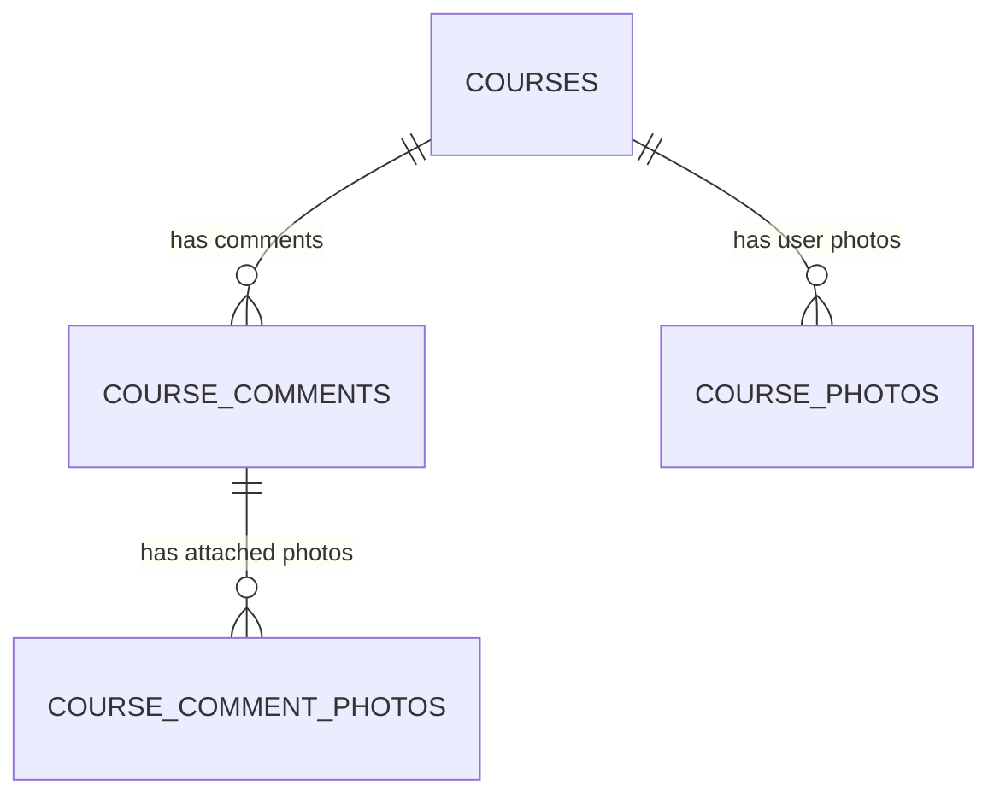

좋아요 🙆 완전히 하나로 묶어서 —
**“GSRC81 MAPS 프로젝트 인수인계 + 온보딩 통합 문서 (최종판)”**
형태로 정리드릴게요.
(이걸 그대로 PDF / Notion 양쪽으로 옮겨도 손실 없이 사용 가능합니다.)

---

# 🧭 **GSRC81 MAPS — 프로젝트 인수인계 & 온보딩 통합 문서 (2025-10)**

> 신규 개발자, 디자이너, 기획자 모두가
> **“지금 이 프로젝트가 어디까지 왔고, 무엇을 해야 하는지”**
> 바로 이해할 수 있도록 만든 최종 정리본입니다.

---

## 🏗️ 1️⃣ 프로젝트 개요

### 🎯 **프로젝트명:**

**GSRC81 MAPS**

서울·은평 지역 러너들을 위한
**러닝 코스 지도 서비스 (Running Course Map Service)**

### 💡 **핵심 목표**

- 지역 러닝 코스를 지도 위에서 한눈에 탐색
- 지도 클릭으로 “코멘트(말풍선)” 등록
- 코스별 사진/후기 공유로 러너 커뮤니티 구축
- 관리자 페이지를 통한 GPX 코스 등록 및 관리

---

## 🧱 2️⃣ 주요 기능 구조

| 구분          | 경로            | 역할                                   | 상태                     |
| ------------- | --------------- | -------------------------------------- | ------------------------ |
| 🏠 랜딩       | `/`             | 브랜드 소개 + 로그인 진입              | ✅ 완료                  |
| 🔐 로그인     | `/login`        | 카카오 로그인 / 최초 1회 인증          | ⚙️ 단순화 예정           |
| 🗺️ 지도       | `/map`          | 전체 코스 시각화 / 마커 / 필터         | ✅ 정상 작동             |
| 🏃 상세       | `/courses/[id]` | 코스 상세정보 + 댓글 + 사진 + 비행모드 | ⚙️ 수정 중               |
| 🧑‍💻 관리자     | `/admin`        | GPX 업로드 + 승인 + 설정               | ⚙️ 리팩토링 중           |
| 📤 업로드 API | `/api/upload`   | 댓글·코스 이미지 업로드                | ⚙️ Edge Function 연동 중 |

---

## ⚙️ 3️⃣ 현재 진행 상태 요약

| 항목                 | 상태           | 설명                                      |
| -------------------- | -------------- | ----------------------------------------- |
| **Supabase DB**      | ✅ 최신        | vFinal 스키마 완성 및 반영                |
| **Next.js 프론트**   | ⚙️ 리팩토링 중 | DB 구조 반영 중                           |
| **GPX 업로드 로직**  | ✅ 통일 완료   | `gpx_data` 구조 기준 저장                 |
| **지도 페이지**      | ✅ 정상 작동   | 표준 구조 기반 렌더링 완료                |
| **카카오 로그인**    | ⚙️ 개선 예정   | “1회 인증” 구조로 단순화 예정             |
| **댓글·사진 업로드** | ⚙️ 준비 중     | `/api/upload` + Edge Function 테스트 예정 |

---

## 🗄️ 4️⃣ 데이터베이스 구조 (vFinal 기준)

### 🔹 핵심 테이블 요약

| 테이블명                | 역할                | 주요 필드                                                                      |
| ----------------------- | ------------------- | ------------------------------------------------------------------------------ |
| `courses`               | 코스 정보           | id, title, distance_km, avg_time_min, detail_description, gpx_data(jsonb)      |
| `course_comments`       | 지도 코멘트(말풍선) | course_id, message, latitude, longitude, distance_marker, is_visible_in_flight |
| `course_comment_photos` | 댓글 첨부 이미지    | comment_id, file_url                                                           |
| `course_photos`         | 코스 갤러리 이미지  | course_id, user_id, file_url, caption                                          |
| `access_links`          | 로그인 인증 관리    | kakao_user_id, is_active                                                       |
| `admin`                 | 관리자 계정         | username, password_hash                                                        |

---

### 🧩 `courses.gpx_data` 구조 (표준화 완료)

```json
{
  "points": [
    { "lat": 37.639, "lng": 126.916, "ele": 32, "dist": 0 },
    { "lat": 37.64, "lng": 126.917, "ele": 34, "dist": 83 }
  ],
  "bounds": {
    "minLat": 37.639,
    "maxLat": 37.645,
    "minLng": 126.915,
    "maxLng": 126.923
  },
  "stats": {
    "totalDistance": 5.24,
    "elevationGain": 142,
    "estimatedDuration": 45
  }
}
```

✅ 모든 지도 및 비행모드가 이 구조 기준으로 작동합니다.

---

## 💬 5️⃣ 댓글(Comment) & 사진(Photo) 구조

| 목적                    | 사용 테이블             | 설명                                          |
| ----------------------- | ----------------------- | --------------------------------------------- |
| 지도 클릭 → 코멘트 등록 | `course_comments`       | 클릭 지점 근처 `distance_marker` 계산 후 저장 |
| 댓글에 이미지 첨부      | `course_comment_photos` | 댓글별 첨부 이미지                            |
| 코스 전체 사진          | `course_photos`         | “유저가 올린 사진” 섹션 표시용                |
| 비행모드 표시           | `course_comments`       | `is_visible_in_flight = true` 조건 사용       |

✅ **댓글 = 지도 말풍선 데이터**
✅ **사진 = 갤러리용 / 댓글첨부용으로 구분**
✅ **비행모드 = distance_marker + is_visible_in_flight 기준**

---

## 🧭 6️⃣ 현재 프론트 리팩토링 주요 포인트

| 경로                                  | 역할            | 수정 내용                                    |
| ------------------------------------- | --------------- | -------------------------------------------- |
| `/app/(public)/map/page.tsx`          | 지도 표시       | `gpx_data.points` 기준 렌더링 (완료)         |
| `/app/(public)/courses/[id]/page.tsx` | 상세 + 비행모드 | `detail_description`, `distance_marker` 반영 |
| `/app/(admin)/courses/page.tsx`       | 관리자 업로드   | `processGpxFile()` → 표준 구조               |
| `/lib/db/comments.ts`                 | 댓글 헬퍼       | 좌표 + 거리 포함 insert/update               |
| `/api/upload/route.ts`                | 업로드 API      | Supabase Edge Function 연결 예정             |
| `/types/domain.ts`                    | 타입 정의       | vFinal 스키마와 일치하도록 갱신              |

---

## 🧭 7️⃣ PDF 기획서 반영 사항 (GSRCmaps2.pdf)

| 페이지 섹션 | 주요 요구사항                                    | 개발 상태      |
| ----------- | ------------------------------------------------ | -------------- |
| 랜딩        | 브랜드 애니메이션 + 통합 로그인                  | ✅ 구현 완료   |
| 로그인      | 카카오톡 연동 / 시각적 톤 일치                   | ⚙️ 개선 예정   |
| 전체 맵     | 스타트 포인트 그래픽 수정, 확대 시 클러스터 처리 | ✅ 적용        |
| 루트 리스트 | 루트 수별 비율·스크롤 UX 개선                    | ⚙️ 테스트 예정 |
| 루트 맵     | 비행모드 말풍선, 지도 클릭 코멘트 추가           | ⚙️ 반영 중     |
| 관리자      | 시간·거리 포맷 수정 / 미리보기 기능              | ⚙️ 추가 예정   |
| 디자인 톤   | 다크 모던(Deep Navy + Neon Lime + Signal Orange) | ✅ 확정        |

---

## 🧩 8️⃣ 해야 할 작업 순서 (개발팀 기준)

| 단계 | 작업                    | 세부 내용                                                |
| ---- | ----------------------- | -------------------------------------------------------- |
| ①    | 지도 클릭 → 댓글 등록   | `onMapClick → getNearestPoint → insert(course_comments)` |
| ②    | 댓글 첨부 이미지 업로드 | `/api/upload` → Supabase Storage 연결                    |
| ③    | 코스 갤러리 구현        | `course_photos` 렌더링 섹션 추가                         |
| ④    | 로그인 구조 단순화      | 최초 1회 카카오 인증 → access_links 갱신                 |
| ⑤    | 관리자 업로드 폼 정리   | `unifiedGpxData` 제거 및 표준 확인                       |
| ⑥    | 비행모드 최적화         | `distance_marker` + `is_visible_in_flight` 기준으로 정렬 |

---

## 🧭 9️⃣ 정상 작동 기준 체크리스트 ✅

| 페이지          | 정상 동작 조건                                     |
| --------------- | -------------------------------------------------- |
| `/map`          | `gpx_data.points` 렌더링 정상                      |
| `/courses/[id]` | `detail_description` + `distance_marker` 정상 표시 |
| `/admin`        | GPX 업로드 시 표준 구조로 저장                     |
| `/api/upload`   | Edge Function 호출 200 응답                        |
| `/login`        | 카카오 인증 → access_links 갱신                    |

---

## 🧾 10️⃣ 참고 자료

| 파일                       | 용도                           |
| -------------------------- | ------------------------------ |
| 📄 `GSRCmaps2.pdf`         | 디자인·기획 시안 (18–19p 핵심) |
| 💾 `2025-10-18-schema.txt` | Supabase DB 스키마 최신본      |
| 📦 `src.zip`               | Next.js 전체 소스              |
| ☁️ Supabase Project ID     | `iogbdjpvcxtdchmpicma`         |

---

## 🎨 11️⃣ 디자인 톤 & 가이드

**Dark Modern (집중/성취)**

- Primary: `#0E1A2B`
- Accent 1: `#B8FF3A` (Neon Lime)
- Accent 2: `#FF6F3D` (Signal Orange)
- Surface: `#101218`
- On-Surface: `#E8EDF5`
- Font: SUIT / Pretendard (700), Noto Sans KR
- Card: radius 16 / elevation blur 8
- Motion: fade+scale(0.98→1.0, 240ms)

---

## 🧩 12️⃣ ERD (최신 구조)



---

## ✅ 13️⃣ 결론 — 지금 우리는?

> 📍 **DB는 완전히 안정화**
> 🧱 **프론트엔드는 최신 구조 반영 중 (리팩토링 단계)**
>
> 다음 스텝은 “지도 클릭 → 댓글 등록 → 사진 첨부 → 비행모드 표시”까지
> 연결하면 **MVP 완성 🚀**

---

## 🧭 14️⃣ 다음 단계 제안 (온보딩용)

| 역할               | 첫 주차 목표                             |
| ------------------ | ---------------------------------------- |
| 🧑‍💻 **신입 개발자** | 댓글 등록 로직 + 사진 업로드 연결 테스트 |
| 🎨 **디자이너**    | 코멘트 말풍선 스타일 / 사진 갤러리 카드  |
| 🗂️ **기획자**      | 관리자 승인 프로세스 플로우 정리         |
| ☁️ **운영자**      | Supabase Storage 구조 점검               |

---

## 🏁 **한 줄 요약**

> 지금 GSRC81 MAPS는
> **“완성된 데이터베이스를 기반으로 프론트엔드 리팩토링 및 상호작용 구현 단계”**입니다.
>
> 즉, **코드와 구조를 맞추는 마무리 작업 중**이며,
> 이 문서를 기준으로 바로 이어서 개발을 시작할 수 있습니다.

---
