# 🗄️ GSRC81 Maps 데이터베이스 스키마 다이어그램 (최종 정리 버전)

## 📊 ERD (Entity Relationship Diagram)

```mermaid
erDiagram
    ADMIN {
        uuid id PK
        varchar username UK
        varchar password_hash
        timestamptz created_at
        timestamptz last_login_at
    }

    ACCESS_LINKS {
        uuid id PK
        varchar access_code UK
        boolean is_active
        varchar kakao_user_id
        varchar kakao_nickname
        varchar kakao_profile_url
        timestamptz created_at
        timestamptz updated_at
    }

    COURSE_CATEGORIES {
        uuid id PK
        varchar key UK
        varchar name
        int sort_order
        boolean is_active
        text description
        text cover_image_url
        timestamptz created_at
    }

    COURSES {
        uuid id PK
        uuid category_id FK
        varchar title
        text description
        varchar cover_image_url
        varchar difficulty
        decimal distance_km
        int avg_time_min
        int elevation_gain
        decimal start_latitude
        decimal start_longitude
        jsonb gpx_data
        jsonb tags
        int sort_order
        boolean is_active
        timestamptz created_at
        timestamptz updated_at
    }

    COURSE_LOCATION_NOTES {
        uuid id PK
        uuid course_id FK
        decimal latitude
        decimal longitude
        varchar title
        text content
        varchar memo_type
        boolean show_during_animation
        int route_index
        boolean is_active
        timestamptz created_at
    }

    COURSE_COMMENTS {
        uuid id PK
        uuid course_id FK
        varchar author_nickname
        varchar avatar_url
        varchar author_user_key
        text message
        int likes_count
        boolean is_flagged
        boolean hidden_by_admin
        timestamptz edited_at
        boolean is_deleted
        timestamptz created_at
        timestamptz updated_at
    }

    COURSE_COMMENT_PHOTOS {
        uuid id PK
        uuid comment_id FK
        text file_url
        int sort_order
        timestamptz created_at
    }

    APP_SETTINGS {
        uuid id PK
        varchar setting_key UK
        text setting_value
        timestamptz updated_at
    }

    COURSE_STATISTICS {
        uuid course_id PK
        varchar title
        int comment_count
        int visible_comments
        int point_count
    }

    %% 관계 ì •ì˜
    COURSE_CATEGORIES ||--o{ COURSES : "has many"
    COURSES ||--o{ COURSE_LOCATION_NOTES : "has many"
    COURSES ||--o{ COURSE_COMMENTS : "has many"
    COURSE_COMMENTS ||--o{ COURSE_COMMENT_PHOTOS : "has many"
    COURSES ||--o{ COURSE_STATISTICS : "generates"
```



## 🏗️ 테이블 구조 상세

### 1️⃣ **ADMIN** (관리자) - 최종 정리

```
┌─────────────────┬──────────────┬─────────────────┐
│ 필드명            │ 타입         │ 설명            │
├─────────────────┼──────────────┼─────────────────┤
│ id              │ UUID (PK)    │ 기본 키         │
│ username        │ VARCHAR(50)  │ 관리자 사용자명  │
│ password_hash   │ VARCHAR(255) │ 비밀번호 해시   │
│ created_at      │ TIMESTAMPTZ  │ 생성일시        │
│ last_login_at   │ TIMESTAMPTZ  │ 마지막 로그인   │
└─────────────────┴──────────────┴─────────────────┘
```

### 2️⃣ **ACCESS_LINKS** (사용자 접근) - 최종 정리

```
┌─────────────────┬──────────────┬─────────────────┐
│ 필드명            │ 타입         │ 설명            │
├─────────────────┼──────────────┼─────────────────┤
│ id              │ UUID (PK)    │ 기본 키         │
│ access_code     │ VARCHAR(100) │ 접근 코드       │
│ is_active       │ BOOLEAN      │ 활성화 상태     │
│ kakao_user_id   │ VARCHAR      │ 카카오 사용자ID │
│ kakao_nickname  │ VARCHAR      │ 카카오 닉네임   │
│ kakao_profile_url│ VARCHAR     │ 카카오 프로필   │
│ created_at      │ TIMESTAMPTZ  │ 생성일시        │
│ updated_at      │ TIMESTAMPTZ  │ 수정일시        │
└─────────────────┴──────────────┴─────────────────┘
```

### 3️⃣ **COURSE_CATEGORIES** (코스 카테고리) - 최종 정리

```
┌─────────────────┬──────────────┬─────────────────┐
│ 필드명            │ 타입         │ 설명            │
├─────────────────┼──────────────┼─────────────────┤
│ id              │ UUID (PK)    │ 기본 키         │
│ key             │ VARCHAR(UK)  │ 카테고리 키     │
│ name            │ VARCHAR      │ 카테고리 이름   │
│ sort_order      │ INT          │ 정렬 순서       │
│ is_active       │ BOOLEAN      │ 활성화 상태     │
│ description     │ TEXT         │ 카테고리 설명   │
│ cover_image_url │ TEXT         │ 커버 이미지     │
│ created_at      │ TIMESTAMPTZ  │ 생성일시        │
└─────────────────┴──────────────┴─────────────────┘
```

### 4️⃣ **COURSES** (러닝 코스) - 최종 정리

```
┌─────────────────┬──────────────┬─────────────────┐
│ 필드명            │ 타입         │ 설명            │
├─────────────────┼──────────────┼─────────────────┤
│ id              │ UUID (PK)    │ 기본 키         │
│ category_id     │ UUID (FK)    │ 카테고리 ID     │
│ title           │ VARCHAR(200) │ 코스 제목       │
│ description     │ TEXT         │ 코스 설명       │
│ cover_image_url │ VARCHAR(500) │ 대표 이미지     │
│ difficulty      │ VARCHAR(20)  │ 난이도          │
│ distance_km     │ DECIMAL(5,2) │ 거리 (km)       │
│ avg_time_min    │ INT          │ 평균 소요시간   │
│ elevation_gain  │ INT          │ 고도 상승 (m)   │
│ start_latitude  │ DECIMAL(10,8)│ 시작점 위도     │
│ start_longitude │ DECIMAL(11,8)│ 시작점 경도     │
│ gpx_data        │ JSONB        │ GPX 데이터      │
│ tags            │ JSONB        │ 태그 배열       │
│ sort_order      │ INT          │ 정렬 순서       │
│ is_active       │ BOOLEAN      │ 활성화 상태     │
│ created_at      │ TIMESTAMPTZ  │ 생성일시        │
│ updated_at      │ TIMESTAMPTZ  │ 수정일시        │
└─────────────────┴──────────────┴─────────────────┘
```

### 5️⃣ **COURSE_LOCATION_NOTES** (비행 노트) - 최종 정리

```
┌─────────────────┬──────────────┬─────────────────┐
│ 필드명            │ 타입         │ 설명            │
├─────────────────┼──────────────┼─────────────────┤
│ id              │ UUID (PK)    │ 기본 키         │
│ course_id       │ UUID (FK)    │ 코스 ID         │
│ latitude        │ DECIMAL      │ 위도            │
│ longitude       │ DECIMAL      │ 경도            │
│ title           │ VARCHAR      │ 노트 제목       │
│ content         │ TEXT         │ 노트 내용       │
│ memo_type       │ VARCHAR      │ 노트 타입       │
│ show_during_animation│ BOOLEAN │ 비행 중 표시    │
│ route_index     │ INT          │ 경로 순서       │
│ is_active       │ BOOLEAN      │ 활성화 상태     │
│ created_at      │ TIMESTAMPTZ  │ 생성일시        │
└─────────────────┴──────────────┴─────────────────┘
```

### 6️⃣ **COURSE_COMMENTS** (코스 댓글) - 최종 정리

```
┌─────────────────┬──────────────┬─────────────────┐
│ 필드명            │ 타입         │ 설명            │
├─────────────────┼──────────────┼─────────────────┤
│ id              │ UUID (PK)    │ 기본 키         │
│ course_id       │ UUID (FK)    │ 코스 ID         │
│ author_nickname │ VARCHAR(50)  │ 작성자 닉네임   │
│ avatar_url      │ VARCHAR(500) │ 아바타 URL      │
│ author_user_key │ VARCHAR      │ 작성자 키       │
│ message         │ TEXT         │ 댓글 내용       │
│ likes_count     │ INT          │ 좋아요 수       │
│ is_flagged      │ BOOLEAN      │ 신고 여부       │
│ hidden_by_admin │ BOOLEAN      │ 관리자 숨김     │
│ edited_at       │ TIMESTAMPTZ  │ 수정일시        │
│ is_deleted      │ BOOLEAN      │ 삭제 여부       │
│ created_at      │ TIMESTAMPTZ  │ 생성일시        │
│ updated_at      │ TIMESTAMPTZ  │ 수정일시        │
└─────────────────┴──────────────┴─────────────────┘
```

### 7️⃣ **COURSE_COMMENT_PHOTOS** (댓글 사진) - 최종 정리

```
┌─────────────────┬──────────────┬─────────────────┐
│ 필드명            │ 타입         │ 설명            │
├─────────────────┼──────────────┼─────────────────┤
│ id              │ UUID (PK)    │ 기본 키         │
│ comment_id      │ UUID (FK)    │ 댓글 ID         │
│ file_url        │ TEXT         │ 파일 URL        │
│ sort_order      │ INT          │ 정렬 순서       │
│ created_at      │ TIMESTAMPTZ  │ 생성일시        │
└─────────────────┴──────────────┴─────────────────┘
```

### 8️⃣ **APP_SETTINGS** (앱 설정) - 최종 정리

```
┌─────────────────┬──────────────┬─────────────────┐
│ 필드명            │ 타입         │ 설명            │
├─────────────────┼──────────────┼─────────────────┤
│ id              │ UUID (PK)    │ 기본 키         │
│ setting_key     │ VARCHAR(100) │ 설정 키         │
│ setting_value   │ TEXT         │ 설정 값         │
│ updated_at      │ TIMESTAMPTZ  │ 수정일시        │
└─────────────────┴──────────────┴─────────────────┘
```

### 9️⃣ **COURSE_STATISTICS** (통계 뷰) - 신규

```
┌─────────────────┬──────────────┬─────────────────┐
│ 필드명            │ 타입         │ 설명            │
├─────────────────┼──────────────┼─────────────────┤
│ course_id       │ UUID (PK)    │ 코스 ID         │
│ title           │ VARCHAR      │ 코스 제목       │
│ comment_count   │ INT          │ 댓글 수         │
│ visible_comments│ INT          │ 표시 댓글 수     │
│ point_count     │ INT          │ GPX 포인트 수   │
└─────────────────┴──────────────┴─────────────────┘
```

## 🔗 관계도

```
ADMIN (관리자)
    ↓ (관리)
COURSES ←→ COURSE_CATEGORIES
    ↓ (포함)
COURSE_LOCATION_NOTES
    ↓ (포함)
COURSE_COMMENTS
    ↓ (포함)
COURSE_COMMENT_PHOTOS

ACCESS_LINKS (사용자 접근)
    ↓ (사용)
COURSES (조회/댓글)

APP_SETTINGS (앱 설정)
    ↓ (전역 설정)
전체 시스템

COURSE_STATISTICS (통계 뷰)
    ↑ (자동 생성)
COURSES
```

## 📊 현재 데이터 현황

| 테이블                    | 레코드 수 | 상태         | 주요 내용                                  |
| ------------------------- | --------- | ------------ | ------------------------------------------ |
| **ADMIN**                 | 1개       | ✅ 활성      | 관리자: `admin`                            |
| **ACCESS_LINKS**          | 2개       | ✅ 활성      | 접근 코드: `gsrc81-maps-2024`, `gsrc81`    |
| **COURSE_CATEGORIES**     | 4개       | ✅ 활성      | 진관동러닝, 트랙러닝, 트레일러닝, 로드러닝 |
| **APP_SETTINGS**          | 9개       | ✅ 활성      | 앱 이름, 버전, 지도 중심점 등              |
| **COURSES**               | 0개       | 📭 빈 테이블 | 러닝 코스 데이터 없음                      |
| **COURSE_LOCATION_NOTES** | 0개       | 📭 빈 테이블 | 비행 노트 데이터 없음                      |
| **COURSE_COMMENTS**       | 0개       | 📭 빈 테이블 | 댓글 데이터 없음                           |
| **COURSE_COMMENT_PHOTOS** | 0개       | 📭 빈 테이블 | 댓글 사진 데이터 없음                      |
| **COURSE_STATISTICS**     | 0개       | 📊 통계 뷰   | 자동 집계 뷰                               |

## 🎯 주요 특징

- **UUID 기반**: 모든 테이블이 UUID를 기본 키로 사용
- **타임스탬프**: created_at, updated_at 자동 관리
- **소프트 삭제**: is_deleted 필드로 논리적 삭제
- **JSONB 지원**: GPX 데이터, 태그, 설정값 등 JSON 저장
- **RLS 적용**: 행 수준 보안으로 데이터 접근 제어
- **확장 가능**: 카테고리, 노트, 댓글 등 모듈화된 구조
- **통계 뷰**: 자동 집계로 성능 최적화

## 🚀 현재 상태

### ✅ **완료된 작업**

- 스키마 단순화 및 정리
- 불필요한 컬럼 제거
- 새로운 필드 추가 (tags, sort_order, route_index 등)
- 통계 뷰 생성
- 백업 데이터 보존
- 관리자/사용자 인증 시스템
- 카테고리 및 앱 설정

### 📋 **다음 단계**

- `course.json` 데이터를 `COURSES` 테이블로 마이그레이션
- 실제 러닝 코스 데이터 입력
- 댓글 및 노트 기능 테스트
- 통계 뷰 데이터 확인

## 🔧 **스키마 정리 요약**

### ❌ **제거된 컬럼들**

- `password_hash` (ACCESS_LINKS)
- `updated_at` (ADMIN, COURSE_CATEGORIES)
- `view_count`, `like_count` (COURSES)
- `nearest_station`, `end_latitude`, `end_longitude` (COURSES)
- `created_by`, `updated_at` (COURSE_LOCATION_NOTES)
- `deleted_by`, `deleted_at`, `flagged_by`, `flagged_at`, `edit_count` (COURSE_COMMENTS)
- `width`, `height` (COURSE_COMMENT_PHOTOS)
- `description` (APP_SETTINGS)

### ✅ **추가된 컬럼들**

- `last_login_at` (ADMIN)
- `description`, `cover_image_url` (COURSE_CATEGORIES)
- `tags`, `sort_order` (COURSES)
- `route_index` (COURSE_LOCATION_NOTES)
- `is_flagged`, `hidden_by_admin`, `edited_at` (COURSE_COMMENTS)

### 🎉 **결과**

- **성능 향상**: 불필요한 컬럼 제거로 쿼리 최적화
- **확장성 확보**: 새로운 기능을 위한 필드 추가
- **데이터 무결성**: 백업 데이터 보존으로 안전성 확보
- **자동화**: 통계 뷰로 실시간 집계 지원
