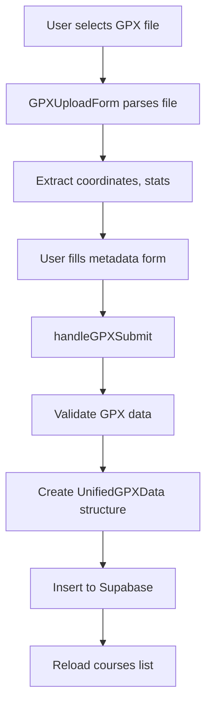

# Admin Courses Page (`/admin/courses`)

## Overview

Course management interface for admins to upload, edit, and delete running courses via GPX files.

## Location

- **Path**: `/admin/courses`
- **File**: `src/app/admin/courses/page.tsx`
- **Type**: Client Component

## Functionality

### Main Features

1. **GPX Upload Form**
   - File upload with drag-and-drop
   - Course metadata input (title, description, difficulty)
   - Real-time GPX parsing and validation
   - Accordion UI (mobile) / Always visible (desktop)

2. **Course List Display**
   - Grid layout of all courses
   - Course cards with stats
   - Edit and delete actions
   - Shows inactive courses for admin

3. **Course Management**
   - Edit via `/admin/courses/[id]/manage`
   - Delete with confirmation
   - View creation date
   - Difficulty badges

## Data Flow

### State Management

```typescript
const [courses, setCourses] = useState<CourseV2[]>([]);
const [loading, setLoading] = useState(true);
const [submitting, setSubmitting] = useState(false);
const [isGPXFormExpanded, setIsGPXFormExpanded] = useState(false);
```

### GPX Upload Flow



### GPX Data Processing

```typescript
async function handleGPXSubmit(formData: FormData, gpxData: unknown) {
  // 1. Extract GPX data
  const gpx = gpxData as {
    name: string;
    distance: number;
    startPoint: { lat: number; lng: number };
    endPoint: { lat: number; lng: number };
    duration: number;
    elevationGain: number;
    coordinates: Array<{ lat: number; lng: number; ele?: number }>;
  };

  // 2. Validate required fields
  if (!startPoint || !coordinates.length || !distance) {
    throw new Error("Invalid GPX data");
  }

  // 3. Calculate bounds
  const bounds = {
    minLat: Math.min(...coordinates.map((c) => c.lat)),
    maxLat: Math.max(...coordinates.map((c) => c.lat)),
    minLng: Math.min(...coordinates.map((c) => c.lng)),
    maxLng: Math.max(...coordinates.map((c) => c.lng)),
  };

  // 4. Create normalized GPX data
  const normalizedGpxData: UnifiedGPXData = {
    version: "1.1",
    points: coordinates,
    bounds,
    stats: {
      totalDistance: distance,
      elevationGain: elevationGain || 0,
      estimatedDuration: duration,
    },
    metadata: {
      startPoint: { lat: startPoint.lat, lng: startPoint.lng },
      endPoint: { lat: endPoint.lat, lng: endPoint.lng },
    },
  };

  // 5. Insert to database
  await supabase.from("courses").insert([
    {
      title: formData.get("title"),
      description: formData.get("description"),
      detail_description: formData.get("detail_description"),
      start_latitude: startPoint.lat,
      start_longitude: startPoint.lng,
      distance_km: distance,
      avg_time_min: duration,
      difficulty: formData.get("difficulty"),
      category_id: formData.get("category_id"),
      tags: JSON.parse(formData.get("tags")),
      cover_image_url: formData.get("cover_image_url"),
      elevation_gain: elevationGain,
      sort_order: 0,
      gpx_data: normalizedGpxData,
      is_active: true,
    },
  ]);
}
```

## Issues & Improvements

### Critical Issues

1. **Type Safety Problems**

   ```typescript
   const gpx = gpxData as { ... }  // ❌ Unsafe type assertion
   ```

   - Should use Zod or similar for runtime validation
   - No guarantee gpxData matches expected structure

2. **Error Handling is Poor**

   ```typescript
   catch (error) {
     const errorMessage = error instanceof Error
       ? error.message
       : typeof error === "object"
         ? JSON.stringify(error, null, 2)
         : String(error);
     alert(`코스 등록 중 오류가 발생했습니다: ${errorMessage}`);
   }
   ```

   - Using `alert()` for errors (bad UX)
   - Should use toast notifications or error boundaries

3. **Complex Validation Logic**
   - Multiple nested if checks
   - Repeated validation patterns
   - Should use schema validation

4. **Client Component Unnecessarily**
   - Course list could be server-rendered
   - Only form needs client-side interactivity

5. **No Progress Indication**
   - File upload has no progress bar
   - User doesn't know upload status
   - Large GPX files may seem frozen

6. **Accordion State Not Persisted**
   - Closes after submission
   - Should stay open on error
   - No persistence across page refreshes

### Recommended Refactoring

#### 1. Add Schema Validation (Zod)

```typescript
// lib/validation/gpx-schema.ts
import { z } from "zod";

export const GPXDataSchema = z.object({
  name: z.string().min(1),
  distance: z.number().positive(),
  startPoint: z.object({
    lat: z.number().min(-90).max(90),
    lng: z.number().min(-180).max(180),
  }),
  endPoint: z.object({
    lat: z.number().min(-90).max(90),
    lng: z.number().min(-180).max(180),
  }),
  duration: z.number().positive(),
  elevationGain: z.number().nonnegative(),
  coordinates: z
    .array(
      z.object({
        lat: z.number(),
        lng: z.number(),
        ele: z.number().optional(),
      }),
    )
    .min(2),
});

export type GPXData = z.infer<typeof GPXDataSchema>;

// Usage in component
const validatedGPX = GPXDataSchema.parse(gpxData);
```

#### 2. Extract GPX Processing Logic

```typescript
// lib/gpx/process-gpx.ts
export function processGPXData(gpxData: unknown): UnifiedGPXData {
  const validated = GPXDataSchema.parse(gpxData);

  const bounds = calculateBounds(validated.coordinates);

  return {
    version: "1.1",
    points: validated.coordinates,
    bounds,
    stats: {
      totalDistance: validated.distance,
      elevationGain: validated.elevationGain,
      estimatedDuration: validated.duration,
    },
    metadata: {
      startPoint: validated.startPoint,
      endPoint: validated.endPoint,
    },
  };
}

function calculateBounds(coordinates: Coordinate[]): Bounds {
  return {
    minLat: Math.min(...coordinates.map((c) => c.lat)),
    maxLat: Math.max(...coordinates.map((c) => c.lat)),
    minLng: Math.min(...coordinates.map((c) => c.lng)),
    maxLng: Math.max(...coordinates.map((c) => c.lng)),
  };
}
```

#### 3. Use Server Actions (Next.js 15)

```typescript
// app/admin/courses/actions.ts
"use server";

import { revalidatePath } from "next/cache";

export async function createCourse(formData: FormData, gpxData: GPXData) {
  // Validate on server
  const validated = GPXDataSchema.parse(gpxData);
  const processedGPX = processGPXData(validated);

  // Insert to database
  const { error } = await supabase.from("courses").insert([
    {
      ...extractFormData(formData),
      gpx_data: processedGPX,
      is_active: true,
    },
  ]);

  if (error) throw error;

  // Revalidate courses page
  revalidatePath("/admin/courses");
  revalidatePath("/map");

  return { success: true };
}

// In component
import { createCourse } from "./actions";

async function handleSubmit(formData: FormData, gpxData: unknown) {
  try {
    await createCourse(formData, gpxData);
    toast.success("코스가 등록되었습니다");
  } catch (error) {
    toast.error("등록 실패: " + error.message);
  }
}
```

#### 4. Better Error UI

```typescript
// Instead of alert()
import { toast } from "sonner";

try {
  await createCourse(formData, gpxData);
  toast.success("✅ 코스가 성공적으로 등록되었습니다");
  setIsGPXFormExpanded(false);
} catch (error) {
  if (error instanceof z.ZodError) {
    toast.error("입력 데이터 오류", {
      description: error.errors.map((e) => e.message).join(", "),
    });
  } else {
    toast.error("등록 실패", {
      description: error.message,
    });
  }
}
```

#### 5. Add Upload Progress

```typescript
// GPXUploadForm with progress
const [uploadProgress, setUploadProgress] = useState(0)

<input
  type="file"
  onChange={(e) => {
    const file = e.target.files?.[0]
    if (file) {
      parseGPXWithProgress(file, setUploadProgress)
    }
  }}
/>

{uploadProgress > 0 && uploadProgress < 100 && (
  <div className="w-full bg-gray-200 rounded-full h-2">
    <div
      className="bg-blue-600 h-2 rounded-full transition-all"
      style={{ width: `${uploadProgress}%` }}
    />
  </div>
)}
```

#### 6. Hybrid Server/Client Pattern

```typescript
// app/admin/courses/page.tsx (Server Component)
export default async function CoursesPage() {
  const courses = await getCourses() // All courses including inactive

  return (
    <ProtectedAdminRoute>
      <div className="min-h-screen bg-gray-50">
        <GPXUploadSection />  {/* Client Component */}
        <CoursesList courses={courses} />  {/* Server Component */}
      </div>
    </ProtectedAdminRoute>
  )
}

// components/admin/GPXUploadSection.tsx
'use client'

export function GPXUploadSection() {
  const [isExpanded, setIsExpanded] = useState(false)
  // ... only upload form logic
}
```

## Course Card Component

### Current Implementation

```typescript
<Card key={course.id} className="shadow-xl border-0 py-6 gap-2">
  <CardHeader>...</CardHeader>
  <CardContent>
    <p className="text-sm text-gray-600 mb-4 line-clamp-2">
      {course.description || "설명이 없습니다."}
    </p>
    <div className="grid grid-cols-2 gap-4 text-sm mb-4">
      <div>
        <span className="text-gray-500">거리</span>
        <p className="font-medium">{getDistance(course).toFixed(2)}km</p>
      </div>
      <div>
        <span className="text-gray-500">소요시간</span>
        <p className="font-medium">{getDuration(course)}</p>
      </div>
    </div>
    <div className="flex space-x-2">
      <Link href={`/admin/courses/${course.id}/manage`}>
        <Button size="sm" variant="outline">
          <Edit className="w-4 h-4 mr-1" />관리
        </Button>
      </Link>
      <Button onClick={() => handleDelete(course)}>
        <Trash2 className="w-4 h-4" />
      </Button>
    </div>
  </CardContent>
</Card>
```

### Improved Version

```typescript
// components/admin/CourseCard.tsx
interface CourseCardProps {
  course: CourseV2
  onDelete: (course: CourseV2) => Promise<void>
}

export function CourseCard({ course, onDelete }: CourseCardProps) {
  const [isDeleting, setIsDeleting] = useState(false)

  return (
    <Card>
      <CardHeader>
        <div className="flex items-start justify-between">
          <div className="flex-1">
            <CardTitle className="text-lg">{course.title}</CardTitle>
            {course.gpx_data.metadata?.nearestStation && (
              <CardDescription>
                {course.gpx_data.metadata.nearestStation} 인근
              </CardDescription>
            )}
          </div>
          <DifficultyBadge difficulty={course.difficulty} />
        </div>
      </CardHeader>

      <CardContent className="space-y-4">
        <CourseDescription text={course.description} />
        <CourseStats course={course} />
        <CourseMetadata createdAt={course.created_at} />
        <CourseActions
          courseId={course.id}
          onDelete={() => onDelete(course)}
          isDeleting={isDeleting}
        />
      </CardContent>
    </Card>
  )
}
```

## Responsive Design

### Current Approach

- Separate mobile/desktop layouts for form
- Accordion on mobile, always visible on desktop

### Issues

- Code duplication
- Hard to maintain
- Inconsistent behavior

### Better Approach

```typescript
// Single responsive component
<div className="mb-8">
  <Collapsible
    open={isGPXFormExpanded}
    onOpenChange={setIsGPXFormExpanded}
    className="bg-white rounded-lg shadow-sm border"
  >
    <CollapsibleTrigger className="w-full p-6 flex items-center justify-between md:cursor-default">
      <h2 className="text-lg font-semibold flex items-center gap-2">
        <Plus className="w-5 h-5" />
        새 코스 등록
      </h2>
      <ChevronDown className="w-5 h-5 md:hidden" />
    </CollapsibleTrigger>

    <CollapsibleContent className="px-6 pb-6">
      <GPXUploadForm onSubmit={handleGPXSubmit} loading={submitting} />
    </CollapsibleContent>
  </Collapsible>
</div>
```

## Performance Considerations

1. **Large Course Lists**
   - No pagination (could be slow with 100+ courses)
   - Should implement virtual scrolling or pagination

2. **Image Loading**
   - Cover images load all at once
   - Should use lazy loading

3. **GPX File Size**
   - No file size limit
   - Large files could crash browser
   - Should chunk processing

## Security Considerations

1. **File Upload Validation**
   - Check file type (GPX only)
   - Limit file size
   - Sanitize file content
   - Validate GPX structure

2. **SQL Injection**
   - Using Supabase client (safe)
   - But should validate all inputs

3. **XSS Prevention**
   - User input in title/description
   - Already handled by React
   - But be careful with HTML rendering

## Dependencies

- `@/types/unified` - Type definitions
- `@/components/admin/GPX-upload-form` - Upload form
- `@/lib/supabase` - Database client
- UI components (Card, Button, etc.)
- Icons (lucide-react)

## Database Operations

- SELECT all courses (including inactive)
- INSERT new course
- DELETE course by ID
- Stores GPX as JSONB in `gpx_data` column

## Next Steps

1. **Add Zod Validation** (High Priority)
2. **Convert to Server Actions** (High Priority)
3. **Better Error Handling** (High Priority)
4. **Add Upload Progress** (Medium Priority)
5. **Implement Pagination** (Medium Priority)
6. **Add Course Preview** (Low Priority)
