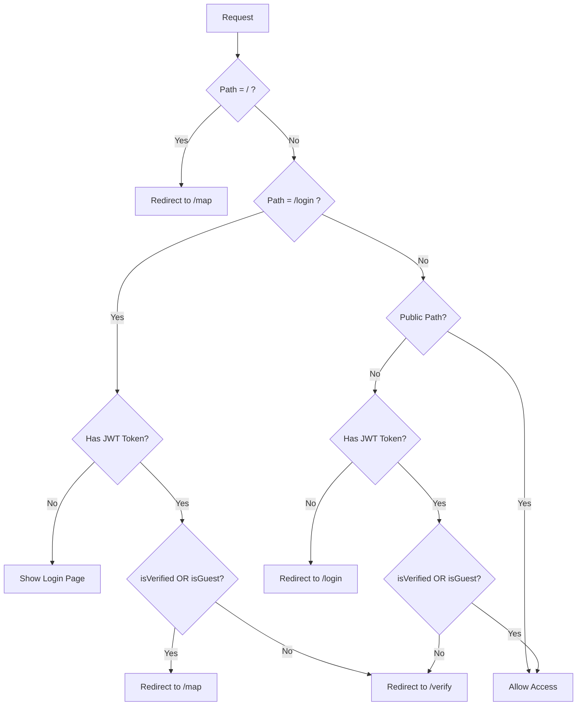

# Middleware (`src/middleware.ts`)

## Overview

Next.js middleware that handles routing protection, authentication checks, verification status, guest sessions, and URL redirects.

## Location

- **File**: `src/middleware.ts`
- **Type**: Edge Runtime
- **Runs**: Before every request (except excluded paths)

---

## Current Implementation (2026-01-18)

### Core Functionality

```typescript
export async function middleware(req: NextRequest) {
  const { pathname } = req.nextUrl;

  // 게스트 세션 쿠키 확인
  const isGuestSession = req.cookies.get("guest_session")?.value === "true";

  // 1. Root redirect
  if (pathname === "/") {
    return NextResponse.redirect(new URL("/map", req.url));
  }

  // 2. /login 접근 시 이미 로그인된 사용자 자동 리다이렉트
  if (pathname === "/login") {
    const token = await getToken({ req, secret: process.env.NEXTAUTH_SECRET });

    if (token) {
      const isVerified = token.isVerified === true;

      if (isVerified || isGuestSession) {
        // 인증 완료 또는 게스트 → /map으로
        return NextResponse.redirect(new URL("/map", req.url));
      } else {
        // 미인증 → /verify로
        return NextResponse.redirect(new URL(`/verify?uid=${token.kakaoId}`, req.url));
      }
    }
  }

  // 3. Public paths (로그인 없이 접근 가능)
  const publicPaths = ["/login", "/verify", "/terms", "/privacy"];
  const isPublicPath = publicPaths.some(path => pathname.startsWith(path));

  if (!isPublicPath) {
    const token = await getToken({ req, secret: process.env.NEXTAUTH_SECRET });

    if (!token) {
      // 로그인 안 됨 → /login으로 리다이렉트
      const loginUrl = new URL("/login", req.url);
      loginUrl.searchParams.set("callbackUrl", pathname);
      return NextResponse.redirect(loginUrl);
    }

    // 로그인은 했지만 코드 인증 안 됨 → /verify로 리다이렉트
    const isVerified = token.isVerified === true;

    if (!isVerified && !isGuestSession && pathname !== "/verify") {
      return NextResponse.redirect(new URL(`/verify?uid=${token.kakaoId}`, req.url));
    }
  }

  // 4. Admin routes handled by AdminContext

  return NextResponse.next();
}
```

---

## Authentication Flow

### 사용자 유형별 처리

| 사용자 유형 | 로그인 상태 | 인증 상태 | 게스트 | 접근 결과 |
|------------|------------|----------|--------|----------|
| 미로그인 사용자 | ❌ | - | - | → `/login?callbackUrl=<path>` |
| 신규 로그인 사용자 | ✅ | ❌ | ❌ | → `/verify?uid=<kakaoId>` |
| 게스트 사용자 | ✅ | ❌ | ✅ | → 콘텐츠 접근 허용 |
| 인증된 사용자 | ✅ | ✅ | - | → 콘텐츠 접근 허용 |

### Guest Session

게스트 모드는 `guest_session` 쿠키를 통해 관리됩니다:

- **목적**: 접근 코드 없이 임시로 앱을 사용할 수 있는 모드
- **설정**: 클라이언트에서 `guest_session=true` 쿠키 설정
- **동작**: 인증 없이도 보호된 페이지 접근 가능
- **제한**: 일부 기능(댓글 작성 등)은 정식 인증 필요

---

## Flow Diagram



---

## Protected Paths

| Path Pattern | Auth Required | Verification Required | Notes |
| ------------ | ------------- | --------------------- | ----- |
| `/` | No | No | Immediate redirect to `/map` |
| `/map` | Yes | Yes (or Guest) | Main map page |
| `/courses/*` | Yes | Yes (or Guest) | Course details |
| `/login` | No | No | Public login page |
| `/verify` | No | No | Public verification |
| `/terms` | No | No | Terms of service |
| `/privacy` | No | No | Privacy policy |
| `/admin/*` | Separate | Separate | Handled by AdminContext |

---

## Matcher Configuration

```typescript
export const config = {
  matcher: [
    "/((?!api|_next/static|_next/image|favicon.ico|.*\\.(?:png|jpg|jpeg|svg|gif|webp|ico|json)).*)",
  ],
};
```

**Excludes:**

- `/api/*` - API routes (have own auth)
- `/_next/static/*` - Static assets
- `/_next/image/*` - Image optimization
- `/favicon.ico` - Favicon
- Image files (`.png`, `.jpg`, etc.)
- `manifest.json` - PWA manifest

---

## JWT Token Structure

미들웨어에서 사용하는 확장된 JWT 토큰:

```typescript
interface ExtendedJWT {
  kakaoId?: string;       // 카카오 사용자 ID
  isVerified?: boolean;   // 코드 인증 완료 여부
  isGuestSession?: boolean; // 게스트 세션 (미사용, 쿠키로 처리)
}
```

---

## Environment Variables

| Variable | Required | Purpose | Example |
| -------- | -------- | ------- | ------- |
| `NEXTAUTH_SECRET` | ✅ Yes | JWT token signing/verification | Random 32+ char string |

**Setup:**

```bash
# Generate secret
openssl rand -base64 32

# Add to .env.local
NEXTAUTH_SECRET="<generated-secret>"
```

---

## Comparison with Previous Implementation

### Changes from 2025-11-24

| Aspect | Before | After | Improvement |
| ------ | ------ | ----- | ----------- |
| HOC Usage | `withAuth` wrapper | Direct `getToken()` | -6.3 kB bundle |
| Guest Support | None | `guest_session` cookie | Flexible access |
| Verification | Page-level check | Middleware-level check | Earlier redirect |
| Public Paths | Hardcoded | Configurable array | Maintainable |

---

## Admin Routes

**Note:** Admin routes (`/admin/*`) are **not** checked in this middleware.

**Reason:**

- Admin uses separate authentication system (username/password)
- Different from user authentication (Kakao OAuth)
- Handled by `AdminContext` and admin-specific logic
- Prevents conflicts between auth systems

**Admin Flow:**

```
/admin/* → AdminContext checks → Redirect to /admin/login if needed
```

---

## Security Considerations

### 1. **Token Verification**

- Uses `NEXTAUTH_SECRET` for JWT verification
- Tokens are cryptographically signed
- Edge runtime prevents token leakage

### 2. **No Sensitive Data in Middleware**

- Only checks token existence/validity
- Does not inspect user data
- Full user info loaded in page/API

### 3. **Redirect Safety**

- `callbackUrl` validated by NextAuth
- Prevents open redirect vulnerabilities
- Only allows same-origin redirects

### 4. **Guest Session Security**

- Cookie is client-settable (intentional for flexibility)
- Limited functionality for guests
- Full features require verification

---

## Testing Checklist

- [ ] `/` redirects to `/map`
- [ ] `/map` requires authentication
- [ ] `/courses/[id]` requires authentication
- [ ] Unauthenticated users redirected to `/login?callbackUrl=<path>`
- [ ] After login, unverified users redirected to `/verify`
- [ ] Guest users (with cookie) can access `/map`
- [ ] Verified users can access all protected pages
- [ ] `/login` and `/verify` are accessible without auth
- [ ] Admin routes not affected by this middleware
- [ ] Static assets load without auth check

---

## Common Issues & Solutions

### Issue: Infinite Redirect Loop

**Symptom:** User bounces between `/login` and `/map`
**Solution:** Check NextAuth session is properly set after login

### Issue: 401 on Every Request

**Symptom:** Always redirected to login, even after logging in
**Solution:** Verify `NEXTAUTH_SECRET` matches between auth config and middleware

### Issue: Guest Can't Access Content

**Symptom:** Guest user redirected to `/verify`
**Solution:** Ensure `guest_session=true` cookie is properly set

### Issue: Verified User Stuck on `/verify`

**Symptom:** User completed verification but still redirected
**Solution:** Call `updateSession()` after verification to refresh JWT token

---

## Related Documentation

- [02-login-page.md](02-login-page.md) - Login flow after redirect
- [03-verify-page.md](03-verify-page.md) - Verification page details
- [09-global-splash-system.md](09-global-splash-system.md) - Splash before middleware
- [00-refactoring-summary.md](00-refactoring-summary.md) - Complete refactoring details

---

## Summary

This middleware serves as the **first line of defense** for protected routes:

- ⚡ Fast edge-based authentication checks
- 🎯 Simple, maintainable code (no HOC wrapper)
- 🔒 Secure JWT verification
- 🔄 Smart redirects with callback URLs
- 👤 Guest session support
- ✅ Verification status enforcement
